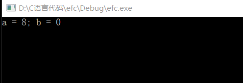
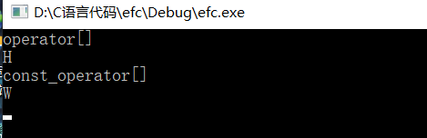

#### 尽量以const，enum，inline替换 #define
这里需要说一下==宏替换是在预处理时期==，它不会进行错误的处理（当然不是不处理是不方便查错），而==const，enum，inline都在编译时期 #F44336==有查询错误的机制。
##### 第一点 const,enum代替宏常量
如果我们使用`#define ASP 1.623`,记号名称可能从未被编译器记录；而在编译器开始处理源码之前它就被预处理器给移走了。于是记号ASP就没有被记入记号表内。这样我们看见的错误就会变成1.623而不是ASP。再者如果这个记号被定义在一个非你所写的头文件中。这就会给你改错带来大量的时间浪费
解决办法：`const double ASP = 1.623`

当我们使用常量代替宏时候有两点：

 1. 宏定义的字符串必需是被两个const修饰的指针，如：`const char* const authorName = "helloWorld"; 或者C++：const std::string authorName("helloWorld");`
 2. 就是class的专属常量。为了将常量的作用域限制于class内，你必须让它成为class的一个成员；而为确保此常量至多只有一份实体，你必须让它成为一个static成员：

``` c++
class GamePlayer {
private:	
	static const int Number = 5;	//常量声明式
	int scores[Number];					//使用该常量
	....
};
```
但是注意这个是声明时候获取到一个参数5，如果你取某个class专属常量的地址，或纵使你不取其地址而你的编译器却坚持要看到一个定义式，你就必须另外提供定义式：`const int GamePlayer::NumTurns;`
因为在声明时候我们给了初值，则定义时候不能在带初值了。这个就会在一些旧的编译器上它不允许static成员在其声明式上获得初值。
一般只能写成如下形式：

``` c++
class ConstEstimate {
private:
	static const double FudgeFactor;
	....
};
const double ConstEstimate::FudgeFactor = 1.35;
```
当你的class中有个使用常量的数组如上面，但是编译器又不支持初值的设定，我们可以使用枚举来完成这项任务:

``` c++
class GamePlayer {
private:	
	enum { Number = 5 }; 			  
	int scores[Number];					//使用该常量
	....
};
```
##### 第二点 inline替换宏函数
当我们使用如下宏函数：`#define CALL_WITH_MAX(a,b) f((a) > (b) ? (a):(b))`时必须记住为宏中的所有参加的变量加上小括号，否则别人用的时候，或者自己过很长时间在使用的时候，都可能出现和自己想法有出入的运算结果，但是就算是都加括号也可能出现和自己想要的不符合的结果，例如下面这个程序：
``` c++
#include <stdio.h>
#define CALL_WITH_MAX(a,b) f((a) > (b) ? (a):(b))
void f()
{}
int main()
{
	int a = 5, b = 0;
	CALL_WITH_MAX(++a, b);
	CALL_WITH_MAX(++a, b + 10);
	printf("a = %d; b = %d", a, b);
	return 0;
}
```

宏在调用的时候根据它选择的不同，它每次a自增的次数也就不相同，
而下面则是C++提供的一种解决上面问题的方法：inline函数

``` c++
template<typename T>
inline void callWithMax(const T& a, const T& b)
{
	f(a > b ?a : b);
}
```
这里因为加入了限制条件const，所有就不允许变量改变，这样就保证了，程序的运算出错大大减少。

#### 尽可能使用const
关键字const，你可以用它在class外部修饰global或namespace作用域中的常量，或修饰文件、函数、或区块作用域中被声明为static的对象。你也可以用它修饰class内部的static和non-static成员变量。面对指针，你也可以指出指针自身，指针所指物，或两者都是const：

``` c++
char qreeting[] = "hallo";
char* p = greeting;										//正常指针
const char* p = greeting;							//指针可以改变指向，但是不能改变数据的值
char* const p = greeting;							//指针不能改变指向，但是数据可以改变值
const char* const p = greeting;					//两个都不可以改变
```
其中`const char* p与char const * p`表示的意思是一样的，其中C++STL中迭代器就是以指针为根据塑膜出来的，所有如果你希望一个迭代器所指的东西不可改变，你就需要的是const_iterator：

``` c++
std::vector<int> vec;
...
const std::vector<int>::iterator iter = vec.begin();
*iter = 10;
++iter;					//有问题
std::vector<int>::const_iterator cIter = vec.begin();
*cIter = 10;		 //有问题
++cIter;
```
下面有个一个例子体现出了const的最具威力的应用：

``` c++
class Rational {....};
const Rational operator* (const Rational& lhs, const Rational& rhs);
```
这假如说我们定义的整数类，它里面重载了乘法运算符，我们定义了三个Rational类型的对象：a, b, c 然后我们使用a * b = c 在平常看来这没有问题，但是在程序中，如果这样写了，==它就说明你a * b得到的不是一个常量，而是一个变量，把c在赋给它 #F44336==，这样的代码直截了当就是不合法。而一个“良好的用户自定义类型”的特征是它们避免无端地与内置类型不兼容，因此允许对两值乘积做赋值动作就是个错误的做法，

##### const成员函数
将const实施于成员函数的目的，是为了确认该成员函数可作用于const对象身上。这一类成员函数之所以重要具有两个理由：

 - 第一：它们使class接口比较容易被理解（就是得知那个函数可以改动对象内容，那些不行）
 - 第二：它们使操作const对象成为可能，改善C++程序效率的一个根本办法是以==常引用 #F44336==方式传递对象，而此技术可行的前提是，我们有const成员函数可用来处理取到const对象。

==两个成员函数如果只是常量性不同是可以被重载的： #4CAF50==

``` c++
#include <iostream>
using namespace std;

class TextBlock {
public:
	TextBlock(std::string my_str) : text(my_str)
	{}
	const char& operator[](std::size_t position) const
	{
		cout << "const_operator[]" << endl;
		return text[position];
	}

	char& operator[](std::size_t position)
	{
		cout << "operator[]" << endl;
		return text[position];
	}

private:
	std::string text;
};

int main()
{
	TextBlock tb("Hello");
	std::cout << tb[0] << std::endl;
	const TextBlock ctb("World");
	std::cout << ctb[0] << std::endl;
	return 0;
}
```

其中我们可以看到，我们可以访问这个值，但是如果对于`ctb[0] = 'X';`程序就会报错，==错误起因于企图对一个“由const版的operator[]返回”的const char& 施行赋值动作。 #F44336==

**const的两个流行概念** ==一个是bitwise constness #9C27B0==（主张的就是成员函数只有在不更改对象之中任何成员变量时才可以说是const），==另一个logical constness #9C27B0==（意思是说一个const成员函数可以修改它所处理的对象内的某些bits，但只有在客户端侦测不出的情况下才得如此。）

> 说一个例子是对不是十足具备const性质却能通过bitwise测试。一个更改了“指针所指物”的成员函数不能算是const，==但是如果只要指针隶属于对象 #9C27B0==，那么此函数就不违背bitwise const不会引发编译器异常.

``` c++
class CTextBlock {
public:
	...
	char& operator[] (std::size_t position) const
	{
		return pText[position];
	}

private:
	char* pText
};
```

这段代码并没有更改pText。于是编译器会为operator[]产除目标码。但是经过下面的操作之后，就违背了bitwise const：

``` c++
const CTextBlock ctb("Hello");
char* pc = &ctb[0];
*pc = 'J'
```
这样这个对象中的成员变量所指的是这样一个内容:Jello。当然现在C++不支持这样做了。但是在面对现实你希望它是个常对象，但是里面有一些数据确实你希望他改变例如下：

``` c++
class CText {
public:

	std::size_t length() const;
private:
	char* pText;
	std::size_t textLength;
	bool lengthIsValid;
};

std::size_t CText::length() const
{
	if (!lengthIsValid)
	{
		textLength = std::strlen(pText);
		lengthIsValid = true;
	}
	return textLength;
}
```
如果我们确实想修改这两笔数据对const CText对象而言虽然可接受，但编译器不同意。所有在C++中使用一个关键字：mutable释放点成员变量的bitwise constness约束：

``` c++
class CText {
public:

	std::size_t length() const;
private:
	char* pText;
	mutable std::size_t textLength;
	mutable bool lengthIsValid;
};

std::size_t CText::length() const
{
	if (!lengthIsValid)
	{
		textLength = std::strlen(pText);
		lengthIsValid = true;
	}
	return textLength;
}
```


