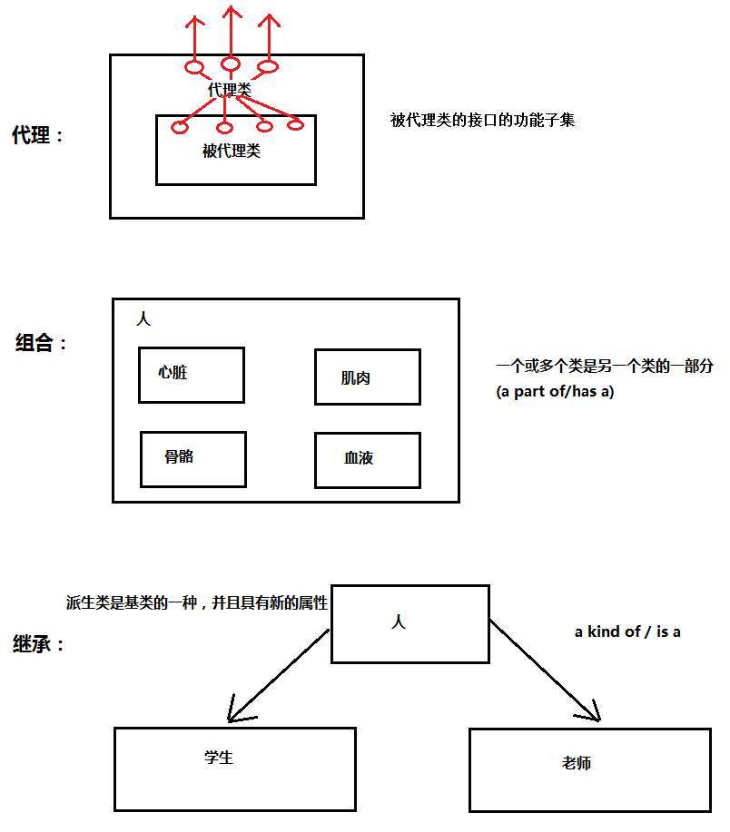
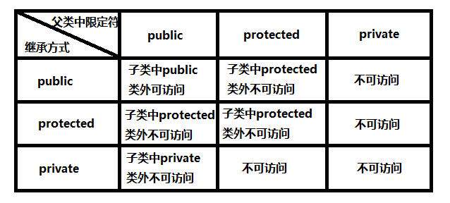
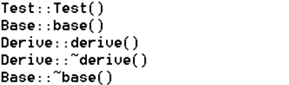

#### 类继承
 C++是一种面向对象的语言，最重要的一个目的就是——提供可重用的代码，而类继承就是C++提供来扩展和修改类的方法。类继承就是从已有的类中派生出新的类，派生类继承了基类的特性，同时可以添加自己的特性。实际上，类与类之间的关系分为三种：代理、组合和继承。以下是三种关系的图解：(为了更好的理解）
 


基类可以派生出派生类，基类也叫做“父类”，派生类也称为“子类”。

那么，派生类从基类中继承了哪些东西呢？分为两个方面：1. 变量——派生类继承了基类中所有的成员变量，并从基类中继承了基类作用域，即使子类中的变量和父类中的同名，有了作用域，两者也不冲突。2.方法——派生类继承了基类中除去构造函数、析构函数以外的所有方法。

#### 继承方式和访问限定符

 继承方式有三种——public、protected和private，不同的继承方式对继承到派生类中的基类成员有什么影响？见下图：
 
 
 
 总的来说，父类成员的访问限定符通过继承派生到子类中之后，访问限定符的权限小于、等于原权限。其中，父类中的private成员只有父类本身及其友元可以访问，通过其他方式都不能进行访问，当然就包括继承。protected多用于继承当中，如果对父类成员的要求是——子类可访问而外部不可访问，则可以选择protected继承方式。
 
 #### 派生类对象的构造方式
 
 前面也提到，派生类将基类中除去构造函数和析构函数的其他方法继承了过来，那么对于派生类对象中自己的成员变量和来自基类的成员变量，它们的构造方式是怎样的呢？
 
 答案是：1.先调用基类构造函数，构造基类部分成员变量，再调用派生类构造函数构造派生类部分的成员变量。2.基类部分成员的初始化方式在派生类构造函数的初始化列表中指定。3.若基类中还有成员对象，则先调用成员对象的构造函数，再调用基类构造函数，最后是派生类构造函数。析构顺序和构造顺序相反。见下：

```c++

#include <iostream>
using namespace std;


class Test
{
public:
	Test()
	{
		cout<<"Test::Test()"<<endl;
	}
private:
	int mc;
};

class Base
{
public:
	Base(int a)
	{
		ma = a;
		cout<<"Base::base()"<<endl;
	}

	~Base()
	{
		cout<<"Base::~base()"<<endl;
	}
private:
	int ma;
	Test t;
};


class Derive : public Base
{
public:
	Derive(int b):Base(b)
	{
		mb = b;
		cout<<"Derive::derive()"<<endl;
	}
	~Derive()
	{
		cout<<"Derive::~derive()"<<endl;
	}
private:
	int mb;
};


int main()
{
	Derive d(2);
	return 0;
}

```

