#### 类继承
 C++是一种面向对象的语言，最重要的一个目的就是——提供可重用的代码，而类继承就是C++提供来扩展和修改类的方法。类继承就是从已有的类中派生出新的类，派生类继承了基类的特性，同时可以添加自己的特性。实际上，类与类之间的关系分为三种：代理、组合和继承。以下是三种关系的图解：(为了更好的理解）
 


基类可以派生出派生类，基类也叫做“父类”，派生类也称为“子类”。

那么，派生类从基类中继承了哪些东西呢？分为两个方面：1. 变量——派生类继承了基类中所有的成员变量，并从基类中继承了基类作用域，即使子类中的变量和父类中的同名，有了作用域，两者也不冲突。2.方法——派生类继承了基类中除去构造函数、析构函数以外的所有方法。

#### 继承方式和访问限定符

 继承方式有三种——public、protected和private，不同的继承方式对继承到派生类中的基类成员有什么影响？见下图：
 
 
 
 总的来说，父类成员的访问限定符通过继承派生到子类中之后，访问限定符的权限小于、等于原权限。其中，父类中的private成员只有父类本身及其友元可以访问，通过其他方式都不能进行访问，当然就包括继承。protected多用于继承当中，如果对父类成员的要求是——子类可访问而外部不可访问，则可以选择protected继承方式。
 
 #### 派生类对象的构造方式
 
 前面也提到，派生类将基类中除去构造函数和析构函数的其他方法继承了过来，那么对于派生类对象中自己的成员变量和来自基类的成员变量，它们的构造方式是怎样的呢？
 
 答案是：1.先调用基类构造函数，构造基类部分成员变量，再调用派生类构造函数构造派生类部分的成员变量。2.基类部分成员的初始化方式在派生类构造函数的初始化列表中指定。3.若基类中还有成员对象，则先调用成员对象的构造函数，再调用基类构造函数，最后是派生类构造函数。析构顺序和构造顺序相反。见下：

```c++

#include <iostream>
using namespace std;


class Test
{
public:
	Test()
	{
		cout<<"Test::Test()"<<endl;
	}
private:
	int mc;
};

class Base
{
public:
	Base(int a)
	{
		ma = a;
		cout<<"Base::base()"<<endl;
	}

	~Base()
	{
		cout<<"Base::~base()"<<endl;
	}
private:
	int ma;
	Test t;
};


class Derive : public Base
{
public:
	Derive(int b):Base(b)
	{
		mb = b;
		cout<<"Derive::derive()"<<endl;
	}
	~Derive()
	{
		cout<<"Derive::~derive()"<<endl;
	}
private:
	int mb;
};


int main()
{
	Derive d(2);
	return 0;
}

```


#### 基类和派生类中同名成员的关系

派生类从基类中继承过来的成员（函数，变量）可能和派生类部分成员重名。
1.前面提到，派生类从基类中继承了基类作用域，所以同成员名变量可以靠作用域区分开（隐藏）。
2.同名成员函数则有三种关系：重载、隐藏和覆盖。

**1.重载_overload**
函数重载有三个条件，一函数名相同，二形参类型、个数、顺序不同，三相同作用域。根据第三个条件，可知函数重载只可能发生在一个类中，见下：

```c++
class Base
{
public:
		Base(int a)
		{
			ma = a;
		}
		
		void show()
		{
			cout << "base show 1" << endl;
		}
		
		void show(int b)
		{
			cout << "base show 2" << endl;
		}
		
private:
	int ma;
};
```
其中，两个show函数构成函数重载。

**2.函数隐藏_overhide**
在派生类中将基类中的同名成员方法隐藏，要想在派生类对象中访问基类同名成员得加上基类作用域。（注意，如果该同名方法在基类中实现了重载，在派生类中同样需要指定作用域，而不能通过简单得传参，调用带参重载方法）

```c++
#include <iostream>
using namespace std;

class Base
{
public:
		Base(int a)
		{
			ma = a;
		}
		
		void show()
		{
			cout << "base show 1" << endl;
		}
		
		void show(int b)
		{
			cout << "base show 2" << endl;
		}
		
private:
	int ma;
};

class Derive : public Base
{
public:
	Derive(int b) : Base(b)
	{
		mb = b;
	}
	
	void show()
	{
		cout << "derive show 1" << endl;
	}
	
private:
	int mb;
};

int main()
{
	Derive d(1);
	d.show();
	d.Base::show();
	d.Base::show(2);
	
	return 0;
}
```


**3.函数覆盖_override**
基类、派生类中的同名方法 函数头相同(参数、返回值)，且基类中该方法为虚函数，则派生类中的同名方法将基类中方法覆盖。这里涉及到了虚函数的问题，在后续进行讲解。函数隐藏和函数覆盖都是发生在基类和派生类之间的，可以这么理解：基类和派生类中的同名函数，除去是覆盖的情况，其他都是隐藏的情况。


#### 指针和引用

**1.基类对象和派生类对象**
- 1.1 派生类对象可以赋值给基类对象
- 1.2 基类对象不可以赋值给基类对象   


对于基类对象和派生类对象，编译器默认支持从下到上的转换，上是基类，下是派生类。


**2.基类指针（引用）和派生类指针（引用）**
- 2.1基类指针（引用）可以指向派生类对象，但只能访问派生类中基类部分的方法，不能访问派生类部分方法
- 2.2派生类指针（引用）不可以指向基类对象，解引用可能出错，因为派生类的一些方法可能基类没有


编译器只支持从上到下的转换，即只能允许基类指针去指向派生类类对象。


以上对于方法的访问都是基于指针的类型。我们可以看一下基类和派生类的大小，以及基类，派生类的指针（引用）的类型。

```c++
#include <iostream>
using namespace std;

class Base
{
	public:
	Base(int a = 1)
	{
		ma = a;
	}
	
	void show()
	{
		cout << "base show 1" << endl;
	}
	
	void show(int b)
	{
		cout << "base show 2" << endl;
	}
	
private:
	int ma;
}

class Derive : public Base
{
public:
	Derive(int b = 2) : Base(b)
	{
		mb = b;
	}
	
	void show()
	{
		cout << "derive show 1" << endl;
	}
	
private:
	int mb;
}

int main()
{
	Base b;
	Derive d;
	
	Base * p = &d;
	
	cout << "base size" << sizeof(b) << endl;
	cout << "derive size" << sizeof(d) << endl;
	cout << "p type" << typeid(p).name() << endl;
	cout << "*p type" << typeid(*p).name() << endl;
	return 0;
}
```


分析：Base类和Derive类的大小就是他们各自包含的成员变量的总大小，Derive类继承了Base类中的成员变量，所以要比Base类大4个字节。在上面提到，这里的方法调用都是依据指针的类型，所以我们可以看到对基类指针p解引用得到的类型只和指针本身的类型相关。

其实，以上的方法指的是普通方法，对于特殊方法---虚函数的调用则完全不一样！

#### 虚函数

首先，我们看一下当Base* 指向Derive对象时，而Base类中含有虚函数时，基类和派生类大小、基类和派生类指针(引用)的类型。

```c++
#include <typeinfo>
using namespace std;

class Base
{
public:
	Base(int a = 1)
	{
		ma = a;
	}

	virtual void show()
	{
		cout<<"base show 1"<<endl;
	}

	void show(int b)
	{
		cout<<"base show 2"<<endl;
	}

private:
	int ma;
};

 

class Derive : public Base
{
public:
	Derive(int b = 2):Base(b)
	{
		mb = b;
	}

	void show()
	{
		cout<<"derive show 1"<<endl;
	}

private:
	int mb;
};

int main()
{
	Base b;
	Derive d;
	Base* p = &d;

	cout<<"base size:"<<" "<<sizeof(b)<<endl;
	cout<<"derive size:"<<" "<<sizeof(d)<<endl;
	cout<<"p type:"<<" "<<typeid(p).name()<<endl;
	cout<<"*p type:"<<" "<<typeid(*p).name()<<endl;
	return 0;
}

```

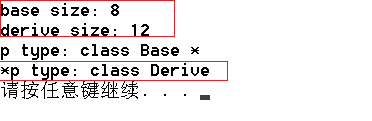

分析：当Base类中有虚函数时，不论是Base类还是Derive类，它们的大小都增加了4个字节。并且当Base* 指向Derive对象时，* Base的类型却变为Derive，不再和指针本身的类型相关，

**1.虚函数指针**

实际上，Base和Derive类增加的4个字节就是虚函数指针的大小，每一个类只要有虚函数（包括继承而来的），它就有且只有一个虚函数指针。类的大小就是总的成员变量的大小加上一个虚函数指针的大小。虚函数指针指向的是一张虚表，里面是这个类所有虚函数的地址，一个类对应一张虚函数表，而虚函数指针存在于每一个对象中，并且永远占据对线内存的前四个字节。

以下含有虚函数的Base类为例，下面是它的内存布局：
```c++
class Base
{
public:
	Base(int a = 1)
	{
		ma = a;
	}
	
	virtual void show()
	{
		cout << "base show 1" << endl;
	}
	
	virtual int getnum()
	{
		return ma;
	}
private:
	int ma;
}
```

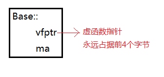

**2.虚函数表**

虚函数表又称为 ”虚表“， 它在编译期间就已经确定，在程序运行时就会呗装载到只读数据段，在整个程序运行期间都会一直存在。一个类实例化的多个对象，它们的虚函数指针指向的是同一个表。

以上Base类中虚函数指针vfptr指向的虚函数表---vftable如下所示：


**3.虚表的合并**
Base类的派生类Derive类定义：

```c++
class Derive : public Base
{
public:
	Derive(int b = 2):Base(b)
	{
		mb = b;
	}
	
	void show()
	{
		cout << "derive show 1" << endl;
	}
	
	virtual int getval()
	{
		return mb;
	}

private:
	int mb;
}
```
上面已经给出了Base类的内存布局，以下是仿照其画出的Derive类的内存布局：

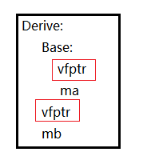

实际上，Derive类的内存布局并不是这样，前面明确提到 ” 只要有虚函数，就一定有且只有一个虚函数指针“ ， 那么派生类中只能有一个虚函数指针，又根据 “ 虚函数指针永远占据对象的前四个字节 ” 原则，那么正确的内存布局见下：

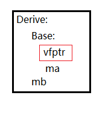

相应地，派生类地虚函数表也有变化。如果派生类中实现了同名覆盖函数，则派生类虚表中同名覆盖函数地地址会将基类该同名地地址覆盖。派生类中如果没有实现覆盖，则里面的同名函数地址还是基类方法的地址。Derive类中对show方法实现了同名方法覆盖，则它的虚函数表为：

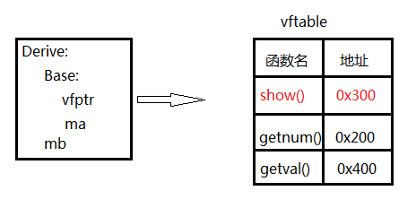

**4.那些方法不能实现为虚函数？**

成员函数能实现为虚函数需要满足两个前提条件：1.成员方法能取地址  2.成员方法依赖于对像。
第一点毋庸置疑，虚函数表中需要存储虚函数的地址。第二点，通过虚函数指针来找到虚函数表从而调用其中的方法，而虚函数指针又存在于对像中，所以这就意味着虚函数的调用需要依赖对象。

那么，我们可以确定一些不能实现为虚函数的方法：
1. 构造函数---构造函数就是用来创建对象的，如何将其实现为虚函数，使其依赖一个对象调用？
2. inline函数---内联函数直接在调用点展开，不能取地址
3. static方法---静态方法是属于整个类的，不依赖与单个对象。

**5.静态绑定和动态绑定**

在编译期就确定调用具体方法从而执行特定的函数代码称为 “静态绑定” ，  在运行期才确定下调用那个方法称为 “动态绑定”。实现“静态绑定”的机制有：函数重载、模板。而实现“动态绑定”的机制是虚函数。

当方法没有实现为virtual时，在编译期就可以根据对象的类型、指针的类型来确定调用那个方法，当实现为virtual时，就得在运行时通过对象中的虚函数指针，找到相应的虚函数表，得到方法地址，才能确定调用的是哪个方法，这时通过指针调用就和指针的类型无关。

Base类中实现了虚函数，Base* 指向Derive对象时， * Base的类型变为Derive，这里就涉及到虚表中的内容---RTTI。

**5.1. 虚表的结构**

以下是虚表的具体结构：

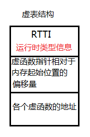

RTTI又称为 “运行时多态” ， 当基类中实现了虚函数时，基类指针指向派生类对象时，打印 * 指针 类型得到的会是派生类类型。得到的 * 指针 类型其实是派生类的虚函数表中的RTTI内容。

**5.2 动态绑定（运行时多态）**

“运行时多态” 和指针、引用调用方法相关，前提是该方法是虚函数。用基类指针指向基类对象，基类指针指向派生类对象和派生类指针指向派生类对象（引用同理），通过该指针或引用调用虚函数时，会发生多态---访问指针指向对象的虚函数表，找到对应方法的地址，最后调用。用对象本身去调用方法（包括虚函数）时不会发生多态。

```c++
#include <iostream>
#include <typeinfo>
using namespace std;

class Base
{
public:
		Base(int a = 1)
		{
			ma = a;
		}
		
		virtual void show()
		{
			cout << "base show 1" << endl;
		}
		
		virtual int getnum()
		{
			return ma;
		}
private:
		int ma;
}

class Derive : public Base
{
public:
		Derive(int b = 2) : Base(b)
		{
			mb = b;
		}
		
		void show()
		{
			cout << "derive show 1" << endl;
		}
		
		virtual int getval()
		{
			return mb;
		}

private:
		int mb;
}

int main()
{
	Base b;
	Derive d;
	
	Base* p = &d;
	
	cout << "*p type: " << typeid(*p).name() << endl;
	p->show();
	return 0;
}
```

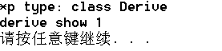

**6.抽象类和纯虚函数**

纯虚函数没有具体的实现，含有纯虚函数的类称为 “抽象类” 。 抽象类不能实例化对象，只能作为基类，派生类可以继承抽象类，对抽象类中的纯虚函数实现函数重写覆盖。

**7.析构函数之虚函数**

前面我们探讨了哪些不能实现虚函数的情况，析构函数是可以的。那么什么时候应该将析构函数实现为虚函数尼？答案是：当基类指针指向堆上开辟的派生类对象时。

```c++
class Base
{
public:
	Base(int a = 1)
	{
		ma = a;
		cout<<"Base"<<endl;		
	}

	virtual ~Base()
	{
		cout<<"~Base"<<endl;
	}

private:
	int ma;
};

class Derive : public Base
{
public:
	Derive(int b = 2):Base(b)
	{
		mb = b;
		cout<<"Derive"<<endl;
	}

	~Derive()
	{
		cout<<"~Derive"<<endl;
	}

private:
	int mb;
};

int main()
{
	Base* p = new Derive(2);
	delete p;
	return 0;
}
```

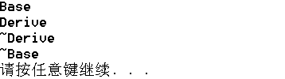


**8.派生类中有虚函数指针，基类中没有虚函数指针时，使基类指针指向派生类对象（new），delete基类指针时引发的一系列问题**

```c++
class Base
{
public:
	Base(int a = 1)
	{
		ma = a;
		cout<<"Base"<<endl;		
	}

	~Base()
	{
		cout<<"~Base"<<endl;
	}

private:
	int ma;
};

class Derive : public Base
{
public:
	Derive(int b = 2):Base(b)
	{
		mb = b;
		cout<<"Derive"<<endl;
	}

	~Derive()
	{
		cout<<"~Derive"<<endl;
	}

private:
	int mb;
};

int main()
{
	Base* p = new Derive(2);
	delete p;
	return 0;
}
```

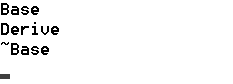

new返回给基类的指针并不是派生类对象的起始地址，而是派生类对象中基类成员开始的地址，最后delete基类指针时的地址 != 派生类对象的起始地址（new是从哪里开始分配内存的，就从哪里开始回收delete），因而析构派生类部分时出错。

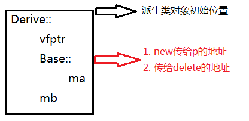

因此，应避免这种情况，一定要将基类中的析构函数实现为虚函数，基类中也存在虚函数表，之后delete时就会发生析构函数的动多态，正确释放空间

**9.虚函数表的写入时间**

在编译期间，虚函数表中已经将虚函数的地址写好，并把虚函数表的地址写到对象虚函数指针当中
例如以下：

```c++
class Base
{
public:
	Base(int a) : ma(a)
	{
		clear();
	}
	
	virtual ~Base() {}
	
	void clear()
	{
		memset(this, 0, sizeof(*this));
	}
	
	virtual void show()
	{
		cout << "Base:: " << ma << endl;
	}
	
private:
	int mb;
};

int main()
{
	Base* p = new Base(10);
	p->show();
	delete p;
	
	return 0;
}
```

执行结果如下：


执行p->show()时出错了？因为发生运行时多态时，clear()将基类对象整个内存都置为0，此时基类的虚函数指针存储的是0x00000000，虚表找不到，则show()函数的地址也找不到，调用出错！

那么，下面的代码可以执行成功吗？

```c++
class Base
{
public:
	Base(int a) : ma(a)
	{
		clear();
	}
	
	virtual ~Base() {}
	
	void clear()
	{
		memset(this, 0, sizeof(*this));
	}
	
	virtual void show()
	{
		cout << "Base:: " << ma << endl;
	}
	
private:

	int ma;
};

class Derive : public Base
{
public:
	Derive(int b) : Base(b),mb(b)
	{}
	
	~Derive(){}
	
	void show()
	{
		cout << "Derive:: " << mb << endl;
	}
	
private:
	int mb;
};

int main()
{
	Base* p = new Derive(10);
	p->show();
	delete p;
	
	return 0;
}
```

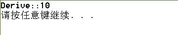

为什么这下就执行成功了呢？不是已经把虚函数指针置零了吗？

派生类对象的构造过程是怎么的？先构造基类部分在构造派生类部分。在构造基类部分时，会将虚函数指针和虚表都初始化好，在这里构造完之后就紧接着clear()置零了，但是后续还要构造派生类部分！这个过程会重写虚函数指针，指针指向了Derive类对应的虚函数表，虚函数指针值由“0x00000000”改变成一个有效值。既然派生类对象中有一个有效的虚函数指针，那么p->show()当然就能成功。

**10. 静态绑定和动态绑定的时间**

我们已经明确地知道：静态绑定发生在编译阶段，动态绑定发生在运行阶段。

**10.1 构造函数和析构函数中能不能实现动多态**

在之前地讨论中我们确定了构造函数本身是不能写成虚函数的，而析构函数必要时需要实现为虚函数。那么在他们的函数体中能否实现多态，调用虚函数呢？

```c++
class Base
{
public:
	Base(int a):ma(a)
	{
		show();
	}

	virtual ~Base()
	{}

	virtual void show()
	{
		cout<<"Base::"<<ma<<endl;
	}

private:	
	int ma;
};

 
class Derive : public Base
{
public:
	Derive(int b):Base(b),mb(b)
	{
		show();
	}

	~Derive(){}

	void show()
	{
		cout<<"Derive::"<<mb<<endl;
	}
private:
	int mb;
};

int main()
{
	Base* p = new Derive(10);
	delete p;
	return 0;
}
```

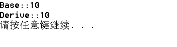

结果执行成功，发生动多态了？让我们来看看对应的汇编代码吧。


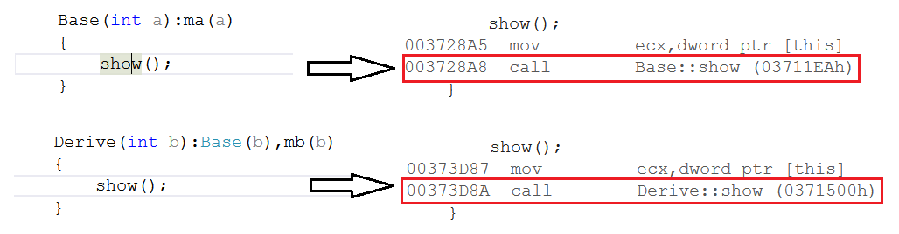

不论是基类部分的show()还是派生类的show()，汇编代码对应的都是“call 函数地址”，这是静态绑定，这在编译期间就已经确定了具体调用的函数。那么，发生动多态的汇编代码又是什么样呢？

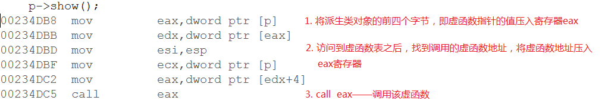


所以我们可以确定，静态绑定对应的汇编代码总是“call 一个确切函数地址”，动态绑定对应的汇编代码“call eax”，eax寄存器中的值是不确定的，只有在运行时才会确定下来。析构函数中调用虚函数同样也不会发生动多态，只是静多态。    

既然我们已经知道构造函数和析构函数中实现的是静多态，
那么为什么不能实现动多态呢？1. 虚函数实现的前提是——函数依赖于对象，构造函数就是来构造一个新对象的，
如何实现动多态？ 2. 析构函数的调用依赖于对象，所以析构函数可以实现为虚函数。可是在执行析构函数时，这个对象就在逻辑意义上消失了，生存周期结束，在这之中调用虚函数也是无法依赖对象调用的。

**10.2 将子类中的虚方法放入private底下，通过基类指针调用该方法，编译能成功吗？**

```c++
class Base
{
public:
	Base(int a) : ma(a)
	{}
	
	virtual ~Base() {}
	
	virtual void show()
	{
		cout << "Base:: " << ma << endl;
	}
private:
	int ma;
};

class Derive : public Base
{
public:
	Derive(int b) : Base(b), mb(b)
	{}
	
	~Derive()
	{}
private:
	void show()
	{
		cout << "Derive:: " << mb << endl;
	}
	int mb;
};

int main()
{
	Base* p = new Derive(10);
	p->show();
	
	delete p;
	return 0;
}
```

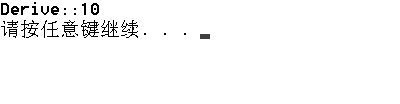

编译、运行都通过了，为什么呢？

编译阶段，访问限定符public、protected和private发挥着作用，控制着外界对类成员的访问。p是一个Base* 类型，因此p只能看到Base类中的成员，即Base::show()，而它的访问限定符为public——外界可访问，因此编译阶段可以通过。到了运行阶段后，因为基类中的show()是一个虚函数，所以发生动多态，最后执行的show()方法就是派生类的show方法。

注意：
1. 在派生类中，只要实现了和基类虚方法同函数头的函数，不论它之前的限定符是何种，它和基类同名虚函数的关系都叫做“覆盖”。
2. 运行期期间，限定符不发挥作用，因为找到虚函数表中对应的虚函数地址后，直接“call 函数地址”。

**10.3 将基类虚函数放入protected或private中， 利用基类指针调用该方法，编译能通过吗？**

```c++
class Base
{
public:
	Base(int a):ma(a){}
	virtual ~Base(){}	

protected:
	virtual void show()
	{
		cout<<"Base::"<<ma<<endl;
	}
	int ma;
};

class Derive : public Base
{
public:

	Derive(int b):Base(b),mb(b){}
	~Derive(){}
	void show()
	{
		cout<<"Derive::"<<mb<<endl;
	}

private:
	int mb;
};

int main()
{
	Base* p = new Derive(10);
	p->show();
	delete p;
	return 0;
}

```

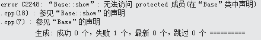

编译不能通过。就如10.3中所说，编译阶段访问限定符发挥着作用。Base类中的show()的限定符为protected，这意味着对外界不可见，只有本身和子类可以访问，Base::show()对Base* p不可见，因此编译错误。


**10.4 当基类虚函数带有默认值，派生类同名虚函数也带有不同默认值时，通过基类指针调用派生类该方法时，默认值究竟是哪个？**

```c++
class Base{
public: 
	Base(int a):ma(a) {}
	
	virtual ~Base() {}
	
	virtual void show(int a = 30) {
		cout << "Base:: " << a << endl;
	}
	
private:
	int ma;
};

class Derive : public Base
{
public:
	Derive(int b) : Base(b), mb(b) {}
	~Derive() {}
	void show(int b = 80)
	{
		cout << "Derive:: " << b << endl;
	}
private:
	int mb;
};

int main()
{
	Base* p = new Derive(10);
	p->show();
	
	delete p;
	return 0;
}
```

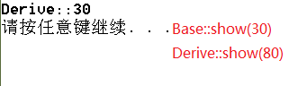

最后得知，Derive::show()中的默认值变为了基类同名方法的默认值，为什么呢？   

因为，在编译阶段，调用函数之前需要压参数，参数有默认值的话，压入的就是确切的值。,main函数中 Base*-->Derive::show()，此时在产生的汇编代码中，压入的参数就是Base::show()中的默认值30，在运行阶段发生多态调用Derive中的方法，执行的还是这段汇编代码，即得到的默认值还是30。    

总的来说，在编译期间，函数默认值、是否可调用该函数、虚函数指针和虚表的内容都可以确定下来。
