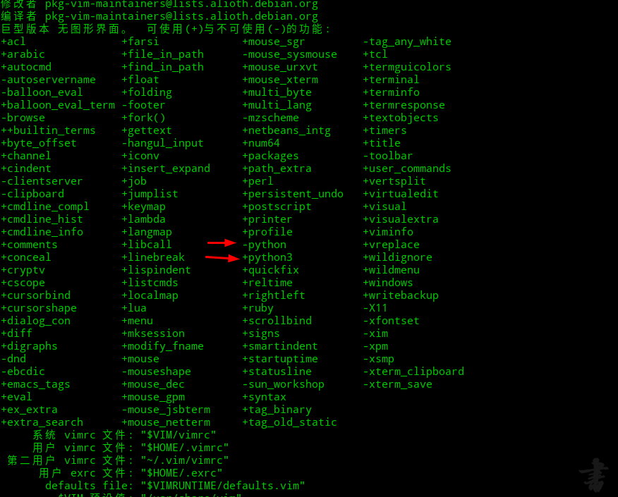
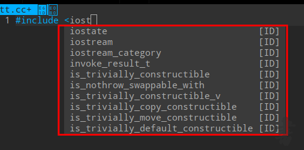

#### 首先python3环境支持

在终端中输入 vim --version 查看是否支持 python，如果看到 +python，请关闭本页面；看到 -python 相信你苦恼多时了，往下看吧！


预装了Python 3和Python 2。 为确保是最新版本，用apt-get更新和升级系统：
``` 
$ sudo apt-get update
$ sudo apt-get -y upgrade
```

一旦过程完成，键入以下内容检查系统中安装的Python 3的版本：
``` 
$ python3 --version
```

以上是本机上没有python3 需要做的步骤，之后最简单的办法就是删除vim
``` 
$ sudo apt remove vim
```

不要使用以下命令安装VIM： 
```sudo apt install vim```
。使用此命令安装的VIM缺少对于Python中的支持，很多的Python编写的插件都无法使用，此前我就在这里被卡死了所以你需要使用源码编译来安装VIM，或者你也可以和我一样使用以下命令来安装：
```sudo apt install vim-nox```

这样就完成了python3的支持了

#### 插件安装
这里我安装的是vimplus
https://www.cnblogs.com/highway-9/p/5984285.html

bedian的三板斧：
```
git clone https://github.com/chxuan/vimplus.git ~/.vimplus
cd ~/.vimplus
./install.sh
```
当然这个安装完之后，它会在YouCompleteMe卡住，原因就是国内无法直接访问国外的ip。
1.首先先获取 YouCompleteMe 的代码
```
#如果你没有更改上面的代码其实你可以在plugged里面看见你所安装的插件

$ cd ~/.vim/plugged/YouCompleteMe
$ git submodule update --init --recursive


#这里安装子模块会出现
fatal: unable to access 'https://go.googlesource.com/tools/': Failed to connect to go.googlesource.com port 443: 连接超时
fatal: 无法克隆 'https://go.googlesource.com/tools' 到子模组路径 '/home/zyj/.vim/bundle/YouCompleteMe/third_party/ycmd/third_party/go/src/golang.org/x/tools'

我们安装YouCompleteMe不能一键安装原因就是在这里，不能访问国外ip，这时候根据后面的路径：
/home/zyj/.vim/bundle/YouCompleteMe/third_party/ycmd/third_party/go/src/golang.org/x/tools
来知道该模块是要放这个路径下的到 github 上找到该模块下载到该路径

$ cd ~/.vim/plugged/YouCompleteMe/third_party/ycmd/third_party/go/src/golang.org/x
$ git clone https://github.com/golang/tools.git

回到 YouComplateMe 目录继续安装其他子模块

$ cd ~/.vim/plugged/YouCompleteMe
$ git submodule update --init --recursive

去用户主目录（也可以自己选）

$ cd ~

创建一个目录用来存放接下来要编译的代码的目录
$ mkdir ~/.ycm_build
$ cd ~/.ycm_build

$ cmake -G "Unix Makefiles" . ~/.vim/bundle/YouCompleteMe/third_party/ycmd/cpp
$ sudo apt install llvm-3.9 clang-3.9 libclang-3.9-dev libboost-all-dev

如果你不是 window 系统，可以将 --config Release 去掉
$ cmake --build . --target ycm_core --config Release

随后讲编译后文件放到你想要放入的目录
$ cp ~/.vim/plugged/YouCompleteMe/third_party/ycmd/examples/.ycm_extra_conf.py ~/.vim/

随后在将 python 和 写入到 ~/.vimrc 中，在文件中位置你随意就好
let g:ycm_server_python_interpreter='/usr/bin/python'
let g:ycm_global_ycm_extra_conf='~/.vim/.ycm_extra_conf.py'


然后尝试写个文件吧
vim hello.c

# 报了如下错误，但是按任意键后依然进入编辑器了，但是 ycm 并不生效
YouCompleteMe unavailable: requires Vim compiled with Python (2.7.1+ or 3.4+) support.
YouCompleteMe unavailable: unable to load Python.

$ sudo apt install vim-gtk 
问题就解决了
```

