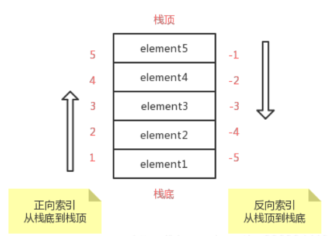
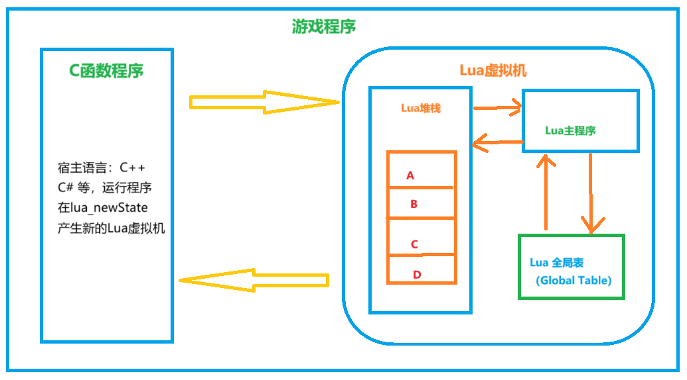
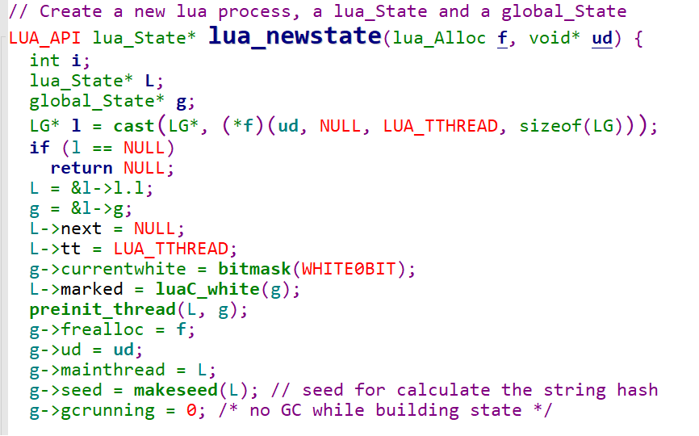
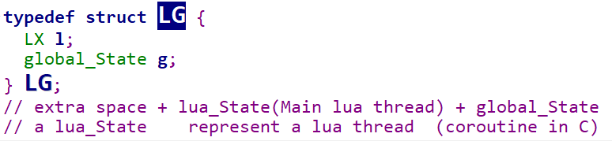
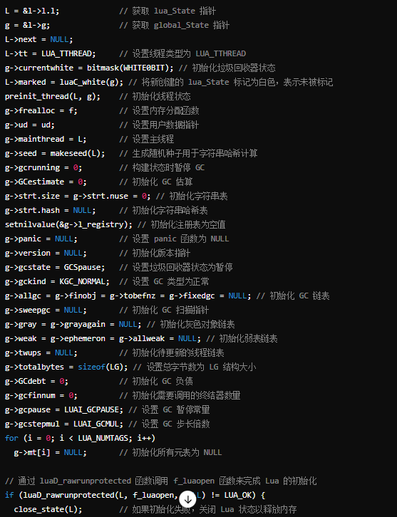
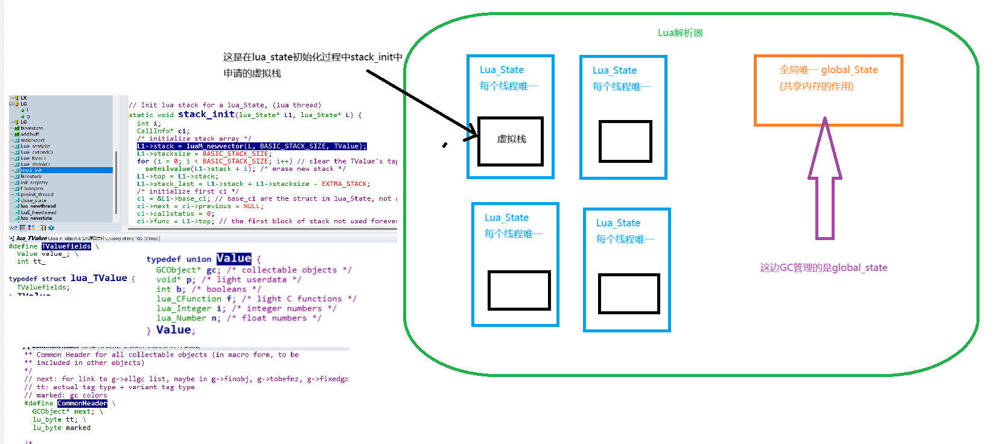

Lua语言本身是用C语言来编写的虚拟机。当初设计Lua的目的就是想让Lua成为一个很容易嵌入其他语言中使用的语言。现有很多应用程序使用Lua作为自己嵌入式脚本语言，以此实现扩展后期热更。

----------

Lua的特性：它是一门轻量级语言，它的官方版本只包括一个精简的核心和最基本的库。源码是开源的，把源码编译之后仅仅一百多K，可以很方便的嵌入别的程序里。Lua同时也易于扩展，由宿主语言(通常是C或C++，但是也有一些列第三方扩展让他在游戏中发光发热)开发和提供一些功能，Lua可以很容易的使用它们。

## Lua与其他宿主语言交互的桥梁-栈

Lua 中，对虚拟栈提供正向索引和反向索引两种索引方式，区别是：<strong>正数索引 1 代表栈底，负数索引 -1 永远表示栈顶。重要！后面所有的交互，都是基于Lua的虚拟栈来</strong>

**Lua与其他宿主语言的交互，是通过C语言实现的虚拟栈来实现交互的**。Lua 在 C 函数和脚本函数之间创建了一钟虚拟栈的结构，栈的元素代表一个Lua的值(table，string，nil等等8种基本类型)。Lua提供了一系列C API用于操作栈，比如将元素入栈，出栈，删除等等。在调用这些API之前，通常都需要将必须的值压入栈，在API调用结束后，再把结果从栈种取出。

## C++ 调用Lua函数

## Lua 源码分析

**Lua_newState : 函数在Lua C API 中用于创建一个新的 Lua 状态。它主要负责初始化 Lua 解释器的各种数据结构，并为 Lua 运行时环境分配内存。** 

>LG* l = cast(LG*, (*f)(ud, NULL, LUA_TTHREAD, sizeof(LG))); 
这句代码的作用是利用自定义的内存分配函数为 Lua 的全局状态和 Lua 状态分配内存，并将结果强制转换为指向‘LG’结构体的指针。

**1. 内存分配函数调用（"（\*f）"）**：\*f  是一个指向内存分配函数的指针，其类型为 ‘lua_Alloc’。这个函数用于管理 Lua 运行时的内存分配。(\*f)(ud, NULL, LUA_TTHREAD, sizeof(LG)) 调用了这个分配函数。
**2. 内存分配函数参数解析**：‘ud’用户数据指针，传递给分配函数。通常用于提供上下文信息，或是在内存管理时使用。第二个参数用‘NULL’是旧内存块的指针，当这个指针为NULL时表示这是一次新内存分配，而不是调整已有内存块的大小。第三个参数 ‘Lua_TTHREAD’告诉分配函数分配的是一个 Lua 线程类型的对象。第四个参数‘sizeof(LG)’为要分配的内存大小。LG 是一个组合结构体，包含了 ‘lua_State’和 ‘global_State’,即它将 Lua 状态和全局状态封装在一起。
**3. 强制类型转换**：‘cast(LG*, ...)’是一个宏定义，通常用来将一个指针类型强制转换为目标类型的指针。在这段代码中，它将分配函数返回的通用指针 （‘void*’）转换为 ‘LG*’类型的指针。
<strong>作用总结：</strong>这句代码的作用是通过Lua自定义的内存分配器为整个Lua解析器状态（包括全局状态和主线程状态）分配所需的内存，并将这个内存块转换为‘LG’类型的指针。这样做是为了初始化 Lua 解释器的主要数据结构，使其可以运行。LG 包含了 Lua 的全局状态 (global_State) 和主线程的 Lua 状态 (lua_State)，是 Lua 状态初始化的核心。

### Lua_State 和 global_State 两个核心数据结构在 Lua 扮演的角色和用途。

首先lua_state是lua中的一个结构体，表示一个Lua线程的状态。每个Lua线程（包括主线程和携程）都有一个独立的‘lua_state’。它主要用于存储与Lua线程相关的信息，包括：
- <b>Lua 栈：</b>管理Lua的操作栈，这是函数调用，表达式计算等的工作区域。
- <b>当前执行的函数</b>：当前正在执行的Lua函数信息。
- <b>状态信息</b>：包括线程的运行状态（例如运行，挂起，错误等）。
- <b>全局状态之争</b>：指向‘global_State’的指针，用于访问全局的Lua运行环境。
- <b>错误处理</b>：包含错误处理的栈和回调函数。

‘Lua_State’是 Lua解析器操作的核心，每个线程都有自己独立的‘Lua_State’，从而实现线程间的隔离。
其次来看看‘global_State’是一个结构体，用于表示Lua解释器的全局状态。所有‘Lua_State’都共享同一个‘global_State’，它包含了整个Lua解释器的全局数据和设置。包括：
-  <b>内存管理器</b>：包括垃圾回收器的状态和配置，内存分配函数等。
-  <b>字符串表</b>：用于管理所有Lua字符串的唯一性和内存。
-  <b>全局变量表</b>：存储全局变量的表和注册表。
-  <b>元表</b>：所有基础类型的元表，如数字，字符串，表的元表等。
-  <b>主线程</b>：指向Lua的主线程的‘lua_state’。
-  <b>随机种子</b>：用于字符串哈希和其他需要随机性的场景。
-  <b>错误处理</b>：包含错误处理函数（‘panic’函数），在严重错误时调用。

**二者的关系**：‘lua_state’和‘global_state’是相互连接的：每个‘lua_state’中都有一个指向‘global_state’的指针，以便访问全局资源；同时，‘global_state’包含一个指向主线程的‘lua_state’指针。（线程隔离）虽然每个‘lua_state’是独立的，但是它们共享同一个‘global_state’，实现了全局资源的共享，例如全局变量，垃圾回收器等。

### 总结：
- ‘lua_state’用于表示每个 Lua 线程的状态，包括栈，当前执行的函数等。
- ‘global_state’用于表示整个Lua解释器的全局环境，包括内存管理，全局变量，字符串表等。
-    通过‘lua_state’的‘global_state’指针，可以实现各线程对全局资源的访问和管理。

我们从上面解析看出来GCObject 是GC缓存区。是Lua内部用于实现垃圾回收的一个核心结构体。它是一个通用的对象类型，用于表示Lua解释器中所有需要垃圾回收的对象。GCObject结构体本身并不存储对象的具体数据，而是作为一个统一的接口用于链接和标识各种类型的对象。