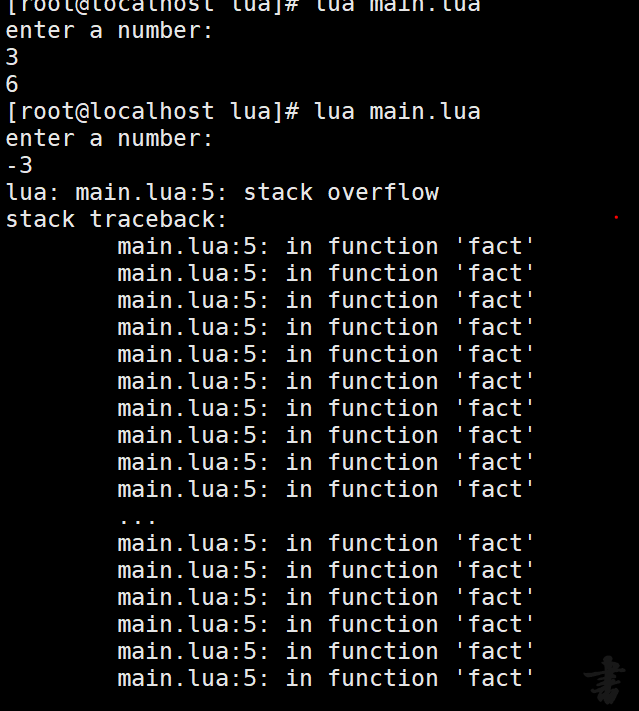
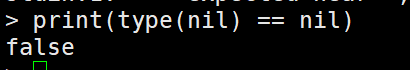
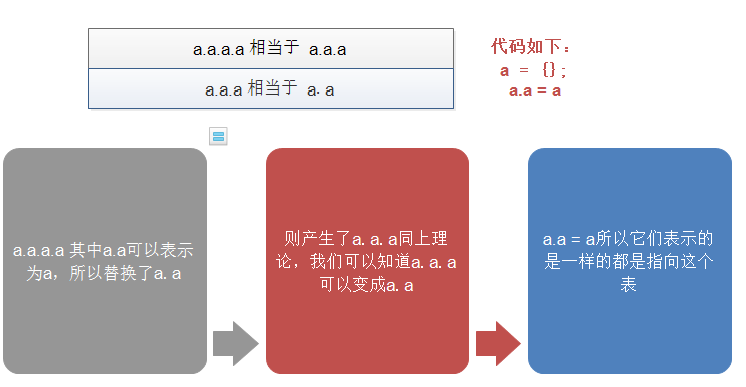
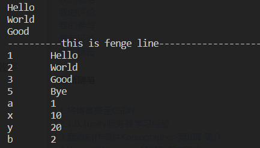

### 第一章lua语言入门
**1.1：运行阶乘的示例并观察，如果输入负数，程序会出现什么问题？修改代码解决问题**
```
function fact (n)
  if n == 0 then
    return 1
  else
    return n * fact(n-1)
  end
end

print("enter a number:");
a = io.read("*n");
print(fact(a));
```



 <font style="background-color:yellowgreen;font-weight:bold;color:red">我们可以看到stack overflow：意思就是栈溢出。再看程序它是当等于0停止，但是已开始我们给的是个负数这就导致我们不断的减是逐渐远离终止条件的。</font>
 修改建议::
 > n == 0 || n >= 0

---

**1.5：表达式type(nil)==nil的值是什么？解释原因**



<font style="">
type函数返回的是一个字符串类型nil与空值nil，首先类型都不相同。所有输出了false
</font>

**1.6：除了使用函数type外，如何检查一个值是否为Boolean类型**

> if value == true or value == false then print("Boolean") end

因为bool类型只有两个值，我们穷举一下就可以了

**1.8：请编写一个可以打印出脚本自身名称的程序**
> [root@localhost lua]# cat judge.lua 
> print(arg[0]);


----

### 第二章：八皇后问题

---
### 第四章：字符串

**4.1:如何在lua程序中使用如下XML片段**
<font style="">
这里[[]]会和内容中的双括号冲突，我们可以修改为[==[]==]让其匹配多行，当然中间的等号数量可以自己定
</font>
```
local s = [==[
    <![CDATA[
        Hello world
    ]]
]==]
local str = "<![CDATA[\n\tHello world\n]]"

print(s)
print(str)
```

**4.3:编写一个函数，使之实现在某个字符串的指定位置插入另一个字符串"**
```
function myInsert(s, i, ts)
    s1=""
    s2=""
    if i>1 then
        s1=string.sub( s, 1, i )
    end
    s2=string.sub( s, i+1, -1 )
    return s1..ts..s2
end

print(myInsert("hello world", 5, "start:"))
```

**4.5编写一个函数，该函数用于移除指定字符串中的一部分**
```
function myRemove(s, i, rn)
    s1 = string.sub( s, 1, i-1 )
    s2 = string.sub( s, i+rn, -1 )
    return s1..s2
end

print(myRemove("hello world", 1, 4))
```

**4.7：编写一个函数判断指定的字符串是否为回文字符串:**
```
function myispali(str)
    s1 = string.reverse( str )
    return s1 == str
end

print(myispali("step on no pets"))
print(myispali("banana"))
```

### 第五章：表
**5.1:下列代码输出是什么？为什么？**
> sunday = "monday";
monday = "sunday";
t = {sunday = "monday", [sunday] = monday};
print(t.sunday, t[sunday], t[t.sunday]);

运行结果为：monday	sunday	sunday：<font style="background"></font>

**5.2：如下代码： a = {}; a.a = a : a.a.a.a 的值是什么？**
是一样的，都是指向这个表：类似如图过程::

如果给a.a.a.a赋值会产生一个错误，原有是因为3是number类型而非表

**5.4: 在lua语言中，我们可以使用由系数组成的列表{a0, a1, .... , an}来表达多项式
```lua
function ans_s(t,x)
    local sp = t[1];
    for i=2,#t do
        sp = sp + t[i] * x^(i-1)
    end
    return sp;
end

// 没有使用指数运算
function ans_s( t, x )
    local sp = t[1];
    local dp = x;
    for i = 2,#t do
        sp = sp + t[1]*dp;
        dp = dp * x;
    end
    return sp;
end
```

**5.6: 编写一个函数，该函数测试指定的表是否为有效的序列**
判断一个表是否是序列使用ipairs和pairs判断。当ipairs遇到nil就会停止，而且它会跳过价值对顺序输出table中的值。pairs除了值为nil的不输出，剩下都输出，没有键的数字补
```lua
local a = {"Hello", "World", a = 1, b = 2, x = 10, y = 20, "Good", nil, "Bye"}
for i,v in ipairs(a) do
    print(v)
end
print("----------".."俺是分割线".."-------------------")
for k,v in pairs(a) do
    print(k,v)
end
```

所以当这两个输出的值都相同则是序列或者循环的次数
```
function ispair( t )
    local x,y;
    for i in pairs(t) do
        x = i;
    end
    print(x);
    for i in ipairs(t) do
        y = i;
    end
    print(y);
    if x ~= y then
        return false;
    else
        return true;
    end
end
```
**5.7 编写一个函数，该函数将指定列表的所有元素插入到另一个列表的指定位置。**
> 因为在lua5.1 中没有move函数则使用两个版本
```lua
-- 5.1版本：
function movetable(t1,t2,n)
    t3 = {};
    for i = 1,n do
        table.insert( t3,t2[i] );
    end
    for i in ipairs(t1) do
        table.insert( t3,t1[i] );
    end
    for i = n+1,#t2 do 
        table.insert( t3,t2[i] );
    end
    for i in ipairs(t3) do 
        print(t3[i]);
    end
end

movetable({1,2,9},{1,2,3},1);
-- 5.3版本：
function movetable(t1,t2,n)
  table.move(t1,1,#t1,n,t2)
  return t2
end
```

