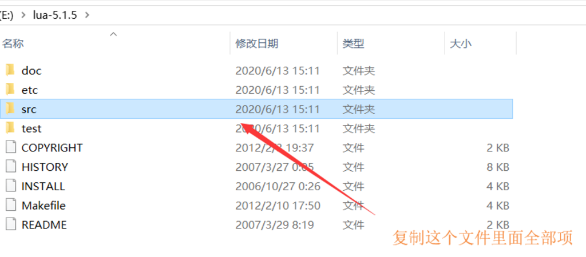
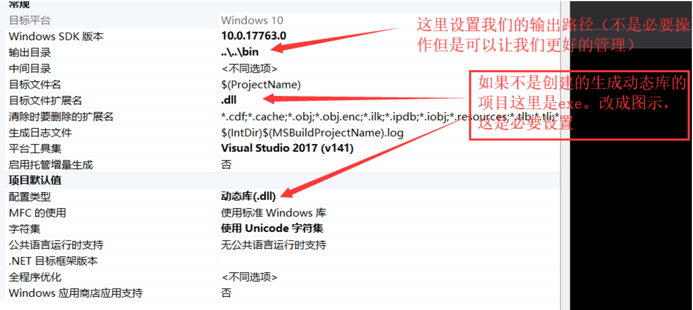
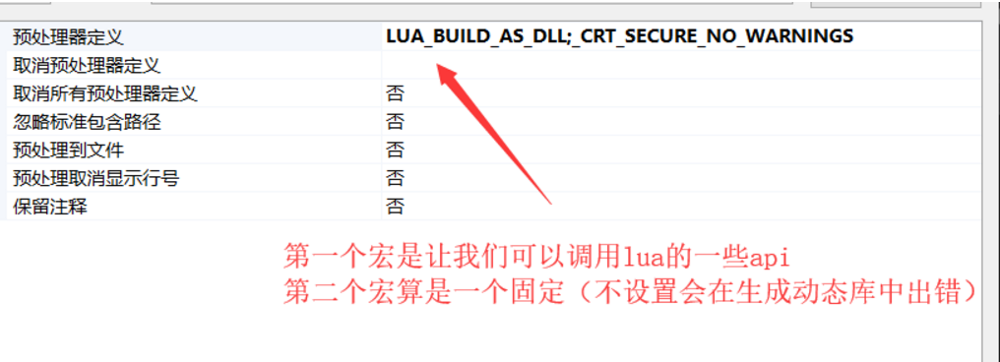
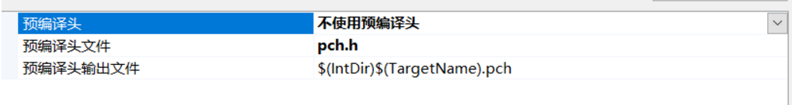
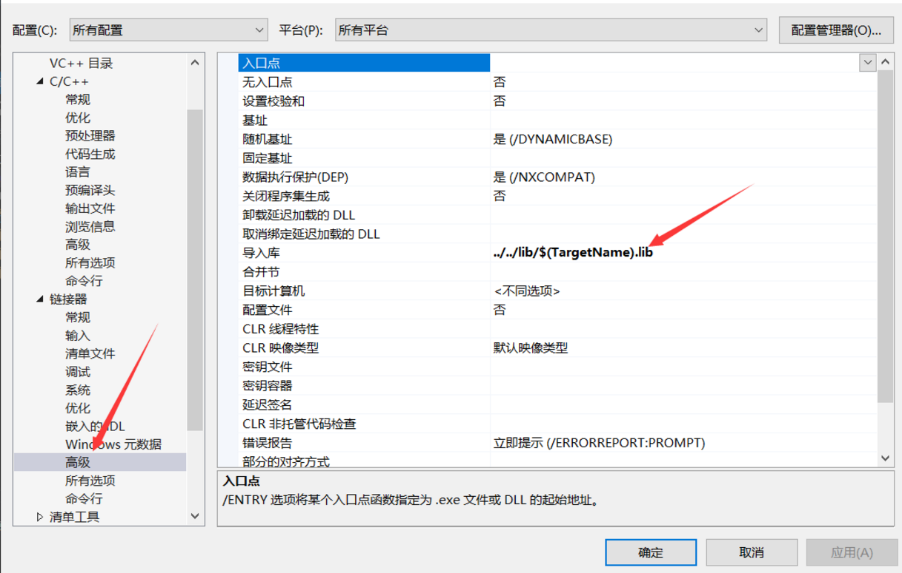
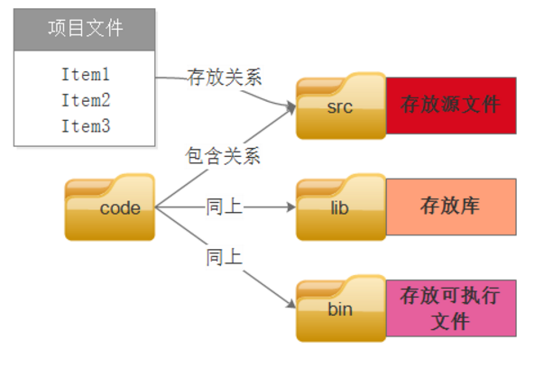
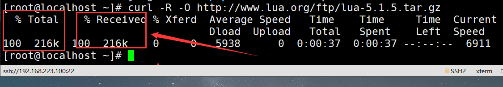
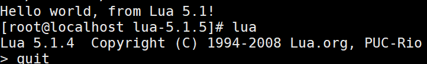
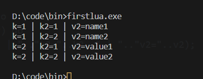
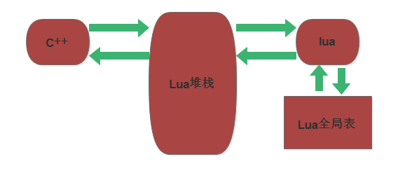

### 使用windows下vs2017 编写lua脚本环境部署

<font color="green">Lua编译：
- 编译Lua为动态库（不用静态库，如果在大型项目中静态库会重复编译，浪费C++编译速度）
- 编译Lua库，也是为了日后对它进行扩展
</font>

---

**Lua的编译步骤：**
<font color="red">
1. 首先需要到lua官网下载安装包，之后对其解压我们只需要复制src文件中的文件：（下载地址：http://www.lua.org/ftp/)

2. 在vs2017创建一个生成动态库的项目，把复制好的文件全部粘贴进去。
3. 设置项目属性的一些参数。

</font>

**常规属性设置**



**预处理属性设置**




**如果报一个没有pch.h的错误，就需要在这里属性-->c++-->预编译头：：设置为不使用预编译头**


**设置我们导入库的位置**


**这是文件之间的关系（就是当我们生成了动态库之后，我们创建项目应该在src目录下）**


---
**使用lua的时候在vs2017创建运行时堆栈**
```
extern "C"
{
#include <lua.h>
#include<lauxlib.h>
#include<lualib.h>
}


int main(int argc, char* argv[])
{
	lua_State *state = lua_open();
	luaopen_base(state);
	luaL_loadfile(state, "main.lua");
	lua_pcall(state, 0, 0, 0);
	getchar();
	return 0;
}
```

<font color="green">
lua最好使用local变量，全局变量不好控制。
</font>

```
-- 这是main.lua文件
print("hallo,world");
a = 10;
local b = 1;
print(a);
dofile("test.lua") //执行另一个文件

-- 这是test.lua文件
print("this is dofile state----")
print(b);
print(a);
print("this is dofile end---")
```
---

### 在linux下配置lua环境

> curl -R -O http://www.lua.org/ftp/lua-5.1.5.tar.gz

首先执行这个命令，可能出现curl18错误，我们需要在执行直到没有错误提示。<font face="微软雅黑">当上面两个括号的值都达到100就说明ok了</font>



> tar zxf lua-5.1.5.tar.gz 
> cd lua-5.1.5
> make linux test



> 练习表用的程序
```lua
local tab1 = {"001","002","003"}

function printList(tab1)
    for i,v in ipairs(tab1) do
        print("value=="..v);
    end
end

for i,v in ipairs(tab1) do
    print("value= "..v);
end
print("=====insert======");
table.insert( tab1,3,"002-2" );
for i,v in ipairs(tab1) do
    print("value="..v);
end
print("----insert back-----");
print("----insert back-----");
table.insert( tab1,"004" );
printList(tab1);
print("----remove-----");
table.remove( tab1,3 );
printList(tab1);

print("----remove back-----");
table.remove( tab1 );
printList(tab1);

local tab2 = {id=123, age=20}
tab2["name"] = "xiaoma";
for k,v in pairs(tab2) do
    print(k..":"..v);
end
```

> 当你需要删除属性，则把属性置为nil：
> 表中可以放许多元素的，包括number，string，函数和表，等一系列类型
```lua
local tab3 = {}
tab3[1] = {"name1","name2"};
tab3[2] = {"value1","value2"};

for k,v in pairs(tab3) do
    for k2,v2 in pairs(v) do
        print("k="..k.." | ".."k2="..k2.." | ".."v2="..v2);
    end
end
```


### 函数
```
function test()
    print("this is function")
end

test();

function test(p1)
    print("p1="..p1);
end

test(1123)

function test(...)
    local len = #arg;
    print(len);
    for i = 1,#arg do
        print(arg[i]);
    end
end

test(123,1,23,4,1);
```

### C++与lua交互
c++与lua交互是使用堆栈，


```
c++:
int CTest(lua_State * L) {
	printf("this C function");
	size_t len;
	const char* name = lua_tostring(L, 1,&len);
	int number = lua_tonumber(L, 2);
	bool judge = lua_toboolean(L, 3);
	printf("this is luafunction = %s\n:: number = %d\n::is = %d", name,number,judge);
	return 0;
}
lua_register(state, "CTest", CTest);

lua:

```