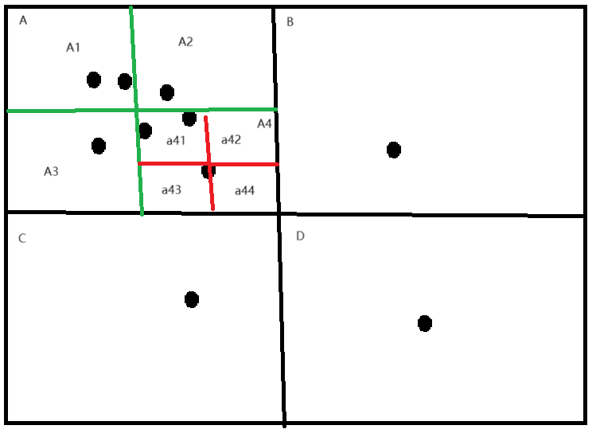
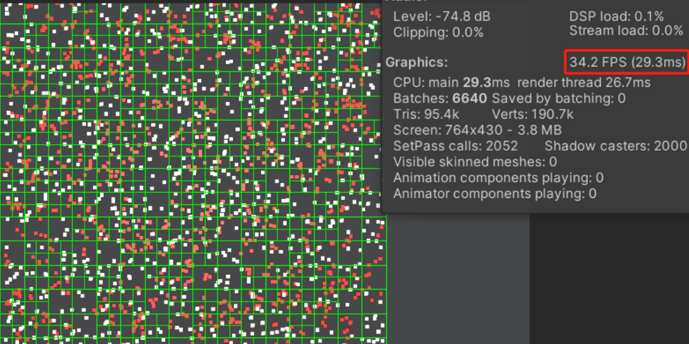

四叉树索引的基本思想是将地理空间递归划分为不同层次的树结构。它将已知范围的空间等分成四个相等的子空间，如此递归下去，直至树的层次到达一定深度或者满足某种要求后停止分裂（八叉树的情况类似只是在游戏方面四叉树用于2D，八叉树用于3D）

----------


这里我们应该可以看出来 **四叉树** 是一种用于空间分割的树形数据结构，特别适用于二维空间问题。它通过递归地将空间分成四个象限来组织数据，主要解决一下问题：
1. **高效的空间分割**：四叉树可以将二维空间（如平面或地图）分割成更小的区域，从而帮助在大规模数据集中进行更快速的查询和更新。
2. **快速的范围查询**：在需要找出一个区域内的所有点或对象时，四叉树能显著减少需要检查的对象数量，因为它只需要检查与查询区域相关的节点，而不是整个空间中的所有节点。
3. **碰撞检测**：在游戏开发或仿真中，四叉树可以用于检测物体之间的碰撞。它通过递归分区减少了需要检查的对象对数，从而加快了碰撞检测的速度。
4. **图像处理**：四叉树在图像处理中被用来表示图像中的稀疏数据或不同分辨率的数据，这对于图像压缩和区域填充等应用非常有用（在游戏里还有相机渲染）。
5. **数据简化**：在地理信息系统（GIS）中，四叉树可以用于表示地理数据并进行数据简化。例如，可以使用四叉树来简化地图的呈现，使其在不同的缩放级别下高效地加载和显示。

---

## 代码实现

```
// 节点结构（二维空间x,y模拟坐标）
struct Point {
    double x, y;
    Point(double _x, double _y) : x(_x), y(_y) {}
};

// 四叉树节点类
class QuadTreeNode
{
private:
    // 这个节点范围
    struct Boundary{
        double x,y,width,height;
    };
    Boundary _boundary;
    // 这个节点范围有多少个点
    std::vector<Point> _points;
    bool _subdivided;
    int _depth;
    static const int CapaCity = 4;  // 每个节点可容纳的最大点数

    // 细分四叉树 子范围
    std::vector<std::unique_ptr<QuadTreeNode>> _children;

    // 检查点是否在当前节点的边界内
    bool contains(Point point) {
        return (_boundary.x <= point.x && point.x < _boundary.x + _boundary.width && 
        _boundary.y <= point.y && point.y < _boundary.y + _boundary.height);
    }

    // 检查查询范围是否与当前节点的边界相交
    bool intersects(double x, double y, double width, double height) {
        return !(_boundary.x + _boundary.width <= x || _boundary.x >= x + width || _boundary.y + _boundary.height <= y || _boundary.y >= y + height);
    }


    // 细分当前节点
    void subdivide() {
    }
    
public:
    QuadTreeNode(double x, double y, double width, double height, int depth);
    ~QuadTreeNode();
    // 插入操作
    bool insert(Point point);
    // 删除操作
    bool remove(Point point);
    // 查询范围内的点
    std::vector<Point> queryRange(double x, double y, double width, double height);
};
```
## 四叉树相关应用—碰撞检测（用于过滤检测对象的空间划分算法）
如果我们直接对所有的方块检测是否发生碰撞，那么算法的时间复杂度将会是N。其中我们也可以发现在暴力中做了太多多余的检查，如果能提前过滤一些明显不可能发生与我们碰撞的方块就可以了。这里面的思路：就是将空间按网格分块，只对有可能发生碰撞的网格内的方块进行碰撞检测。而网格划分又会导致过多的内存浪费，因为在实际情况下我们的点分布不会满足均匀分布，这时候我们利用四叉树的思想就可以根据那块密集那块细致切分。

