内存是程序运行的重要物质基础。如何在有限的内存空间运行较大的应用程序，曾是困扰人们的一个难题。为了解决这个问题，其中最成功的当属虚拟内存技术。

#### 虚拟内存
为了运行比实际物理内存容量还要大的程序，包括linux在内的所有现代操作系统几乎毫无例外的都采用了虚拟内存技术。虚拟内存技术，可让系统看上去具有比实际物理意义内存大的多的内存空间，并为实现多道程序的执行创制了条件。

#### 虚拟内存的概念
众所周知，**为了对内存中的存储单元进行识别，内存中的每一个存储单元都必须有一个确切的地址**。而一台计算机的处理器能访问多大的内存空间就取决于处理器的程序计数器，该计数器的字长越长，能访问的空间就越大。

例如：

照理说，为了充分利用处理器的寻址空间，就应按照处理器的最大寻址来为其分配系统的内存。如果处理器具有32位程序计数器，那么就应该按照下图的方式，为其配备4G的内存：

这样，处理器所发出的每一个地址都会有一个真实的物理存储单元与之对应；同时，每一个物理存储单元都有唯一的地址与之对应。这显然是一种最理想的情况。

但遗憾的是，**实际上计算机所配置内存的实际空间常常小于处理器的寻址范围**，这是就会因处理器的一部分寻址空间没有对应的物理存储单元，从而导致处理器寻址能力的浪费。例如：如下图的系统中，具有32位寻址能力的处理器只配置了256M的内存储器，这就会造成大量的浪费：

另外，**还有一些处理器因外部地址线的根数小于处理器程序计数器的位数**，而使地址总线的根数不满足处理器的寻址范围，从而处理器的其余寻址能力也就被浪费了。例如：Intel8086处理器的程序计数器位32位，而处理器芯片的外部地址总线只有20根，所以它所能配置的最大内存为1MB：

在实际的应用中，如果需要运行的应该程序较小没啥问题，如果过大计算机实际所配置的内存空间无法满足，就会导致程序运行不起来，面对这个问题：我们提出了一种方法：

> 一个应用程序总是逐段被运行的，而且在一段时间内会稳定运行在某一段程序里。意思就是把要运行的那一段程序从辅存（磁盘）复制到内存中来运行，而其他暂时不运行的程序段就让它仍然留在辅存中。

图一：为一个大于1MB程序的一段运行

图二：为这个程序的第二段需要运行的部分

在计算机技术中，把内存中的程序段复制回辅存的做法叫做“换出”，而把辅存中程序段映射到内存的做法叫做“换入”。经过不断有目的的换入和换出，处理器就可以运行一个大于实际物理内存的应用程序了。这个存储空间叫做虚拟内存空间，而把可以运行程序的那部分叫做物理内存叫做实际物理内存，或简称为物理内存。

对于一台真实的计算机来说，它的虚拟内存的大小就是由计算机的寻址能力来决定的。例如32位计算机的寻址能力2^32，它的虚拟内存空间就是4GB。

**处理器运算器和应用程序设计人员看到的只是虚拟内存空间和虚拟地址，而处理器片外的地址总线看到的只是物理地址空间和物理地址。**

由于存在两个内存地址，因此一个应用程序从编写到被执行，需要进行两次映射。第一次是映射到虚拟内存空间，第二次时映射到物理内存空间。在计算机系统中，第两次映射的工作是由硬件和软件共同来完成的。承担这个任务的硬件部分叫做存储管理单元MMU，软件部分就是操作系统的内存管理模块了。

在映射工作中，为了记录程序段占用物理内存的情况，操作系统的内存管理模块需要建立一个表格，该表格以虚拟地址为索引，记录了程序段所占用的物理内存的物理地址。这个虚拟地址/物理地址记录表便是存储管理单元MMU把虚拟地址转化为实际物理地址的依据，记录表与存储管理单元MMU的作用如下图所示：
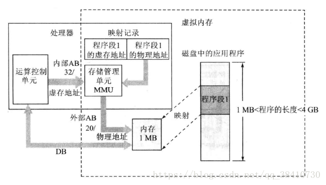

所有虚拟内存技术的实现，是建立在应用程序可以分成段，并且具有在任何时候正在使用的信息总是所有存储信息的一小部分的局部特性基础上的。**它是通过用辅存空间模拟RAM来实现的一种使机器的作业地址空间大于实际内存的技术。**

**从处理器运算装置和程序设计人员的角度来看，它面对的是一个用MMU、映射记录表和物理内存封装起来的一个虚拟内存空间，这个存储空间的大小取决于处理器程序计数器的寻址空间。**

可见，程序映射表是实现虚拟内存的技术关键，它可给系统带来如下特点：
 - 系统中每一个程序各自都有一个大小与处理器寻址空间相等的虚拟内存空间；
 - 在一个具体时刻，处理器只能使用其中一个程序的映射记录表，因此它只看到多个程序虚存空间中的一个，这样就保证了各个程序的虚存空间时互不相扰、各自独立的；
 - 使用程序映射表可方便地实现物理内存的共享。

#### Linux的虚拟内存技术

以存储单元为单位来管理显然不现实，因此Linux把虚存空间分成若干个大小相等的存储分区，Linux把这样的分区叫做页。为了换入、换出的方便，物理内存也就按也得大小分成若干个块。由于物理内存中的块空间是用来容纳虚存页的容器，所以物理内存中的块叫做页框。页与页框是Linux实现虚拟内存技术的基础。

#### 虚拟内存的页，物理内存的页框及页表

在Linux中，页与页框的大小一般为4KB。当然，根据系统和应用的不同，页与页框的大小也可有所变化。

物理内存和虚拟内存被分成了页框与页之后，其存储单元原来的地址都被自然地分成了两段，并且这两段各自代表着不同的意义：高位段分别叫做页框码和页码，它们是识别页框和页的编码；低位段分别叫做页框偏移量和页内偏移量，它们是存储单元在页框和页内的地址编码。下图就是两段虚拟内存和物理内存分页之后的情况：
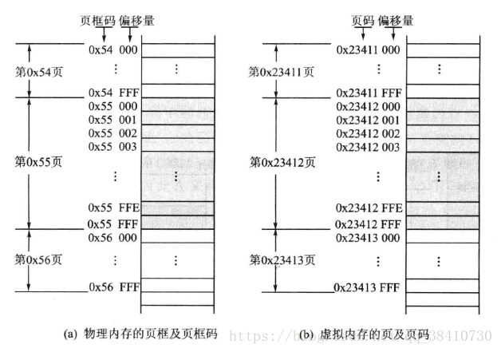

为了使系统可以正确的访问虚存页在对应页框中的映像，在把一个页映射到某个页框上的同时，就必须把页码和存放该页映像的页框码填入一个叫做页表的表项中。这个页表就是之前提到的映射记录表。一个页表的示意图如下所示：
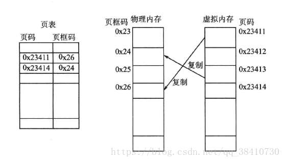

页模式下，虚拟地址、物理地址转换关系的示意图如下所示：
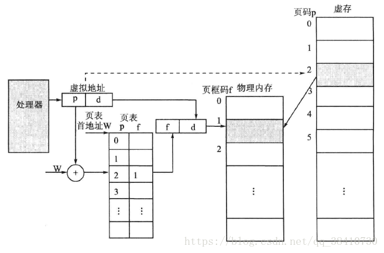

也就是说：处理器遇到的地址都是虚拟地址。虚拟地址和物理地址都分成页码（页框码）和偏移值两部分。在由虚拟地址转化成物理地址的过程中，偏移值不变。而页码和页框码之间的映射就在一个映射记录表——页表中。

#### 请页与交换

虚存页面到物理页框的映射叫做页面的加载。

当处理器试图访问一个虚存页面时，首先到页表中去查询该页是否已映射到物理页框中，并记录在页表中。如果在，则MMU会把页码转换成页框码，并加上虚拟地址提供的页内偏移量形成物理地址后去访问物理内存；如果不在，则意味着该虚存页面还没有被载入内存，这时MMU就会通知操作系统：发生了一个页面访问错误（页面错误），接下来系统会启动所谓的“请页”机制，即调用相应的系统操作函数，判断该虚拟地址是否为有效地址。

如果是有效的地址，就从虚拟内存中将该地址指向的页面读入到内存中的一个空闲页框中，并在页表中添加上相对应的表项，最后处理器将从发生页面错误的地方重新开始运行；如果是无效的地址，则表明进程在试图访问一个不存在的虚拟地址，此时操作系统将终止此次访问。

当然，也存在这样的情况：在请页成功之后，内存中已没有空闲物理页框了。这是，系统必须启动所谓地“交换”机制，即调用相应的内核操作函数，在物理页框中寻找一个当前不再使用或者近期可能不会用到的页面所占据的页框。找到后，就把其中的页移出，以装载新的页面。对移出页面根据两种情况来处理：如果该页未被修改过，则删除它；如果该页曾经被修改过，则系统必须将该页写回辅存。

系统请页的处理过程如下所示：
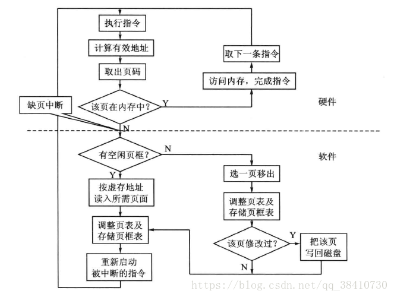

为了公平地选择将要从系统中抛弃的页面，Linux系统使用最近最少使用（LRU）页面的衰老算法。这种策略根据系统中每个页面被访问的频率，为物理页框中的页面设置了一个叫做年龄的属性。页面被访问的次数越多，则页面的年龄最小；相反，则越大。而年龄较大的页面就是待换出页面的最佳候选者。

#### 快表
在系统每次访问虚存页时，都要在内存的所有页表中寻找该页的页框，这是一个很费时间的工作。但是，人们发现，系统一旦访问了某一个页，那么系统就会在一段时间内稳定地工作在这个页上。所以，为了提高访问页表的速度，系统还配备了一组正好能容纳一个页表的硬件寄存器，这样当系统再访问虚存时，就首先到这组硬件寄存器中去访问，系统速度就快多了。这组存放当前页表的寄存器叫做快表。

总之，使用虚拟存储技术时，处理器必须配备一些硬件来承担内存管理的一部分任务。承担内存管理任务的硬件部分叫做存储管理单元MMU。存储管理单元MMU的工作过程如下图所示：
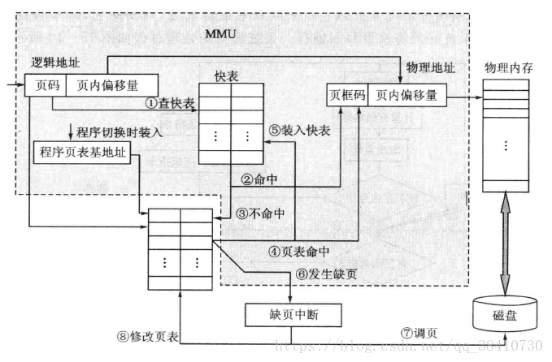

#### 页的共享
在多程序系统中，常常有多个程序需要共享同一段代码或数据的情况。在分页管理的存储器中，这个事情很好办：让多个程序共享同一个页面即可。

具体的方法是：使这些相关程序的虚拟空间的页面在页表中指向内存中的同一个页框。这样，当程序运行并访问这些相关页面时，就都是对同一个页框中的页面进行访问，而该页框中的页就被这些程序所共享。下图是3个程序共享一个页面的例子：
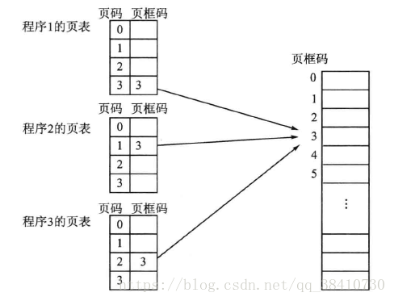

#### 多级页表

需要注意的是，页表是操作系统创建的用于内存管理的表格。因此，一个程序在运行时，其页表也要存放到内存空间。如果一个程序只需要一个页表，则不会有什么问题。但如果，程序的虚拟空间很大的话，就会出现一个比较大的问题。

比如：一个程序的虚拟空间为4GB，页表以4KB为一页，那么这个程序空间就是1M页。为了存储这1M页的页指针，那么这个页表的长度就相当大了，对内存的负担也很大了。所以，最好对页表也进行分页存储，在程序运行时只把需要的页复制到内存，而暂时不需要的页就让它留在辅存中。为了管理这些页表页，还要建立一个记录页表页首地址的页目录表，于是单级页表就变成了二级页表。二级页表的地址转换如下图所示：
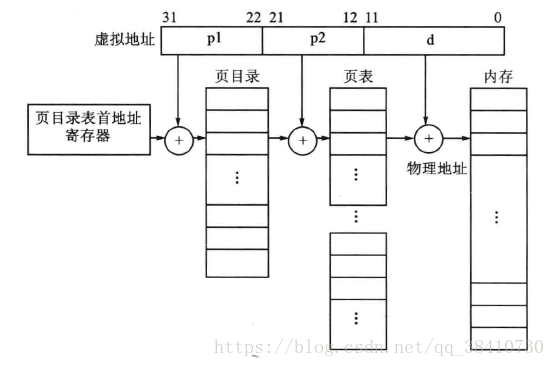

当然，如果程序的虚拟空间更大，那么也可以用三级页表来管理。为了具有通用性，Linux系统使用了三级页表结构：页目录（Page Directory，PGD）、中间页目录（Page Middle Directory，PMD）、页表（Page Table，PTE）。

### 缓存算法LRU、LFU、FIFO，OPT
缓存算法和内存页面置换算法（Page Replacement Algorithm）的核心思想是一样的：给定一个有限的空间，设计一个算法来更新和访问里面的数据。下面提到缓存算法的同时，也指代页面置换算法。

#### LRU缓存机制
LRU（The Least Recently Used，最近最久未使用算法） 是一种常见的缓存算法，在很多分布式缓存系统（如Redis, Memcached）中都有广泛使用。

LRU算法的思想是：**如果一个数据在最近一段时间没有被访问到，那么可以认为在将来它被访问的可能性也很小。因此，当空间满时，最久没有访问的数据最先被置换（淘汰）。**

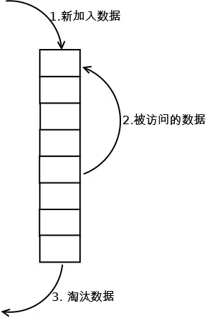

LRU算法的描述： 设计一种缓存结构，该结构在构造时确定大小，假设大小为 K，并有两个功能： 
 - set(key,value)：将记录(key,value)插入该结构。当缓存满时，将最久未使用的数据置换掉。
 - get(key)：返回key对应的value值。

实现：最朴素的思想就是用数组+时间戳的方式，不过这样做效率较低。因此，我们可以用 双向链表（LinkedList）+哈希表（HashMap） 实现（链表用来表示位置，哈希表用来存储和查找）。
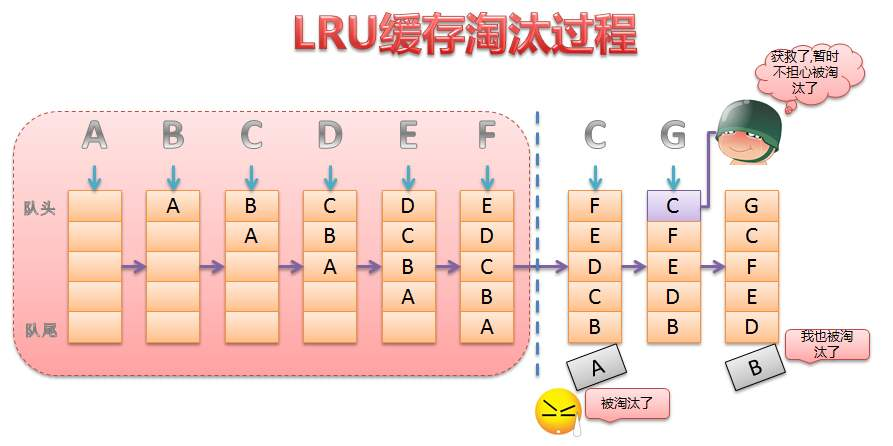

#### LFU缓存机制

LFU（Least Frequently Used ，最近最少使用算法） 也是一种常见的缓存算法。

LFU算法的思想是：**如果一个数据在最近一段时间很少被访问到，那么可以认为在将来它被访问的可能性也很小。因此，当空间满时，最小频率访问的数据最先被淘汰。**

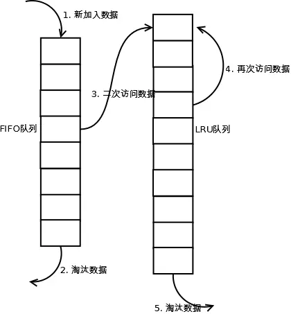

LFU 算法的描述：
设计一种缓存结构，该结构在构造时确定大小，假设大小为 K，并有两个功能：
 - set(key,value)：将记录(key,value)插入该结构。当缓存满时，将访问频率最低的数据置换掉。
 - get(key)：返回key对应的value值。

算法实现策略：考虑到 LFU 会淘汰访问频率最小的数据，我们需要一种合适的方法按大小顺序维护数据访问的频率。
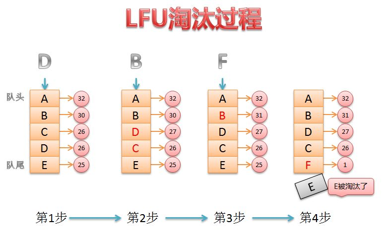

#### FIFO缓存机制

FIFO 算法的核心思想是先进先出（FIFO，队列），这是最简单、最公平的一种思想，即如果一个数据是最先进入的，那么可以认为在将来它被访问的可能性很小。空间满的时候，最先进入的数据会被最早置换（淘汰）掉。

FIFO 算法的描述：设计一种缓存结构，该结构在构造时确定大小，假设大小为 K，并有两个功能：

 - set(key,value)：将记录(key,value)插入该结构。当缓存满时，将最先进入缓存的数据置换掉。
 - get(key)：返回key对应的value值。

实现：维护一个FIFO队列，按照时间顺序将各数据（已分配页面）链接起来组成队列，并将置换指针指向队列的队首。再进行置换时，只需把置换指针所指的数据（页面）顺次换出，并把新加入的数据插到队尾即可。

缺点：判断一个页面置换算法优劣的指标就是缺页率，而FIFO算法的一个显著的缺点是，在某些特定的时刻，缺页率反而会随着分配页面的增加而增加，这称为Belady现象。产生Belady现象现象的原因是，FIFO置换算法与进程访问内存的动态特征是不相容的，被置换的内存页面往往是被频繁访问的，或者没有给进程分配足够的页面，因此FIFO算法会使一些页面频繁地被替换和重新申请内存，从而导致缺页率增加。因此，现在不常使用FIFO算法。

#### OPT缓存机制

最佳页面置换算法（OPT，Bélády’s Algorithm）是一种理论上最佳的页面置换算法。它的思想是，试图淘汰掉以后永远也用不到的页面，如果没有则淘汰最久以后再用到的页面。因为这种算法必须知道进程访问页面的序列，而这是无法实现的，因此仅有理论意义。

