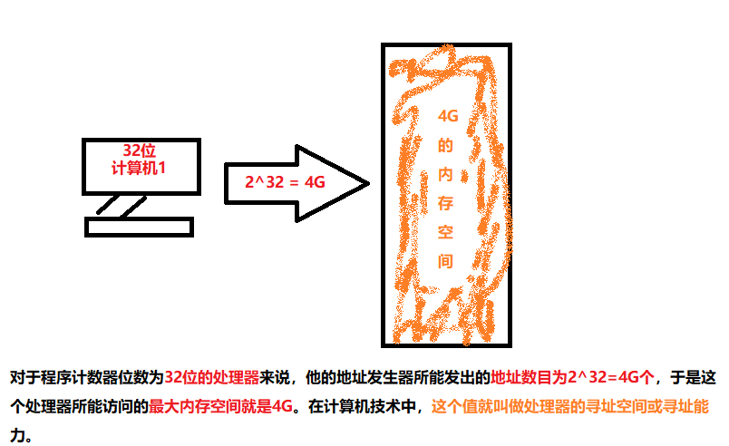
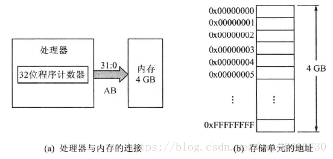
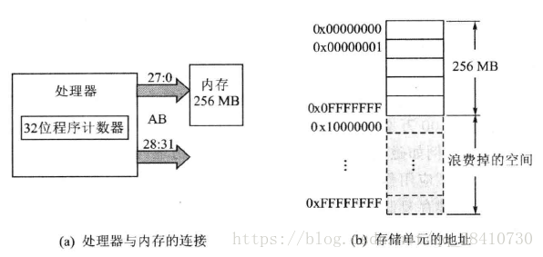
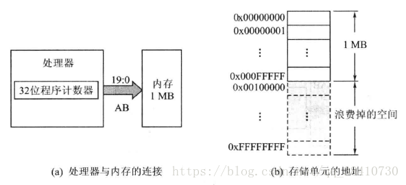
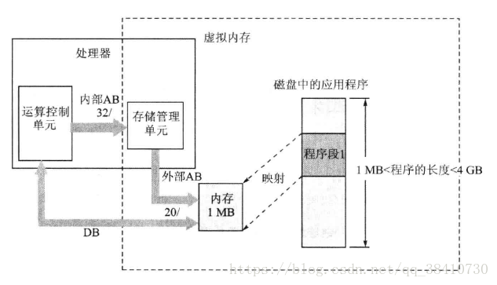

内存是程序运行的重要物质基础。如何在有限的内存空间运行较大的应用程序，曾是困扰人们的一个难题。为了解决这个问题，其中最成功的当属虚拟内存技术。

#### 虚拟内存
为了运行比实际物理内存容量还要大的程序，包括linux在内的所有现代操作系统几乎毫无例外的都采用了虚拟内存技术。虚拟内存技术，可让系统看上去具有比实际物理意义内存大的多的内存空间，并为实现多道程序的执行创制了条件。

#### 虚拟内存的概念
众所周知，**为了对内存中的存储单元进行识别，内存中的每一个存储单元都必须有一个确切的地址**。而一台计算机的处理器能访问多大的内存空间就取决于处理器的程序计数器，该计数器的字长越长，能访问的空间就越大。

例如：

照理说，为了充分利用处理器的寻址空间，就应按照处理器的最大寻址来为其分配系统的内存。如果处理器具有32位程序计数器，那么就应该按照下图的方式，为其配备4G的内存：

这样，处理器所发出的每一个地址都会有一个真实的物理存储单元与之对应；同时，每一个物理存储单元都有唯一的地址与之对应。这显然是一种最理想的情况。

但遗憾的是，**实际上计算机所配置内存的实际空间常常小于处理器的寻址范围**，这是就会因处理器的一部分寻址空间没有对应的物理存储单元，从而导致处理器寻址能力的浪费。例如：如下图的系统中，具有32位寻址能力的处理器只配置了256M的内存储器，这就会造成大量的浪费：

另外，**还有一些处理器因外部地址线的根数小于处理器程序计数器的位数**，而使地址总线的根数不满足处理器的寻址范围，从而处理器的其余寻址能力也就被浪费了。例如：Intel8086处理器的程序计数器位32位，而处理器芯片的外部地址总线只有20根，所以它所能配置的最大内存为1MB：

在实际的应用中，如果需要运行的应该程序较小没啥问题，如果过大计算机实际所配置的内存空间无法满足，就会导致程序运行不起来，面对这个问题：我们提出了一种方法：

> 一个应用程序总是逐段被运行的，而且在一段时间内会稳定运行在某一段程序里。意思就是把要运行的那一段程序从辅存（磁盘）复制到内存中来运行，而其他暂时不运行的程序段就让它仍然留在辅存中。

图一：为一个大于1MB程序的一段运行

图二：为这个程序的第二段需要运行的部分
