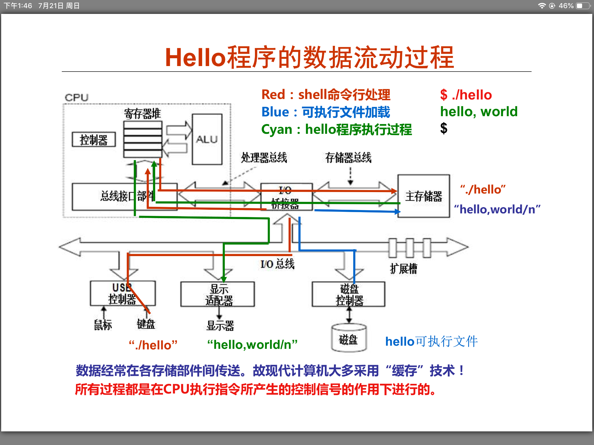

#### 前提
想要了解程序的详细执行流程，就必须对计算机系统了解

下面一张图总汇文件的执行流程：

可执行程序hello在计算机中执行过程：

#### 计算机系统层次结构
使用高级语言开发程序需要复杂的支持环境：

现代计算机语言的发展是一个不断抽象的过程，因而，相应的计算机系统也不断有新的层次出现

操作系统包括人机交互界面、提供服务功能的内核例程。

**计算机系统的不同层次的不同用户**

 1. 最终用户：工作在由应用程序提供的最上面的抽象层
 2. 系统管理员：工作在由操作系统提供的抽象层
 3. 应用程序员：工作在由语言处理系统的抽象层（语言处理系统建立在操作系统之上）
 4. 系统程序员：（实现系统软件）工作在ISA层次，必须对ISA非常了解

**ISA和计算机组成之间的关系**
不同ISA规定的指令集不同，计算机组成必须能够实现ISA规定的功能，

程序由指令组成：
程序在执行前：数据和指令事先存放在存储器中，每条指令和每个数据都有地址，指令按序存放，指令由OP、ADDR字段组成，程序起始地址置PC
开始执行程序：

 - 第一步：根据PC取指令
 - 第二步：指令译码
 - 第三步：取操作数
 - 第四步：指令执行
 - 第五步：回写结果
 - 第六步：修改PC的值（继续执行下一条指令）

**计算机中数据的存储**
外存 <  内存  < 寄存器

存储器操作数的寻址：
 - linux系统：double型变量按4bit边界对齐
 - windows系统：double型变量按8bit边界对齐

图解寻址：

栈是一种采用"先进后出"方式进行访问的一块存错区，用于嵌套过程调用。从高地址向低地址增长

