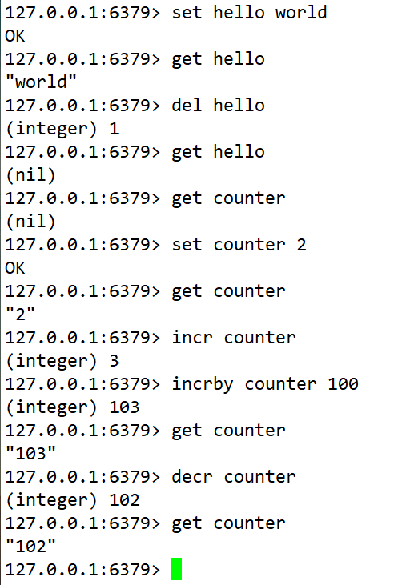

#### Redis简介：

Redis 是完全开源免费的，遵守BSD协议，是一个高性能的key-value数据库。

NoSQL 泛指非关系型数据库（基于键值对，不需要SQL层解析，性能高，易扩展，内存存储，读写速度快，低成本）， Redis是NoSQL 产品。

Redis也提供了持久化的选项，这些选项可以让用户将自己的数据保存到磁盘上面进行存储。根据实际情况，可以每隔一定时间将数据集导出到磁盘（快照），或者追加到命令日志中（AOF只追加文件），它会在执行写命令时，将被执行的写命令复制到硬盘里面。也可以关闭持久化功能，将Redis作为一个高效的网络的缓存数据功能使用。

Redis 与其他 key - value 缓存产品有以下三个特点：
- Redis支持数据的持久化，可以将内存中的数据保存在磁盘中，重启的时候可以再次加载进行使用。Redis为了保证效率会定期持久化数据。
- Redis不仅仅支持简单的key-value类型的数据，同时还提供list，set，zset，hash等数据结构的存储。
- Redis支持数据的备份，即master-slave模式的数据备份。

----------
#### Redis的应用场景：

1、配合关系型数据库做高速缓存
- 主流缓存技术有Redis 和 Memcached
- 缓存高频次访问的数据，降低数据库I/O
- 由于redis访问速度快、支持的数据类型比较丰富，所以redis很适合用来存储热点数据，另外结合expire，我们可以设置过期时间然后再进行缓存更新操作，这个功能最为常见，我们几乎所有的项目都有所运用。

2、可以持久化特定数据
- 利用zset类型可以存储排行榜
- 利用list的自然时间排序存储最新n个数据

3、实现缓存中间件、消息队列（利用Redis的存储列表类型）
- 支持发布、订阅模式，使其不仅仅是一款缓存中间件，也可用作一个消息队列，以及注册中心

4、计数器相关问题
- redis由于incrby命令可以实现原子性的递增，所以可以运用于高并发的秒杀活动、分布式序列号的生成，具体业务还体现在比如限制一个手机号发多少条短信、一个接口一分钟限制多少请求、一个接口一天限制调用多少次等等。

5、排行榜相关问题
- 关系型数据库在排行榜方面查询速度普遍偏慢，所以可以借助redis的SortedSet进行热点数据的排序。

6、队列
- 由于redis有list push和list pop这样的命令，所以能够很方便的执行队列操作。

----------
#### Redis的优势

1.性能极高 – 由于其数据存储在内存上，因此它具有极高的数据读写速度，Redis读的速度是110000次/s,写的速度是81000次/s。

2.丰富的数据类型 – Redis提供了五种数据类型：string，hash，list，set及zset(sorted set)。

3.原子 – Redis的所有操作都是原子性的，意思就是要么成功执行要么失败完全不执行。单个操作是原子性的。多个操作也支持事务，即原子性，通过MULTI和EXEC指令包起来。

4.丰富的特性 – Redis还支持 publish/subscribe，即发布-订阅模式，按key设置过期时间，过期后将会自动删除等。

----------
#### Redis的缺点

1.**缓存穿透问题**
缓存穿透是指查询一个不存在的key值，即缓存未命中而DB中也没有；会不断频繁的访问数据库，从而导致了大量请求达到数据库，从而导致巨大冲击和压力。经常是为了防止有人恶意针对未存在的数据做查找而导致数据库因高并发访问而崩溃。

解决方案：**当在数据库中未查找到该key值时，仍然将该key写入缓存（其值为null），并设置过期时间以保护后端数据源。**

2.**缓存击穿问题**
缓存击穿，是指一个key非常热点，在不停的扛着大并发，大并发集中对这一个点进行访问，当这个key在失效的瞬间，持续的大并发就穿破缓存，直接请求数据库，就像在一个屏障上凿开了一个洞。

3.**缓存失效问题**

4.**缓存雪崩问题**
缓存雪崩，是指在某一个时间段，缓存集中过期失效或者缓存服务器某个节点宕机或断网导致了自然的缓存雪崩。

产生雪崩的原因之一，比如马上就要到双十二零点，很快就会迎来一波抢购，这波商品时间比较集中的放入了缓存，假设缓存一个小时。那么到了凌晨一点钟的时候，这批商品的缓存就都过期了。而对这批商品的访问查询，都落到了数据库上，对于数据库而言，就会产生周期性的压力波峰，从而致使存储层服务奔溃。（缓存在高并发环境保护存储层）

其实集中过期，倒不是非常致命，比较致命的缓存雪崩，是缓存服务器某个节点宕机或断网。因为自然形成的缓存雪崩，一定是在某个时间段集中创建缓存，那么那个时候数据库能顶住压力，这个时候，数据库也是可以顶住压力的。无非就是对数据库产生周期性的压力而已。而缓存服务节点的宕机，对数据库服务器造成的压力是不可预知的，很有可能瞬间就把数据库压垮。

5.**缓存和数据库双写一致性问题**

缓存无法保证强缓存一致性，如果允许有一定的不一致性的出现，可以使用缓存

6.**缓存的并发竞争问题**

多个客户端同时发送请求，由于 Redis 是单线程，在同一时刻只能处理一个请求，其他的请求会阻塞等待。

多个客户端同时发送请求，由于 Redis 是单线程，在同一时刻只能处理一个请求，其他的请求会阻塞等待。

----------
#### Redis的并发竞争问题解决方案

Redis为单进程单线程模式，采用队列模式将并发访问变为串行访问。Redis本身没有锁的概念，
Redis对于多个客户端连接并不存在竞争，但是在Redis客户端对Redis进行并发访问时发生连接超时、数据转换错误、阻塞、客户端关闭连接等问题，这些问题均是由于客户端连接混乱造成。对此有两种解决方法：
- 客户端角度，为保证每个客户端间正常有序与Redis进行通信，对连接进行池化，同时对客户端读写Redis操作采用内部锁进行同步。
- 服务器角度，利用setnx实现锁。

----------
#### Redis与Memcached的区别
- 数据类型与操作：Redis 拥有更多丰富的数据结构支持与操作，而Memcached则需客户端自己处理并进行网络交互。单个value的最大限制是1GB，而memcached只能保存1MB的数据。
- 内存使用率：简单K/V存储，Memcached内存利用率更高（使用了slab与大小不同的chunk来管理内存），而如果采用Redis Hash来存储则其组合压缩，内存利用率高于Memcached。
- 性能：总体来说，二者性能接近；Redis使用了单核（单线程+IO复用，封装了AeEvent事件处理框架，实现了epoll,kqueue,select），Memcached采用了多核，各有利弊；当数据大于100K的时候，Memcached性能高于Redis。memcached 采用的是多线程非阻塞IO复用，redis采用的是单线程的IO复用，单线程消除了并发控制的开销。
- 数据持久化：Redis支持数据文件持久化，RDB与AOF两种策略；Memcached则不支持。
- 分布式：Memcached本身并不支持服务器端分布式，客户端只能借助一致性哈希分布式算法来实现Memcached分布式存储；Redis从3.0版本开始支持服务器端cluster。
- 单纯从缓存命中的角度来说，Memcached要高，Redis和Memcache的差距不大, 但是，Redis提供的功能更加的强大。
- 单纯从缓存命中的角度来说，Memcached要高，Redis和Memcache的差距不大, 但是，Redis提供的功能更加的强大。

----------
#### Redis的数据淘汰策略

**定时删除**：在设置键的过期时间的同时，创建一个定时器，让定时器在键的过期时间来临时，立即执行对键的删除操作。

**惰性删除**：放任过期键不管，每次从键空间读写操作时，都检查键是否过期，如果过期，删除该键，如果没有过期，返回该键。

**定期删除**：对定时删除策略和惰性删除策略的一种整合和折中。每隔一段时间执行一次定时删除，并通过限制删除操作执行的总时长和总频率来限制删除操作对CPU占用时间的影响。通过定期删除过期键，有效减少了因为过期键而带来的内存浪费。

**主动清理**：当前已用内存超过maxmemory限定时，触发主动清理策略。清理时会根据用户配置的maxmemory-policy来做适当的清理。

主动清理策略主要有一下六种:

volatile-lru：从已设置过期时间的数据集（server.db[i].expires）中挑选最近最少使用的数据淘汰
volatile-ttl：从已设置过期时间的数据集（server.db[i].expires）中挑选将要过期的数据淘汰
volatile-random：从已设置过期时间的数据集（server.db[i].expires）中任意选择数据淘汰
allkeys-lru：从数据集（server.db[i].dict）中挑选最近最少使用的数据淘汰
allkeys-random：从数据集（server.db[i].dict）中任意选择数据淘汰
no-enviction（驱逐）：禁止驱逐数据

----------
#### Redis为何如此快速

1、完全基于内存，绝大部分请求是纯粹的内存操作，非常快速。数据存在内存中，类似于HashMap、HashMap的优势就是查找和操作的时间复杂度都是O(1);

2、数据结构简单，对数据操作也简单，Redis中的数据结构是专门进行设计的；

3、采用单线程，避免了不必要的上下文切换和竞争条件，也不存在多进程或者多线程导致的切换而消耗CPU，不用去考虑各种锁的问题，不存在加锁释放锁操作，没有因为可能出现死锁而导致的性能消耗；

4、使用多路I/O复用模型，非阻塞IO；

5、使用底层模型不同，它们之间底层实现方式以及与客户端之间通信的应用协议不一样，Redis直接自己构建了VM机制，因为一般的系统调用系统函数的话，会浪费一定的时间去移动和请求；

----------
#### Redis为什么单线程还这么快

- **纯内存访问**，redis将所有数据放在内存中，内存的响应时长大约为100纳秒，这是redis达到每秒百万级别访问的重要基础。
- **非阻塞I/O**，redis使用epoll作为I/O多路复用技术的实现，再加上redis自身的事件处理模型将epoll中的连接，读写，关闭都转为事件，不在网络I/O上浪费过多的时间。
- **单线程避免了线程切换和竞态产生的消耗。**

**单线程的好处**
- 简化数据结构和算法的实现。
- 避免了线程切换和竞态产生的消耗，对于服务端来说，锁和线程切换通常是性能杀手。

**单线程的问题**

对于每个命令的执行时间是有要求的。如果某个命令执行过程，会造成其他命令的阻塞，对于redis这种高性能的服务来说是致命的，所以Redis是面向快速执行场景的数据库。

但是，我们使用单线程的方式是无法发挥多核CPU性能，不过我们可以通过在单机开多个Redis实例来完善！

----------
#### Redis的五种数据类型
之前介绍到Redis是一个key-value存储系统。和Memcached类似，它支持存储的value类型相对更多，包括string，list，set，zset和hash。这些数据类型都支持push/pop、add/remove及取交集和差集及更丰富的操作，而且这些操作都是原子性的。在此基础上，redis支持各种不同方式的排序。与memcached一样，为了保证效率，数据都是缓存在内存上。区别的是Redis会周期性的把更新的数据写入磁盘或者把修改操作写入追加的记录文件，并且在此基础上实现了master-slave（主从）同步。
对redis来说，所有的key（键）都是字符串。

----------
#### String
string数据类型是redis种最基本的数据类型，一个key对应一个value。

string类型是二进制安全的，意思是redis的string可以包含任何数据。如数字，字符串，jpg图片或者序列化的对象。

常用命令：get、set、del、incr、decr等。

实战场景：
- 缓存：经典使用场景，把常用信息，字符串，图片或者视频等信息放到redis中，redis作为缓存层、MySQL做持久化层，降低MySQL的读写压力。
- 计数器：Redis是单线程模型，一个命令执行完才会执行下一个，同时数据可以一步落地到其他的数据源。
- 比如想知道什么时候封锁一个ip地址（访问超过几次）。INCRBY命令让这些变得很容易，通过原子递增保持计数。

----------
#### Hash
是一个Mapmap，指值本身又是一种键值对结构，如value={{field1，value1},...fieldN，valueN}}

常用命令：所有hash的命令都是 h 开头的hget、hset 、hdel、hgetall等

实战场景：比如我们要存储一个用户的信息，包括以下信息：
- 用户ID，为查找的key
- 存储的value用户对象包含姓名name，年龄age，生日birthday等信息

如果以普通的key/value结构存储，主要有以下两种存储方式：

第一种方式将用户id作为key，其他信息封装成对象以序列化的方式存储，如 set u0001 “李三， 18， 20010101”

这种方式的缺点，增加了序列化/反序列化的开销；需要修改其中一项信息时，需要把整个对象取回，修改操作需要对并发进行保护，引入CAS等复杂问题。

第二种方式是这个用户信息有多少成员就存成多少个key-value对，虽然省去了序列化开销和并发问题，但是用户ID为重复存储，如果存在大量这样的数据，内存浪费较大。

Redis提供的hash就很好的解决了这个问题，Redis的hash实际是内部存储的value为一个HashMap，并且提供了直接存取这个map的成员接口。

----------
#### List
List说白了就是链表（redis使用双端链表实现的List），是有序的，value可以重复，可以通过下标取出对应的value值，左右两边都能进行插入和删除数据。

使用链表的技巧
- lpush+lpop = Stack（栈）
- lpush+rpop = Queue（队列）
- lpush+ltrim = Capped Collection（有限集合）
- lpush + brpop = Message Queue（消息队列）

常用命令：lpush，rpush，lpop，rpop，lrange，BLPOP（阻塞版）等。

应用场景：
- TimeLine：例如微博的时间轴，有人发布微博，用lpush加入时间轴，展示新的列表信息。
- 消息队列。利用Lists的push的操作，将任务存储在list中，然后工作线程再用pop操作将任务取出进行执行。

----------
#### Set
Set类似List，特殊之处是Set可以自动排重。

Set还提供了某个成员是否在一个Set内的接口，这个也是List没有的。

比如在微博应用中，每个人的好友存在一个集合（Set）中，这样求两个人的共同好友的操作，可能只需要用求交集命令即可。

Redis还为集合提供了求交集，并集，差集等操作。

常用命令都是以s开头的：sadd，srem，spop，sdiff，smembers，sismember等。

实战场景：
- 标签（tag）：给用户添加标签，或者用户给消息添加标签，这样有同一标签或者类似标签的可以给推荐关注的事或者关注的人。
- 点赞、或投币，收藏等，可以放到Set中实现。

----------
#### Sort Set(Zset)
有序集合和集合有着必然的联系，保留了集合不能有重复成员的特性，区别是，有序集合中的元素是可以排序的，Sorted set可以通过用户额外提供一个优先级（score）的参数来为成员排序，并且是插入有序的，即自动排序。

有序集合的命令都是以Z开头：zadd、zrange、zscore

实战场景：
- 排行榜：有序集合经典使用场景。例如小说视频等网站需要对用户上传的小说视频做排行榜，榜单可以按照用户关注数，更新时间，字数等打分，做排行。

----------
#### Redis的持久化机制：RDB和AOF

Redis提供了两种方式对数据进行持久化，分别是RDB和AOF。

RDB持久化方式能够在指定的时间间隔能对你的数据进行快照存储。

AOF持久化方式记录每次对服务器写的操作，当服务器重启的时候会重新执行这些命令来恢复原始的数据，AOF命令以Redis协议追加保存每次写的操作到文件末尾。Redis还能对AOF文件进行后台重写，使得AOF文件的体积不至于过大。

如果你只希望你的数据在服务器运行的时候存在，你也可以不使用任何持久化方式。
也可以同时开启两种持久化方式，在这种情况下，当Redis重启的时候会优先载入AOF文件来恢复原始的数据，因为在通常情况下AOF文件保存的数据集要比RDB文件保存的数据集要完整。

----------
#### Redis常见性能问题和解决方案
- Master最好不要做任何持久化工作，如RDB内存快照和AOF日志文件。
-    1.Matser写内存快照，save命令调度rdbSave函数，会阻塞主线程的工作，当快照比较大时对性能影响是非常大的，会间断性暂停服务，所以Master最好不要写内存快照。
-    2.Matser AOF持久性，如果不重写AOF文件，这个持久化方式对性能的影响是最小的，但是AOF文件会不断增大，AOF文件过大会影响Matser重启的恢复速度。Matser最好不要做任何持久化工作，包括内存快照和AOF日志文件，特别是不要启用内存快照做持久化，如果数据比较关键，某个Slave开启AOF备份数据，策略为每秒同步一次。
-    3.Master调用BGREWRITEAOF重写AOF文件，AOF在重写的时候会占大量的CPU和内存资源，导致服务load过高，出现短暂服务暂停现象。
- 如果数据比较重要，某个Slave开启AOF备份数据，策略设置为每秒同步一次。
- 为了主从复制的速度和连接的稳定性，Master和Slave最好在同一个局域网。
- 尽量避免在压力很大的主库上增加从库。
- 主从复制不要用图状结构，用单向链表结构更为稳定，即：Master <- Slave1 <- Slave2 <- Slave3… ，这样的结构方便解决单点故障问题，实现Slave对Master的替换。如果Master挂了，可以立刻启用Slave1做Master，其他不变。

----------
#### Redis 事务

Redis事务可以一次执行多个命令，并且带有以下三个重要的保证：
- 批量操作在发送EXEC命令前被放入队列缓存。
- 收到EXEC命令后进入事务执行，事务中任意命令执行失败，其余的命令依然被执行。
- 在事务执行过程，其他客户端提交的命令请求不会插入到事务执行命令序列中。

一个事务从开始到执行会经历以下三个阶段：
- 开始事务
- 命令入队
- 执行事务

**Redis 事务命令**
- DISCARD ：取消事务，放弃执行事务块内的所有命令。
- EXEC ：执行所有事务块内的命令。
- UNWATCH ：取消 WATCH 命令对所有 key 的监视。
- MULTI ：标记一个事务块的开始。
- WATCH key [key …] ：监视一个(或多个) key ，如果在事务执行之前这个(或这些) key 被其他命令所改动，那么事务将被打断。

----------
#### Redis管道

Redis的是一种基于客户端-服务端模型以及请求/响应协议的TCP服务这意味着通常情况下一个请求会遵循以下步骤：
- 客户端向服务端发送一个查询请求，并监听套接字返回，通常是以阻塞模式，等待服务端响应。
- 服务端处理命令，并将结果返回给客户端。

Redis管道技术可以在服务端未响应时，可以继续向服务端发送请求，并最终一次性读取所有服务端的响应。管道技术最显着的优势是提高了Redis服务的性能。

----------
#### Redis 分区
分区是分割数据到多个Redis实例的处理过程。因此每个实例只保存key的一个子集。

**分区的优势**
- 通过利用多台计算机内存的和值，允许我们构造更大的数据库。
- 通过多核和多台计算机，允许我们扩展计算能力；通过多台计算机和网络适配器；允许我们扩展网络带宽。