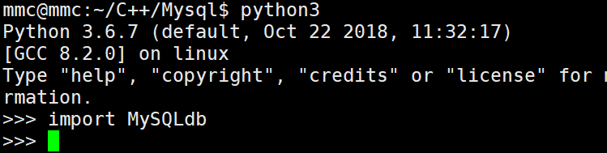
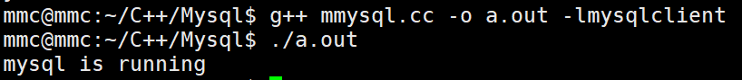
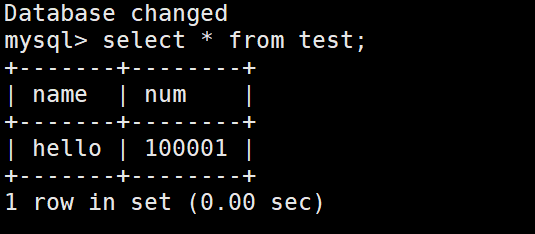
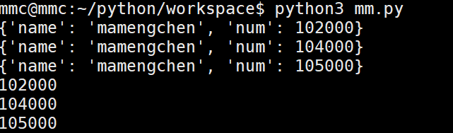
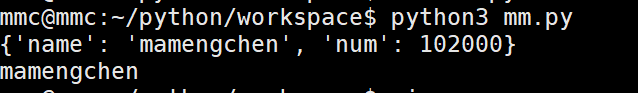

#### 依赖安装liemysql和mysqlclient
其中c++的是libmysql 操作如下：（ubuntu）
``` 
sudo apt-get install mysql-server
sudo apt-get install mysql-client
sudo apt-get install libmysql-dev
```
上面俩个条命令为安装数据库的python需要做同样操作，之后需要pip一个api的包如下
```pip3 install mysqlclient```
安装成功之后（其中pip可能受到网速的影响），你进入python，运行import MySQLdb没有报错就成功了（python大小写敏感）


C++提供一段程序来检验：
```c++
#include <iostream>
#include <string>
#include <mysql/mysql.h>
using namespace std;

int main()
{
    MYSQL mysql;
    mysql_init(&mysql);
    cout << "mysql is running" << endl;
    mysql_real_connect( &mysql, "localhost", "root", "", "test", 3306, NULL, 0);    
    string sql = " insert into test(name, num) values('hello', 100001);";
    mysql_query(&mysql,sql.c_str());
    mysql_close(&mysql);
    return 0;
}
//其中头文件可以会有错，因为当时下完，我编译找不到一个头文件，我改了一下文件路径
```
运行完之后是如下结果


然后打开数据库（你前提需要创建一个test数据库，和test一个表）



这也证明你安装完毕，下面介绍两种的API

#### C++操作数据库
MySQL操作的官方文档：[MySQL官方文档](https://dev.mysql.com/doc/refman/5.7/en/c-api-data-structures.html)
支持C/C++的数据类型

> MYSQL
> 该结构代表1个数据库连接的句柄。几乎所有的MySQL函数均使用它。不应尝试拷贝MYSQL结构。不保证这类拷贝结果会有用。
> 
> MYSQL_RES
> 该结构代表返回行的查询结果（SELECT, SHOW, DESCRIBE, EXPLAIN）。
> 
> MYSQL_ROW
> 这是1行数据的“类型安全”表示。它目前是按照计数字节字符串的数组实施的。（如果字段值可能包含二进制数据，不能将其当作由Null终结的字符串对待，这是因为这类值可能会包含Null字节）。行是通过调用mysql_fetch_row()获得的.
> 
> MYSQL_FIELD
> 该结构包含关于字段的信息，如字段名、类型和大小。这里详细介绍了其成员。通过重复调用mysql_fetch_field()，可为每个字段获得MYSQL_FIELD结构。字段值不是该结构的组成部份，它们包含在MYSQL_ROW结构中。
> 
> MYSQL_FIELD_OFFSET
> 这是MySQL字段列表偏移量的“类型安全”表示（由mysql_field_seek()使用）。偏移量是行内的字段编号，从0开始。


下面是比较常用的几个C++ 操作数据库的api函数：
**登录MySQL：mysql_init()，mysql_real_connect()**


#### python 操作数据库
直接上代码：
对于数据的查询，这里fetchone()：是对单条数据的查询，fetchall()：是对多条数据的查询
```python
import MySQLdb

# try:
#     conn = MySQLdb.connect(
#         host='127.0.0.1',
#         user='root',
#         passwd='',
#         db='test',
#         port=3306,
#         charset='utf8'
#     )
# except MySQLdb.Error as e:
#     print(f'Error: {e}')
# 
# cursor = conn.cursor()
# cursor.execute('select * from test;')
# rest = cursor.fetchone()
# print(rest)
# 
# conn.close()


class mysqlsearch(object):
    def __init__(self):
        self.get_conn()

    def get_conn(self):
        try:
            self.conn = MySQLdb.connect(
                host='127.0.0.1',
                user='root',
                passwd='',
                db='test',
                port=3306,
                charset='utf8'
            )
        except MySQLdb.Error as e:
            print(f"error: {e}")
    
    def close_conn(self):
        try:
            if self.conn:
                self.conn.close()
        except MySQLdb.Error as e:
            print(f'Error: {e}')

    def get_one(self):
        sql = 'select * from test where name = %s;'
        cursor = self.conn.cursor()
        
        # print(dir(cursor))
        # print(cursor.description)
        cursor.execute(sql, ('mamengchen', ))
        rest = dict(zip([k[0] for k in cursor.description], cursor.fetchone()))
        print(rest)

        cursor.close();
        self.close_conn()
        return rest;

    def get_more(self):
        sql = 'select * from test where name = %s;'
        cursor = self.conn.cursor()
        cursor.execute(sql, ('mamengchen', ))
        rest = [dict(zip([k[0] for k in cursor.description], row)) 
                for row in cursor.fetchall()]

        for item in rest:
            print(item)
        cursor.close()
        self.close_conn()
        return rest


obj = mysqlsearch()
# rest = obj.get_one()
# print(rest['name'])
rest = obj.get_more()

for item in rest:
    print(item['num'])

```

