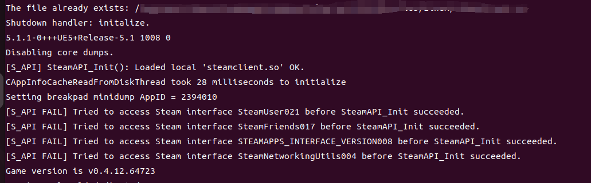
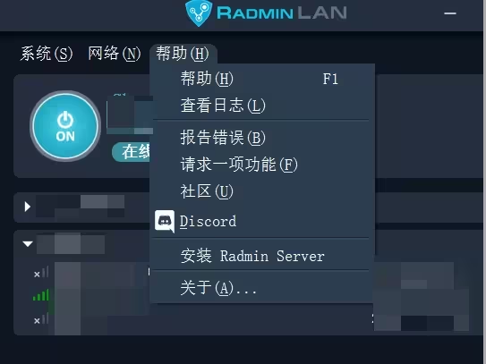

在初始搭建时候一直没有办法让公网ip+端口访问自己电脑的虚拟机

----------

需求：电脑（自己用的电脑就行，直接省下买服务器的钱）
软件需求：Radmin Lan，幻兽server，vmware，ubuntu；（其中后面两项没有可以在windows搭建）
概述：虚拟机中Linux打开幻兽server，其他所有电脑使用radmin联机，连接主机的ip+端口。

---

（以下操作均在ubuntu 下的命令）
### 1.服务器安装
1. 先安装SteamCMD（需要先update以下apt-install）

```bash
sudo add-apt-repository multiverse; sudo dpkg --add-architecture i386; sudo apt update
sudo apt install steamcmd

`steamcmd +login anonymous +app_update 2394010 validate +quit`
```
 最后运行 PalServer.sh 有以下信息就是成功



### 2. 安装Radmin

这是局域网远程软件：（服务器电脑安装 radmin 和 server，玩游戏的电脑和朋友都安装radmin）



服务器端创建网络，玩游戏的电脑加入网络，开放端口8211。然后win在控制面板，在
