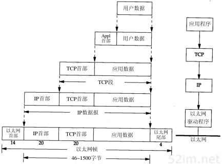
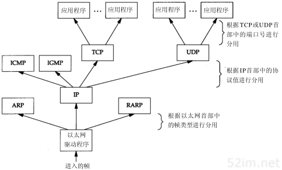
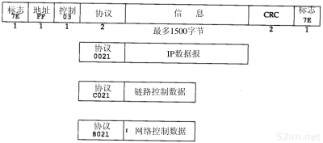
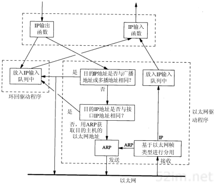

#### 一张图了解计算机网络

**不同网络的通信协议**

#### 概述

##### 1.1分层
	网络协议通常分不同层次进行开发，每一层分别负责不同的通信功能。一个协议族，比如TCP/IP，是一组不同层次上的多个协议的组合。TCP/IP通常被认为是一个四层协议系统

每一层负责不同的功能：

 1. 链路层，有时也称作数据链路层或网络接口层，通常包括操作系统中的设备驱动程序和计算机中对应的网络接口卡。它们一起处理与电缆（或其他任何传输媒介）的物理接口细节。
 2. 网络层，有时也称作互联网层，处理分组在网络中的活动，例如分组的选路。在TCP/IP协议族中，网络层协议包括IP协议（网际协议），ICMP协议（Internet互联网控制报文协议），以及IGMP协议（Internet组管理协议）。
 3. 运输层主要为两台主机上的应用程序提供端到端的通信。在TCP/IP协议族中，有两个互不相同的传输协议：TCP（传输控制协议）和UDP（用户数据报协议）。
 4. 应用层负责处理特定的应用程序细节。几乎各种不同的TCP/IP实现都会提供下面这些通用的应用程序：
• Telnet远程登录。
• FTP文件传输协议。
• SMTP简单邮件传送协议。
• SNMP简单网络管理协议。

==TCP为两台主机提供高可靠性的数据通信。它所做的工作包括把应用程序交给它的数据分成合适的小块交给下面的网络层，确认接收到的分组，设置发送最后确认分组的超时时钟等。由于运输层提供了高可靠性的端到端的通信，因此应用层可以忽略所有这些细节。 #9C27B0==

==UDP则为应用层提供一种非常简单的服务。它只是把称作数据报的分组从一台主机发送到另一台主机，但并不保证该数据报能到达另一端。任何必需的可靠性必须由应用层来提供。 #E91E63==

这里，我们列举了一个FTP客户程序和另一个FTP服务器程序。大多数的网络应用程序都被设计成客户---服务器模式。服务器为客户提供某种服务，在例子中就是访问服务器所在主机上的文件。在远程登陆应用程序telent中，为客户提供的服务是登录到服务器主机上。
==在同一层上，双方都有对应的一个或多个协议进行通信。 #2196F3==例如，某个协议允许TCP层进行通信，而另一个协议则允许两个IP层进行通信。
在图的右边，我们注意到应用程序通常是一个用户进程，而下三层则一般在（操作系统）内核中执行。尽管这不是必需的，但通常都是这样处理的，例如UNIX操作系统。
顶层与下三层之间还有另一个关键的不同之处。==应用层关心的是应用程序的细节 #9C27B0==，而不是数据在网络中的传输活动。下三层对应用程序一无所知，==但它们要处理所有的通信细节。 #E91E63==
该图中列举了四种不同层次上的协议：FTP是一种应用层协议，TCP是一种运输层协议，IP是一种网络层协议，而以太网协议则应用于链路层上。TCP/IP协议族是一组不同的协议组合在一起构成的协议族。尽管通常称该协议族为TCP/IP，但TCP和IP只是其中的两种协议而已（该协议族的另一个名字是Internet协议族(Internet Protocol Suite)）。

**网络接口层**和**应用层**的目的是很显然的——**前者处理有关通信媒介的细节（以太网、令牌环网等），而后者处理某个特定的用户应用程序（FTP、Telnet等）**。
但是，从表面上看，网络层和运输层之间的区别不那么明显。为什么要把它们划分成两个不同的层次呢？
为了理解这一点，我们必须把视野从单个网络扩展到一组网络。在80年代，网络不断增长的原因之一是大家都意识到只有一台孤立的计算机构成的“孤岛”没有太大意义，于是就把这些孤立的系统组在一起形成网络。随着这样的发展，到了90年代，我们又逐渐认识到这种由单个网络构成的新的更大的“岛屿”同样没有太大的意义。于是，人们又把多个网络连在一起形成一个网络的网络，或称作互连网(internet)。一个互连网就是一组通过相同协议族互连在一起的网络。构造互连网最简单的方法是把两个或多个网络通过路由器进行连接。它是一种特殊的用于网络互连的硬件盒。==路由器的好处是为不同类型的物理网络提供连接：以太网、令牌环网、点对点的链接和FDDI（光纤分布式数据接口）等等。 #E91E63==

> 这些盒子也称作IP路由器（IPRouter），但我们这里使用路由器(Router)这个术语。从历史上说，这些盒子称作网关（gateway），在很多TCP/IP文献中都使用这个术语。现在网关这个术语只用来表示应用层网关：一个连接两种不同协议族的进程（例如，TCP/IP和IBM的SNA），它为某个特定的应用程序服务（常常是电子邮件或文件传输）。

图1-3是一个包含两个网络的互连网：一个以太网和一个令牌环网，通过一个路由器互相连接。尽管这里是两台主机通过路由器进行通信，实际上以太网中的任何主机都可以与令牌环网中的任何主机进行通信。

在图1-3中，我们可以划分出端系统（End system）（两边的两台主机）和中间系统（Intermediate system）（中间的路由器）。应用层和运输层使用端到端（End-to-end）协议。在图中，只有端系统需要这两层协议。但是，网络层提供的却是逐跳（Hop-by-hop）协议，两个端系统和每个中间系统都要使用它。

在TCP/IP协议族中，网络层IP提供的是一种不可靠的服务。也就是说，它只是尽可能快地把分组从源结点送到目的结点，但是并不提供任何可靠性保证。而另一方面，TCP在不可靠的IP层上提供了一个可靠的运输层。为了提供这种可靠的服务，==TCP采用了超时重传、发送和接收端到端的确认分组等机制 #9C27B0==。由此可见，运输层和网络层分别负责不同的功能。

从定义上看，一个路由器具有两个或多个网络接口层（因为它连接了两个或多个网络）。任何具有多个接口的系统，英文都称作是多接口的(multihomed)。一个主机也可以有多个接口，但一般不称作路由器,除非它的功能只是单纯地把分组从一个接口传送到另一个接口。同样，路由器并不一定指那种在互联网中用来转发分组的特殊硬件盒。大多数的TCP/IP实现也允许一个多接口主机来担当路由器的功能，但是主机为此必须进行特殊的配置。在这种情况下，我们既可以称该系统为主机（当它运行某一应用程序时，如FTP或Telnet），也可以称之为路由器（当它把分组从一个网络转发到另一个网络时）。在不同的场合下使用不同的术语。

互联网的目的之一是在应用程序中隐藏所有的物理细节。虽然这一点在图1-3由两个网络组成的互联网中并不很明显，但是应用层不能关心（也不关心）一台主机是在以太网上，而另一台主机是在令牌环网上，它们通过路由器进行互连。随着增加不同类型的物理网络，可能会有20个路由器，但应用层仍然是一样的。物理细节的隐藏使得互联网功能非常强大，也非常有用。

连接网络的另一个途径是使用网桥。网桥是在链路层上对网络进行互连，而路由器则是在网络层上对网络进行互连。网桥使得多个局域网（LAN）组合在一起，这样对上层来说就好像是一个局域网。

##### 1.3TCP/IP的分层
^[TCP/IP协议族中不同层次的协议]

TCP和UDP是两种最为著名的运输层协议，二者都使用IP作为网络层协议。虽然TCP使用不可靠的IP服务，但它却提供一种可靠的运输层服务。
UDP为应用程序发送和接收数据报。一个数据报是指从发送方传输到接收方的一个信息单元（例如，发送方指定的一定字节数的信息）。但是与TCP不同的是，UDP是不可靠的，它不能保证数据报能安全无误地到达最终目的。

IP是网络层上的主要协议，同时被TCP和UDP使用。TCP和UDP的每组数据都通过端系统和每个中间路由器中的IP层在互联网中进行传输。在图1-4中，我们给出了一个直接访问IP的应用程序。这是很少见的，但也是可能的（一些较老的选路协议就是以这种方式来实现的。当然新的运输层协议也有可能使用这种方式）。

ICMP是IP协议的附属协议。IP层用它来与其他主机或路由器交换错误报文和其他重要信息。

IGMP是Internet组管理协议。它用来把一个UDP数据报多播到多个主机。

ARP（地址解析协议）和RARP（逆地址解析协议）是某些网络接口（如以太网和令牌环网）使用的特殊协议，用来转换IP层和网络接口层使用的地址。

##### 1.4互联网的地址
互联网上的每个接口必须有一个唯一的Internet地址（也称作IP地址）。IP地址长32 bit。Internet地址并不采用平面形式的地址空间，如1、2、3等。IP地址具有一定的结构，五类不同的互联网地址格式如图

这些 32 位的地址通常写成四个十进制的数,其中每个整数对应一个字节。这种表示方法称作“点分十进制表示法(Dotted decimal notation)”。例如,作者的系统就是一个 B 类地址,它表示为: 140.252.13.33。

区分各类地址的最简单方法是看它的第一个十进制整数。图列出了各类地址的起止范围，其中第一个十进制整数用加黑字体表示。
需要再次指出的是，多接口主机具有多个IP地址，其中每个接口都对应一个IP地址。

由于互联网上的每个接口必须有一个唯一的IP地址，因此必须要有一个管理机构为接入互联网的网络分配IP地址。这个管理机构就是互联网络信息中心（Internet Network Information Centre），称作InterNIC。InterNIC只分配网络号。主机号的分配由系统管理员来负责。

>Internet注册服务(IP地址和DNS域名)过去由NIC来负责，其网络地址是nic.ddn.mil。1993年4月1日，InterNIC成立。现在，NIC只负责处理国防数据网的注册请求，所有其他的Internet用户注册请求均由InterNIC负责处理，其网址是：rs.internic.net。事实上InterNIC由三部分组成：注册服务（rs.internic.net），目录和数据库服务（ds.internic.net），以及信息服务（is.internic.net）。

有三类IP地址：单播地址（目的为单个主机）、广播地址（目的端为给定网络上的所有主机）以及多播地址（目的端为同一组内的所有主机）。

##### 1.5域名系统

尽管通过IP地址可以识别主机上的网络接口，进而访问主机，但是人们最喜欢使用的还是主机名。在TCP/IP领域中，域名系统（DNS）是一个分布的数据库，由它来提供IP地址和主机名之间的映射信息。

现在，我们必须理解，任何应用程序都可以调用一个标准的库函数来查看给定名字的主机的IP地址。类似地，系统还提供一个逆函数—给定主机的IP地址，查看它所对应的主机名。

大多数使用主机名作为参数的应用程序也可以把IP地址作为参数。如使用telnet进行一个远程登录，既可以指定一个主机名，或者可以指定其ip地址。

##### 1.6封装

当应用程序用TCP传送数据时，数据被送入协议栈中，然后逐个通过每一层直到被当作一串比特流送入网络。其中每一层对收到的数据都要增加一些首部信息（有时还要增加尾部信息），该过程如图1-7所示。TCP传给IP的数据单元称作TCP报文段或简称为TCP段（TCP segment）。IP传给网络接口层的数据单元称作IP数据报(IP datagram)。通过以太网传输的比特流称作帧(Frame)。

图中帧头和帧尾下面所标注的数字是典型以太网帧首部的字节长度。以太网数据帧的物理特性是其长度必须在46～1500字节之间。
^[数据进入协议栈时的封装过程]

UDP数据与TCP数据基本一致。唯一的不同是UDP传给IP的信息单元称作UDP数据报（UDP datagram），而且UDP的首部长为8字节。

由于TCP、UDP、ICMP和IGMP都要向IP传送数据，因此IP必须在生成的IP首部中加入某种标识，以表明数据属于哪一层。为此，IP在首部中存入一个长度为8bit的数值，称作协议域。1表示为ICMP协议，2表示为IGMP协议，6表示为TCP协议，17表示为UDP协议。

类似地，许多应用程序都可以使用TCP或UDP来传送数据。运输层协议在生成报文首部时要存入一个应用程序的标识符。TCP和UDP都用一个16bit的端口号来表示不同的应用程序。TCP和UDP把源端口号和目的端口号分别存入报文首部中。

网络接口分别要发送和接收IP、ARP和RARP数据，因此也必须在以太网的帧首部中加入某种形式的标识，以指明生成数据的网络层协议。为此，以太网的帧首部也有一个16 bit的帧类型域。

##### 1.7分用

当目的主机收到一个以太网数据帧时，数据就开始从协议栈中由底向上升，同时去掉各层协议加上的报文首部。每层协议盒都要去检查报文首部中的协议标识，以确定接收数据的上层协议。这个过程称作分用（Demultiplexing）

^[以太网数据帧分用过程]

> 为协议ICMP和IGMP定位一直是一件很棘手的事情。在TCP/IP协议族中不同层次的协议图里，我们把它们与IP放在同一层上，那是因为事实上它们是IP的附属协议。但是在这里，我们又把它们放在IP层的上面，这是因为ICMP和IGMP报文都被封装在IP数据报中。
> 对于ARP和RARP，我们也遇到类似的难题。在这里把它们放在以太网设备驱动程序的上方，这是因为它们和IP数据报一样，都有各自的以太网数据帧类型。我们又把ARP作为以太网设备驱动程序的一部分，放在IP层的下面，其原因在逻辑上是合理的。这些分层协议盒并不都是完美的。

##### 1.8客户-服务器模型

大部分网络应用程序在编写时都假设一端是客户，另一端是服务器，其目的是为了让服务器为客户提供一些特定的服务。

可以将这种服务分为两种类型：重复型或并发型。
重复型服务器通过以下步骤进行交互：

 1.等待一个客户请求的到来。
 2.处理客户请求。
 3.发送响应给发送请求的客户。
 4.返回I1步。

==重复型服务器主要的问题发生在I2状态。在这个时候，它不能为其他客户机提供服务。 #9C27B0==相应地，并发型服务器采用以下步骤：

 1. 等待一个客户请求的到来。
 2. 启动一个新的服务器来处理这个客户的请求。在这期间可能生成一个新的进程、任务或线程，并依赖底层操作系统的支持。这个步骤如何进行取决于操作系统。生成的新服务器对客户的全部请求进行处理。处理结束后，终止这个新服务器。
 3. 返回C1步。

并发服务器的优点在于它是利用生成其他服务器的方法来处理客户的请求。也就是说，每个客户都有它自己对应的服务器。如果操作系统允许多任务，那么就可以同时为多个客户服务。

对服务器，而不是对客户进行分类的原因是因为对于一个客户来说，它通常并不能够辨别自己是与一个重复型服务器或并发型服务器进行对话。

一般来说，我们使用TCP服务器时并发的，而UDP服务器是重复的，但是也有例外。

##### 1.9端口号

前面已经指出过，TCP和UDP采用16 bit的端口号来识别应用程序。那么这些端口号是如何选择的呢？
服务器一般都是通过知名端口号来识别的。例如，对于每个TCP/IP实现来说，FTP服务器的TCP端口号都是21，每个Telnet服务器的TCP端口号都是23，每个TFTP(简单文件传送协议)服务器的UDP端口号都是69。任何TCP/IP实现所提供的服务都用知名的1～1023之间的端口号。这些知名端口号由Internet号分配机构（Internet Assigned Numbers Authority, IANA）来管理。

客户端通常对它所使用的端口号并不关心，只需保证该端口号在本机上是唯一的就可以了。客户端口号又称作临时端口号（即存在时间很短暂）。这是因为它通常只是在用户运行该客户程序时才存在，而服务器则只要主机开着的，其服务就运行。

大多数TCP/IP实现给临时端口分配1024～5000之间的端口号。大于5000的端口号是为其他服务器预留的（Internet上并不常用的服务)。

#### 1.10小结
TCP/IP协议族分为四层：链路层、网络层、运输层和应用层，每一层各有不同的责任。在TCP/IP中，网络层和运输层之间的区别是最为关键的：网络层（IP）提供点到点的服务，而运输层（TCP和UDP）提供端到端的服务。

一个互联网是网络的网络。构造互联网的共同基石是路由器，它们在IP层把网络连在一起。第一个字母大写的Internet是指分布在世界各地的大型互联网，其中包括1万多个网络和超过100万台主机。

在一个互联网上，每个接口都用IP地址来标识，尽管用户习惯使用主机名而不是IP地址。域名系统为主机名和IP地址之间提供动态的映射。端口号用来标识互相通信的应用程序。服务器使用知名端口号，而客户使用临时设定的端口号。

#### 详细了解数据链路层

在TCP/IP协议族中，链路层主要有三个目的：

 1. 为IP模块发送和接收IP数据报；
 2. 为ARP模块发送ARP请求和接收ARP应答；
 3. 为RARP发送RARP请求和接收RARP应答。

TCP/IP支持多种不同的链路层协议，这取决于网络所使用的硬件，如以太网，令牌环网，FDDI等。。。

##### 2.1以太网和IEEE 802封装

以太网这个术语一般是指数字设备公司（Digital Equipment Corp.）、英特尔公司（Intel Corp.）和Xerox公司在1982年联合公布的一个标准。它是当今TCP/IP采用的主要的局域网技术。它采用一种称作CSMA/CD的媒体接入方法，其意思是带冲突检测的载波侦听多路接入（Carrier Sense, Multiple Access with Collision Detection）。它的速率为10 Mb/s，地址为48 bit。

几年后，IEEE（电子电气工程师协会）802委员会公布了一个稍有不同的标准集，其中802.3针对整个CSMA/CD网络，802.4针对令牌总线网络，802.5针对令牌环网络。这三者的共同特性由802.2标准来定义，那就是802网络共有的逻辑链路控制（LLC）。不幸的是，802.2和802.3定义了一个与以太网不同的帧格式。

在TCP/IP世界中，以太网IP数据报的封装是在RFC 894[Hornig 1984]中定义的，IEEE 802网络的IP数据报封装是在RFC 1042[Postel and Reynolds 1988]中定义的。主机需求RFC要求每台Internet主机都与一个10 Mb/s的以太网电缆相连接：

 1. 必须能发送和接收采用RFC 894（以太网）封装格式的分组。
 2. 应该能接收与RFC 894混合的RFC 1042（IEEE 802）封装格式的分组。
 3. 也许能够发送采用RFC 1042格式封装的分组。如果主机能同时发送两种类型的分组数据，那么发送的分组必须是可以设置的，而且默认条件下必须是RFC 894分组。

最常使用的封装格式是RFC 894定义的格式。图2-1显示了两种不同形式的封装格式。图中每个方框下面的数字是它们的字节长度。

两种帧格式都采用48bit （6字节）的目的地址和源地址（802.3允许使用16bit的地址，但一般是48bit地址）。ARP和RARP协议对32 bit的IP地址和48 bit的硬件地址进行映射。

> 图2-1: IEEE 802.2/802.3（RFC 1042）和以太网的封装格式（RFC 894）

接下来的2个字节在两种帧格式中互不相同。
在802标准定义的帧格式中，长度字段是指它后续数据的字节长度，但不包括CRC检验码。
以太网的类型字段定义了后续数据的类型。
在802标准定义的帧格式中，类型字段则由后续的子网接入协议（Sub-network Access Protocol，SNAP）的首部给出。幸运的是，802定义的有效长度值与以太网的有效类型值无一相同，这样，就可以对两种帧格式进行区分。

在以太网帧格式中，类型字段之后就是数据；而在802帧格式中，跟随在后面的是3字节的802.2LLC和5字节的802.2SNAP。目的服务访问点（Destination Service Access Point, DSAP）和源服务访问点（Source Service Access Point, SSAP）的值都设为0xaa。cntl字段的值设为3。随后的3个字节org code都置为0。在接下来的2个字节类型字段和以太网帧格式一样

CRC字段用于帧内后续字节差错的循环冗余码检验（检验和）（它也被称为FCS或帧检验序列）。

802.3标准定义的帧和以太网的帧都有最小长度要求。802.3规定数据部分必须至少为38字节，而对于以太网，则要求最少要有46字节。为了保证这一点，必须在不足的空间插入填充（pad）字节。在开始观察线路上的分组时将遇到这种最小长度的情况。

两种不常用的封装格式：

 1. 尾部封装RFC：这是一个早期BSD系统在DEC VA X机上运行时的试验格式，它通过调整IP数据报中字段的次序来提高性能。在以太网数据帧中，开始的那部分是变长的字段（IP首部和TCP首部）。把它们移到尾部（在CRC之前），这样当把数据复制到内核时，就可以把数据帧中的数据部分映射到一个硬件页面，节省内存到内存的复制过程。TCP数据报的长度是512字节的整数倍，正好可以用内核中的页表来处理。两台主机通过协商使用ARP扩展协议对数据帧进行尾部封装。这些数据帧需定义不同的以太网帧类型值。
 2. SLIP：串行线路IP

> SLIP的全称是Serial Line IP。它是一种在串行线路上对IP数据报进行封装的简单形式，在RFC 1055[Romkey 1988]中有详细描述。SLIP适用于家庭中每台计算机几乎都有的RS-232串行端口和高速调制解调器接入Internet。
> 下面的规则描述了SLIP协议定义的帧格式：
> 1.IP数据报以一个称作END（0xc0）的特殊字符结束。同时，为了防止数据报到来之前的线路噪声被当成数据报内容，大多数实现在数据报的开始处也传一个END字符（如果有线路噪声，那么END字符将结束这份错误的报文。这样当前的报文得以正确地传输，而前一个错误报文交给上层后，会发现其内容毫无意义而被丢弃）。
> 2.如果IP报文中某个字符为END，那么就要连续传输两个字节0xdb和0xdc来取代它。0xdb这个特殊字符被称作SLIP的ESC字符，但是它的值与ASCII码的ESC字符（0x1b）不同。
> 3.如果IP报文中某个字符为SLIP的ESC字符，那么就要连续传输两个字节0xdb和0xdd来取代它。

> 图2-2：SLIP报文的封装

这个图中就是含有一个END字符和一个ESC字符的IP报文。在这个例子中，在串行线路上传输的总字节数是原IP报文长度在加4个字节。

SLIP是一种简单的帧封装方法，还有一些值得一提得缺陷：

 1. 每一端必须知道对方得IP地址。没有办法把本端得IP地址通知给另一端。
 2. 数据帧中没有类型字段（类似于以太网中的类型字段）。如果一条串行线路用于SLIP，那么它不能同时使用其他协议。
 3. SLIP没有在数据帧中加上校验和（类似于以太网中的CRC字段）。如果SLIP传输的报文被线路噪声影响而发生错误、只能通过上层协议来发现（另一种方法是，新型的调制解调器可以检测并纠正错误报文）。这样，上层协议提供某种形式的CRC就显得很重要。

##### 2.2压缩的SLIP
由于串行线路的速率通常较低（19200 b/s或更低），而且通信经常是交互式的（如Telnet和Rlogin，二者都使用TCP），因此在SLIP线路上有许多小的TCP分组进行交换。为了传送1个字节的数据需要20个字节的IP首部和20个字节的TCP首部，总数超过40个字节。

既然承认这些性能上的缺陷，于是人们提出一个被称作CSLIP（压缩SLIP）的新协议，它在RFC1144中被详细描述。CSLIP一般能把上面的40个字节压缩到3或5个字节。它能在CSLIP的每一端维持多达16个TCP连接，并且知道其中每个连接的首部中的某些字段一般不会发生变化。对于那些发生变化的字段，大多数只是一些小的数字和的改变。这些被压缩的首部大大地缩短了交互响应时间。

##### 2.3点对点协议
ppp,点对点协议修改了SLIP协议中的所有缺陷。PPP包括以下三个部分：

 1. 在串行链路上封装IP数据报的方法。PPP既支持数据为8位的无奇偶检验的异步模式，还支持面向比特的同步链接。
 2. 建立、配置及测试数据链路的链路控制协议（LCP：Link Control Protocol）。它允许通信双方进行协商，以确定不同的选项。
 3. 针对不同网络层协议的网络控制协议（NCP：Network Control Protocol）体系。当前RFC定义的网络层有IP、OSI网络层、DECnet以及AppleTalk。例如，IP NCP允许双方商定是否对报文首部进行压缩，类似于CSLIP（缩写词NCP也可用在TCP的前面）。

RFC 1548[Simpson 1993]描述了报文封装的方法和链路控制协议。RFC 1332[McGregor 1992]描述了针对IP的网络控制协议。PPP数据帧的格式看上去很像ISO的HDLC（高层数据链路控制）标准。图2-3是PPP数据帧的格式。

每一帧都以标志字符0x7e开始和结束。紧接着是一个地址字节，值始终是0xff，然后是一个值为0x03的控制字节。

> 2-3PPP数据帧的格式

接下来是协议字段，类似于以太网中类型字段的功能。当它的值为0x0021时，表示信息字段是一个IP数据报；值为0xc021时，表示信息字段是链路控制数据；值为0x8021时，表示信息字段是网络控制数据。

CRC字段（或FCS，帧检验序列）是一个循环冗余检验码，以检测数据帧中的错误。

由于标志字符的值是0x7e，因此当该字符出现在信息字段中时，PPP需要对它进行转义。在同步链路中，该过程是通过一种称作比特填充(bit stuffing)的硬件技术来完成的[Tanenbaum 1989]。在异步链路中，特殊字符0x7d用作转义字符。当它出现在PPP数据帧中时，那么紧接着的字符的第6个比特要取其补码，具体实现过程如下：

 1. 当遇到字符0x7e时，需连续传送两个字符：0x7d和0x5e，以实现标志字符的转义。
 2. 当遇到转义字符0x7d时，需连续传送两个字符：0x7d和0x5d，以实现转义字符的转义。
 3. 默认情况下，如果字符的值小于0x20（比如，一个ASCII控制字符），一般都要进行转义。例如，遇到字符0x01时需连续传送0x7d和0x21两个字符（这时，第6个比特取补码后变为1，而前面两种情况均把它变为0）。

这样做的原因是防止它们出现在双方主机的串行接口驱动程序或调制解调器中，因为有时它们会把这些控制字符解释成特殊的含义。另一种可能是用链路控制协议来指定是否需要对这32个字符中的某一些值进行转义。默认情况下是对所有的32个字符都进行转义。

与SLIP类似，由于PPP经常用于低速的串行链路，因此减少每一帧的字节数可以降低应用程序的交互时延。利用链路控制协议，大多数的产品通过协商可以省略标志符和地址字段，并且把协议字段由2个字节减少到1个字节。如果我们把PPP的帧格式与前面的SLIP的帧格式（图2-2）进行比较会发现，PPP只增加了3个额外的字节：1个字节留给协议字段，另2个给CRC字段使用。另外，使用IP网络控制协议，大多数的产品可以通过协商采用Van Jacobson报文首部压缩方法（对应于CSLIP压缩），减小IP和TCP首部长度。

总的来说，PPP比SLIP具有下面这些优点：

 1.PPP支持在单根串行线路上运行多种协议，不只是IP协议；
 2.每一帧都有循环冗余检验；
 3.通信双方可以进行IP地址的动态协商(使用IP网络控制协议)；
 4.与CSLIP类似，对TCP和IP报文首部进行压缩；
 5.链路控制协议可以对多个数据链路选项进行设置。

为这些优点付出的代价是在每一帧的首部增加3个字节，当建立链路时要发送几帧协商数据，以及更为复杂的实现。

##### 2.4环回接口
大多数的产品都支持环回接口（Loopback Interface），以允许运行在同一台主机上的客户程序和服务器程序通过TCP/IP进行通信。A类网络号127就是为环回接口预留的。根据惯例，大多数系统把IP地址127.0.0.1分配给这个接口，并命名为localhost。一个传给环回接口的IP数据报不能在任何网络上出现。

我们想象，一旦传输层检测到目的端地址是环回地址时，应该可以省略部分传输层和所有网络层的逻辑操作。但是大多数的产品还是照样完成传输层和网络层的所有过程，只是当IP数据报离开网络层时把它返回给自己。

图2-4是环回接口处理IP数据报的简单过程。

> 图2-4环回接口处理IP数据报的过程

图中需要指出的关键点是：

 1.传给环回地址（一般是127.0.0.1）的任何数据均作为IP输入。
 2.传给广播地址或多播地址的数据报复制一份传给环回接口，然后送到以太网上。这是因为广播传送和多播传送的定义包含主机本身。
 3.任何传给该主机IP地址的数据均送到环回接口。

看上去用传输层和IP层的方法来处理环回数据似乎效率不高，但它简化了设计，因为环回接口可以被看作是网络层下面的另一个链路层。网络层把一份数据报传送给环回接口，就像传给其他链路层一样，只不过环回接口把它返回到IP的输入队列中。

在图2-4中，另一个隐含的意思是送给主机本身IP地址的IP数据报一般不出现在相应的网络上。例如，在一个以太网上，分组一般不被传出去然后读回来。某些BSD以太网的设备驱动程序的注释说明，许多以太网接口卡不能读回它们自己发送出去的数据。由于一台主机必须处理发送给自己的IP数据报，因此图2-4所示的过程是最为简单的处理办法。

> 4.4BSD系统定义了变量useloopback，并初始化为1。但是，如果这个变量置为0，以太网驱动程序就会把本地分组送到网络，而不是送到环回接口上。它也许不能工作，这取决于所使用的以太网接口卡和设备驱动程序。

##### 2.5最大传输单元MTU
以太网和802.3对数据帧的长度都有一个限制，其最大值分别是1500和1492字节。链路层的这个特性称作MTU ,最大传输单元。不同类型的网络大 多数都有一个上限。

如果IP层有一个数据报要传，而且数据的长度比链路层的MTU还大,那么IP层就需要进行分片（fragmentation），把数据报分成若干片，这样每一片都小于MTU。

> 图2-5 几种常见的最大传输单元（MTU）
> 我们可以通过netstat命令打印出网络接口的MTU

##### 2.6路径MTU
当在同一个网络上的两台主机互相进行通信时，该网络的MTU是非常重要的。但是如果两台主机之间的通信要通过多个网络，那么每个网络的链路层就可能有不同的MTU。重要的不是两台主机所在网络的MTU的值，重要的是两台通信主机路径中的最小MTU。它被称作路径MTU。

两台主机之间的路径MTU不一定是个常数。它取决于当时所选择的路由。而选路不一定是对称的（从A到B的路由可能与从B到A的路由不同），因此路径MTU在两个方向上不一定是一致的。

RFC 1191[Mogul and Deering 1990]描述了路径MTU的发现机制，即在任何时候确定路径MTU的方法。我们在介绍了ICMP和IP分片方法以后再来看它是如何操作的。在11.6节中，我们将看到ICMP的不可到达错误就采用这种发现方法。在11.7节中，还会看到，traceroute程序也是用这个方法来确定到达目的节点的路径MTU。在11.8节和24.2节，将介绍当产品支持路径MTU的发现方法时，UDP和TCP是如何进行操作的。

##### 2.7串行线路吞吐量计算
如果线路速率是9600 b/s，而一个字节有8bit，加上一个起始比特和一个停止比特，那么线路的速率就是960 B/s（字节/秒）。以这个速率传输一个1024字节的分组需要1066 ms。如果用SLIP链接运行一个交互式应用程序，同时还运行另一个应用程序如FTP发送或接收1024字节的数据，那么一般来说就必须等待一半的时间（533 ms）才能把交互式应用程序的分组数据发送出去。

假定交互分组数据可以在其他“大块”分组数据发送之前被发送出去。大多数的SLIP实现确实提供这类服务排队方法，把交互数据放在大块的数据前面。交互通信一般有Telnet、Rlogin以及FTP的控制部分（用户的命令，而不是数据）。

这种服务排队方法是不完善的。它不能影响已经进入下游（如串行驱动程序）队列的非交互数据。同时，新型的调制解调器具有很大的缓冲区，因此非交互数据可能已经进入该缓冲区了。

对于交互应用来说，等待533 ms是不能接受的。关于人的有关研究表明，交互响应时间超过100～200 ms就被认为是不好的[Jacobson 1990a]。这是发送一份交互报文出去后，直到接收到响应信息（通常是出现一个回显字符）为止的往返时间。

把SLIP的MTU缩短到256就意味着链路传输一帧最长需要266 ms，它的一半是133 ms（这是一般需要等待的时间）。这样情况会好一些，但仍然不完美。我们选择它的原因（与64或128相比）是因为大块数据提供良好的线路利用率（如大文件传输）。假设CSLIP的报文首部是5个字节，数据帧总长为261个字节，256个字节的数据使线路的利用率为98.1%，帧头占了1.9%，这样的利用率是很不错的。如果把MTU降到256以下，那么将降低传输大块数据的最大吞吐量。

在图2-5列出的MTU值中，点对点链路的MTU是296个字节。假设数据为256字节，TCP和IP首部占40个字节。由于MTU是IP向链路层查询的结果，因此该值必须包括通常的TCP和IP首部。这样就会导致IP如何进行分片的决策。IP对于CSLIP的压缩情况一无所知。

我们对平均等待时间的计算（传输最大数据帧所需时间的一半）只适用于SLIP链路（或PPP链路）在交互通信和大块数据传输这两种情况下。当只有交互通信时，如果线路速率是9600 b/s，那么任何方向上的1字节数据（假设有5个字节的压缩帧头）往返一次都大约需要12.5ms。它比前面提到的100~200 ms要小得多。需要注意的是，由于帧头从40个字节压缩到5个字节，使得1字节数据往返时间从85 ms减到12.5ms。

不幸的是，当使用新型的纠错和压缩调制解调器时，这样的计算就更难了。这些调制解调器所采用的压缩方法使得在线路上传输的字节数大大减少，但纠错机制又会增加传输的时间。不过，这些计算是我们进行合理决策的入口点。

在后面的章节中，我们将用这些串行线路吞吐量的计算来验证数据从串行线路上通过的时间。

##### 结论：
本章讨论了Internet协议族中的最底层协议，链路层协议。我们比较了以太网和IEEE802.2/802.3的封装格式，以及SLIP和PPP的封装格式。由于SLIP和PPP经常用于低速的链路，二者都提供了压缩不常变化的公共字段的方法。这使交互性能得到提高。

大多数的实现都提供环回接口。访问这个接口可以通过特殊的环回地址，一般为127.0.0.1。也可以通过发送IP数据报给主机所拥有的任一IP地址。当环回数据回到上层的协议栈中时，它已经过传输层和IP层完整的处理过程。

我们描述了很多链路都具有的一个重要特性，MTU，相关的一个概念是路径MTU。根据典型的串行线路MTU，对SLIP和CSLIP链路的传输时延进行了计算。

本章的内容只覆盖了当今TCP/IP所采用的部分数据链路公共技术。TCP/IP成功的原因之一是它几乎能在任何数据链路技术上运行。

互联网的发展历史
第一阶段：
单个网络ARPANET
第二阶段：主干网+地区网+校园网
三级结构互联网
第三阶段：多ISP互联网
ISP：网络服务提供商

计算机网络的层次结构：
层级结构设计的基本原则：
保证数据通路顺畅
识别目的计算机
获取目的计算机状态
判断数据是否出错
分层实现不同的功能
网络应用数据：视频，文件，游戏
数据可靠通信：数据错误，重复
物理网络接入：光电等物理特性
第一原则：各层之间是相互独立的
第二原则：每一层要有足够的灵活性
第三原则：各层之间完全解耦
应用层：为计算机用户提供接口和服务
表示层：数据处理（编码解码，加密解密等）
会话层：管理（建立，维护，重连）通信会话
传输层：管理端到端的通信连接
网络层：数据路由（决定数据在网络的路径）
数据链路层：管理相邻节点之间的数据通信
物理层：数据通信的光电物理特性
网络使用的速率换算公式：bps=bit/s 及100M光纤
100M/s = 100Mbps = 100Mbit/s
100Mbit/s = （100/8）MB/s = 12.5MB/s

时延：
1.发送时延：=数据长度（bit）/发送速率（bit/s）【分母受限网络介质】
2.传播时延：=传播路径距离/传播速率（bit/s）【分母受限传输介质】
3.排队时延：数据包在网络设备中等待被处理的时间
4.处理时延：数据包到达设备或者目的计算机被处理所需要的时间
总时延=1+2+3+4；
往返时间RTT：也是评估网络质量的一项重要指标
RTT表示的是数据报文在端到端通信中的来回一次的时间
通常使用ping命令可以查看RTT

为了使网络电缆支持全双工我们使用了分用-复用技术
频分复用：时分复用：码分复用：波分复用：

数据链路层解决了三个问题：
1、封装成帧
2、透明传输：如果在ip数据中有EOT则前面加上转移字符ESC，如果有ESC则为 ESC ESC
3、差错监测：奇偶校验码，循环冗余校验码CRC（前找到g（x）如g（x）=x^3+x^2+1 1101，然后给报文后面加如最高次个零在通过模2除法，算的一个余数，交换那三个零）
数据链路层只进行差错的监测，不进行修改，如果有错直接丢弃

MTU：
最大传输单元MTU
数据链路层的数据帧也不是无限大的
数据帧过大或过小都会影响传输的效率
路径MTU由于链路中MTU的最小值决定的

以太网协议：
以太网是一种使用广泛的局域网技术
以太网是一种应用于数据链路层的协议
使用以太网可以完成相邻设备的数据帧传输

类型：0800是ip数据报、0806arp请求/应答，8045rarp请求/应答

MAC地址：每一个设备都拥有唯一的MAC地址（MAC地址共48位，使用十六进制表示）ifconfig /all
	最小网络号	最大网络号	子网数量	最小主机号	最大主机号	主机数量
A	0	127	2^7-2	0.0.1	255.255.254	2^24-2
B	128.0	191.255	2^14-1	0.1	255.254	2^16-2
C	192.0.0	223.255.255	2^21-1	1	254	2^8-2

特殊的主机号：
*主机号全0表示当前网络段，不可分配为特定主机
*主机号为全1表示广播地址，向当前网络段所有主机发消息
1.2.3.4 1.0.0.0 1.255.255.255 都不可以
特殊的网络号：
*A类地址网络段全0(00000000)表示特殊网络
*A类地址网络段后7位全1（01111111：127）表示回环地址

分类的IP地址：
127.0.01，通常被称为本地回环地址（Loopback Address），不属于任何一个有类别地址类。它代表设备的本地虚拟接口，所以默认被看作是永远不会宕掉的接口。在Windows操作系统中也有相似的定义，所以通常在安装网卡前就可以ping通这个本地回环地址。一般都会用来检查本地网络协议，基本数据接口等是否正常的。

子网掩码：
1、子网掩码和IP地址一样、
2、子网掩码由连续的1和连续的0组成
3、某一个子网的子网掩码具备网络号位数个连续的1

无分类编址CIDR
1、CIDR中没有A、B、C类网络号、和子网划分的概念如/25，/12，/8

NAT技术：
内网地址：内部机构使用，避免与外网地址重复
外网地址：全球范围使用，全球公网唯一

三大内网地址
1、10.0.0.0~10.255.255.255（支持千万数量级设备）
2、172.16.0.0~172.31.255.255（支持百万数量级设备）
3、192.168.0.0~192.168.255.255（支持万数量级设备）
NAT技术用于多个主机通过一个公有ip访问互联网的私有网络中
NAT减缓了IP地址的消耗，但是增加了网络通信的复杂度

ICMP协议详解
网际控制报文协议
ICMP协议可以报告错误信息或者异常情况

流量控制考虑点对点的通信量的控制
拥塞控制考虑整个网络，是全局性的考虑
慢启动算法：
拥塞避免算法：维护一个拥塞窗口的变量，只要网络不拥塞，就试探着拥塞窗口调大
