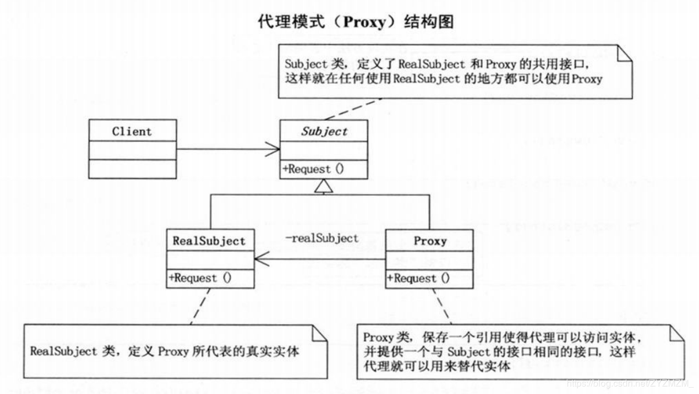

----------
#### 代理模式概述
代理模式市常用的**结构型设计模式**之一，当无法直接访问某个对象或访问某个对象存在困难时可以==通过一个代理对象来间接访问 #9C27B0==，为了保证客户端使用的透明性，**所访问的真实对象与代理对象需要实现相同的接口。**

根据代理模式的使用目的不同，代理模式又可以分为多种类型，例如**保护代理，远程代理，虚拟代理，缓冲代理**等，

**代理模式定义如下：**

> 代理模式（Proxy）：为其他对象提供一种代理以控制对这个对象的访问。

代理模式是一种对象结构型模式。在代理模式中引入了一个新的代理对象，代理对象在客户端对象和目标对象之间起到中介的作用，它去掉客户不能看到的内容和服务或者增添客户需要的额外的新服务。

所谓的代理者是指一个类别可以作为其他东西的接口。代理者可以作任何东西的接口：网上连接，存储器中的大对象，文件或其它昂贵或无法复制的资源。

#### 代理模式结构与实现
代理模式的结构比较简单，其核心是代理类，为了让客户端能够一致性地对待真实对象和代理对象，在代理模式中引入了抽象层.

**静态代理**



代理模式包含如下三个角色：
 - Subject（抽象主题角色）：它声明了真实主题和代理主题的共同接口，这样一来在任何使用真实主题的地方都可以使用代理主题，客户端通常需要针对抽象主题角色进行编程。**通过接口或抽象类声明真实角色实现的业务方法。**

 - Proxy（代理主题角色）：它包含了对真实主题的引用，从而可以在任何时候操作真实主题对象；在代理主题角色中提供一个与真实主题角色相同的接口，以便在任何时候都可以替代真实主题；代理主题角色还可以控制对真实主题的使用，负责在需要的时候创建和删除真实主题对象，并对真实主题对象的使用加以约束。通常，在代理主题角色中，客户端在调用所引用的真实主题操作之前或之后还需要执行其他操作，而不仅仅是单纯调用真实主题对象中的操作。**实现抽象角色，是真实角色的代理，通过真实角色的业务逻辑方法来实现抽象方法，并可以附加自己的操作。**
 
- RealSubject（真实主题角色）：它定义了代理角色所代表的真实对象，在真实主题角色中实现了真实的业务操作，客户端可以通过代理主题角色间接调用真实主题角色中定义的操作。**实现抽象角色，定义真实角色所要实现的业务逻辑，供代理角色调用。**


#### 模式实现

抽象主题类声明了真实主题类和代理类的公共方法，它可以是接口，抽象类或具体类。

客户端访问抽象主题类时，要把真实主题和代理主题的接口统一起来：

``` c++
class Subject{
public:
	virtual void Request() = 0;
}
```

真实主题继承抽象主题类，提供了业务方法的具体实现：

``` c++
class RealSubject : public Subject{
public:
	void Request(){
		// 业务方法具体实现代码
	}
}
```

代理类也是抽象主题类的子类，它维持一个对真实主题对象的引用，调用在真实主题中实现的业务方法，在调用时可以在原有业务方法的基础上附加一些新的方法来对功能进行扩充或约束：

``` c++
class Proxy : public Subject
{
public:
	Proxy(){
		realSubject = new RealSubject();
	}
	void PostRequest() { .... };
	
	.....
	
	void Request()
	{
		....
		realSubject.Request();
		....
		PostRequest();
	}
};
```

代理模式根据其目的和实现方式不同可分为很多种类，其中常用的几种代理模式简要说明如下：

 - 远程代理(Remote Proxy)：为一个位于不同的地址空间的对象提供一个本地的代理对象，这个不同的地址空间可以是在同一台主机中，也可是在另一台主机中，远程代理又称为大使(Ambassador)。
 - 虚拟代理(Virtual Proxy)：如果需要创建一个资源消耗较大的对象，先创建一个消耗相对较小的对象来表示，真实对象只在需要时才会被真正创建。
 - 保护代理(Protect Proxy)：控制对一个对象的访问，可以给不同的用户提供不同级别的使用权限。
 - 缓冲代理(Cache Proxy)：为某一个目标操作的结果提供临时的存储空间，以便多个客户端可以共享这些结果。
 - 智能引用代理(Smart Reference Proxy)：当一个对象被引用时，提供一些额外的操作，例如将对象被调用的次数记录下来等。

#### 代码实现简单的静态代理

