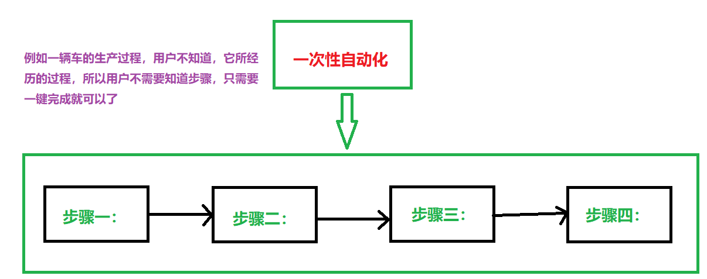
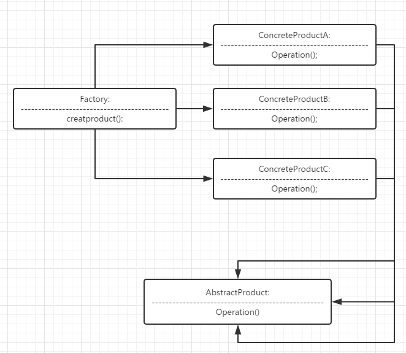
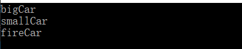

工厂模式（Factory Pattern）：这种类型的设计模式属于创建型模式，它提供了一种创建对象的最佳方式。在工厂模式中，我们在创建对象时不会对客户端暴露创建逻辑，并且是通过使用一个共同的接口来指向新创建的对象。 **==使用一个单独的类来创建实例的过程，就是工厂。 #F44336==**


#### 简单工厂
#### 模式的定义与特点
简单工厂模式是属于创建型模式，又叫做**静态工厂方法模式**，是工厂模式种最简单的一种，可以理解为是不同工厂模式的一个特殊实现。它可以用比较简单的方法隐藏创建对象的细节，==是由一个工厂对象决定创建出哪一种产品类的实例。 #F44336==

#### 模型的结构与实现
该模式中包含的角色及其职责如下：

 - 工厂角色：简单工厂模式的核心，它负责创建所有实例的内部逻辑。工厂类的创建产品类的产品类的方法可以被外界直接调用，创建所需的产品对象。
 - 抽象产品角色：简单工厂模式所创建的所有对象的父类，它负责描述所有实例所共有的公共接口。
 - 具体产品角色：是简单工厂模式的创建目标，所有创建的对象都是充当这个角色的某个具体类的实例。

缺点：对修改不封闭，新增加产品就需要修改工厂。违背了开闭法则（OCP）。

UML图如下：


代码实例：

``` c++
#include <iostream>
using namespace std;

/* 定义汽车类型 */
enum CarType { bigCar, smallCar, fireCar };

/* 抽象产品汽车模型 */
class CarBase
{
public:
	virtual ~CarBase() {}
	virtual void show() = 0;
};

/* bigCar具体产品Car */
class BigCar : public CarBase
{
public:
	void show() { cout << "bigCar" << endl; }
};

/* smallCar具体产品Car */
class SmallCar : public CarBase
{
public:
	void show() { cout << "smallCar" << endl; }
};

/* fireCar具体产品Car */
class FireCar : public CarBase
{
public:
	void show() { cout << "fireCar" << endl; }
};

/* 汽车工厂 */
class Factory {
public:
	CarBase* Car(CarType type)
	{
		switch (type)
		{
		case bigCar:
			return new BigCar();
			break;
		case smallCar:
			return new SmallCar();
			break;
		case fireCar:
			return new FireCar();
			break;
		default:
			break;
		}
	}
};

int main()
{
	Factory factory;
	CarBase* ptr = factory.Car(bigCar);
	ptr->show();
	ptr = factory.Car(smallCar);
	ptr->show();
	ptr = factory.Car(fireCar);
	ptr->show();
	delete ptr;
	return 0;
}
```



----------
#### 工厂方法
#### 模式的定义与特点
工厂方法模式的意义是==定义一个创建产品对象的工厂接口，将实际创建工作推迟到子类当中 #F44336== 。核心工厂类不再负责产品的创建，这样核心类成为一个抽象工厂角色，仅负责具体工厂子类必须实现的接口，这样进一步抽象化的好处是使得工厂方法模式==可以使系统在不修改具体工厂角色的情况下引进新的产品。 #9C27B0==
