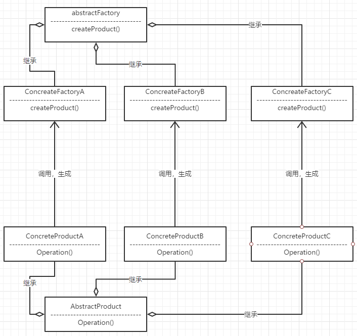
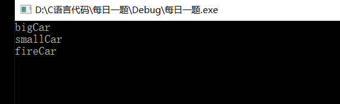
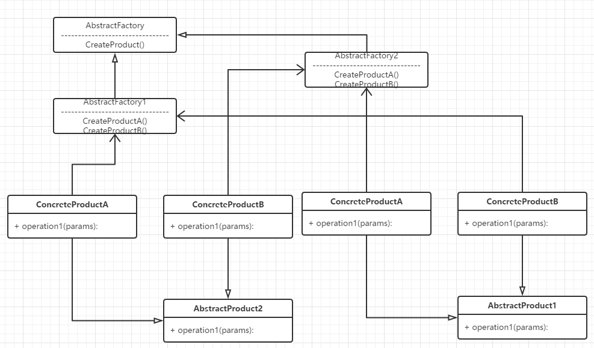
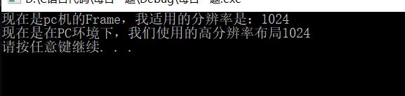

工厂模式（Factory Pattern）：这种类型的设计模式属于创建型模式，它提供了一种创建对象的最佳方式。在工厂模式中，我们在创建对象时不会对客户端暴露创建逻辑，并且是通过使用一个共同的接口来指向新创建的对象。 **==使用一个单独的类来创建实例的过程，就是工厂。 #F44336==**


#### 简单工厂
#### 模式的定义与特点
简单工厂模式是属于创建型模式，又叫做**静态工厂方法模式**，是工厂模式种最简单的一种，可以理解为是不同工厂模式的一个特殊实现。它可以用比较简单的方法隐藏创建对象的细节，==是由一个工厂对象决定创建出哪一种产品类的实例。 #F44336==

#### 模型的结构与实现
该模式中包含的角色及其职责如下：

 - 工厂角色：简单工厂模式的核心，它负责创建所有实例的内部逻辑。工厂类的创建产品类的产品类的方法可以被外界直接调用，创建所需的产品对象。
 - 抽象产品角色：简单工厂模式所创建的所有对象的父类，它负责描述所有实例所共有的公共接口。
 - 具体产品角色：是简单工厂模式的创建目标，所有创建的对象都是充当这个角色的某个具体类的实例。

缺点：对修改不封闭，新增加产品就需要修改工厂。违背了开闭法则（OCP）。

UML图如下：


代码实例：

``` c++
#include <iostream>
using namespace std;

/* 定义汽车类型 */
enum CarType { bigCar, smallCar, fireCar };

/* 抽象产品汽车模型 */
class CarBase
{
public:
	virtual ~CarBase() {}
	virtual void show() = 0;
};

/* bigCar具体产品Car */
class BigCar : public CarBase
{
public:
	void show() { cout << "bigCar" << endl; }
};

/* smallCar具体产品Car */
class SmallCar : public CarBase
{
public:
	void show() { cout << "smallCar" << endl; }
};

/* fireCar具体产品Car */
class FireCar : public CarBase
{
public:
	void show() { cout << "fireCar" << endl; }
};

/* 汽车工厂 */
class Factory {
public:
	CarBase* Car(CarType type)
	{
		switch (type)
		{
		case bigCar:
			return new BigCar();
			break;
		case smallCar:
			return new SmallCar();
			break;
		case fireCar:
			return new FireCar();
			break;
		default:
			break;
		}
	}
};

int main()
{
	Factory factory;
	CarBase* ptr = factory.Car(bigCar);
	ptr->show();
	ptr = factory.Car(smallCar);
	ptr->show();
	ptr = factory.Car(fireCar);
	ptr->show();
	delete ptr;
	return 0;
}
```


----------
#### 工厂方法
#### 模式的定义与特点
工厂方法模式的意义是==定义一个创建产品对象的工厂接口，将实际创建工作推迟到子类当中 #F44336== 。核心工厂类不再负责产品的创建，这样核心类成为一个抽象工厂角色，仅负责具体工厂子类必须实现的接口，这样进一步抽象化的好处是使得工厂方法模式==可以使系统在不修改具体工厂角色的情况下引进新的产品。 #9C27B0==

工厂方法模式是简单工厂模式的衍生，解决了许多简单工厂模式的问题。==首先完全实现“开-闭原则”，实现了可扩展 #03A9F4==。其次更复杂的层次结构，可以应用于产品结果复杂的场合。

工厂方法模式对简单工厂模式进行了抽象。有一个抽象的Factory类（可以是抽象类和接口），这个类将不再负责具体的产品生产，而是只制定一些规范，具体的生产工作由子类去完成。

在这个模式中，工厂类和产品类往往可以依次对应。即一个抽象工厂对应一个抽象产品，一个具体工厂对应一个具体产品，这个具体的工厂就负责生产对应的产品。

#### 模式的结构和实现
该模式中包含的角色及其职责如下：

 - 抽象工厂角色： ==是工厂方法模式的核心， #F44336== 与应用程序无关。任何在模式中创建的对象的工厂类必须实现这个接口。
 - 具体工厂角色： ==这是实现抽象工厂接口的具体工厂类，包含于应用程序密切相关的逻辑，并且受到应用程序调用以创建产品对象。 #E91E63==
 - 抽象产品角色： 工厂方法模式所创建的对象类型，也就是产品对象的共同父类或共同拥有的接口。
 - 具体产品角色： ==这个角色实现了抽象产品角色所定义的接口。 #2196F3==某具体产品有专门的具体工厂创建，它们之间往往一一对应。

UML图如下：

示例程序：

``` c++
#include <iostream>
using namespace std;

/* 定义汽车类型 */
enum CarType { bigCar, smallCar, fireCar };

/* 抽象产品汽车模型 */
class CarBase
{
public:
	virtual ~CarBase() {}
	virtual void show() = 0;
};

/* bigCar具体产品Car */
class BigCar : public CarBase
{
public:
	void show() { cout << "bigCar" << endl; }
};

/* smallCar具体产品Car */
class SmallCar : public CarBase
{
public:
	void show() { cout << "smallCar" << endl; }
};

/* fireCar具体产品Car */
class FireCar : public CarBase
{
public:
	void show() { cout << "fireCar" << endl; }
};

/* 抽象汽车工厂 */
class Factory {
public:
	virtual CarBase* createCar() = 0;
};

/* 专门生产fireCar工厂 */
class FireCarFactory : public Factory {
public:
	CarBase * createCar()
	{
		return new FireCar();
	}
};

/* 专门生产bigCar工厂 */
class BigCarFactory : public Factory {
public:
	CarBase * createCar()
	{
		return new BigCar();
	}
};

/* 专门生产smallCar工厂 */
class SmallCarFactory : public Factory {
public:
	CarBase * createCar()
	{
		return new SmallCar();
	}
};
int main()
{
	BigCarFactory Bigfactory;
	CarBase* ptr1 = Bigfactory.createCar();
	ptr1->show();

	SmallCarFactory Smallfactory;
	CarBase* ptr2 = Smallfactory.createCar();
	ptr2->show();

	FireCarFactory Firefactory;
	CarBase* ptr3 = Firefactory.createCar();
	ptr3->show();

	delete ptr1;
	delete ptr2;
	delete ptr3;
	return 0;
}
```
运行结果：



----------
#### 抽象工厂
#### 模式的定义与特点
前面介绍的工厂方法模式中考虑的是一类产品的生产。

工厂方法模式只考虑生产同等级的产品，但是在现实生活中许多工厂都是综合型的工厂，能生产多种类的产品，如高通不仅生产芯片，还对通信行业有涉及。

抽象工厂模式的定义：==是一种为访问类提供一个创建一组相关或相互依赖对象的接口 #F44336==，且访问类无须指定所要产品的具体类就能得到同族的不同等级的产品的模式结构。

抽象工厂模式是**工厂方法模式的升级版本**，工厂方法模式只生产一个等级的产品，而==抽象工厂模式可生产多个等级（种类） 的产品。 #F44336==

使用抽象工厂模式一般要满足以下条件。

 - 系统中有多个产品族，每个具体工厂创建同一族但属于不同等级结构的产品。
 - 系统一次只可能消费某中某一族产品，即同族的产品一起使用。

抽象工厂模式除了具有工厂方法模式的优点外，其他主要优点如下。

 - 可以在类的内部对产品族中相关联的多等级产品共同管理，而不必专门引入多个新的类来进行管理。
 - 当==增加一个新的产品族时不需要修改原代码，满足开闭原则。 #2196F3==

其缺点是：当产品族中需要==增加一个新的产品时，所有的工厂类都需要进行修改。 #9C27B0==
#### 模式的结构与实现
抽象工厂模式同工厂方法模式一样，也是由抽象工厂，具体工厂，抽象产品和具体产品等4个要素构成，但抽象工厂中方法个数不同，抽象产品的个数也不同。现在我们来分析其基本结构和实现方法。

抽象工厂模式的主要角色如下：

 - 抽象工厂：提供了创建产品的接口， 它包含多个创建产品的方法 newProduct(), ==可以创建多个不同等级的产品。 #F44336==
 - 具体工厂：主要是==实现抽象工厂中的多个抽象方法，完成具体产品的创建。 #9C27B0==
 - 抽象产品：定义了产品的规范，描述了产品的主要特性和功能，抽象工厂模式有==多个抽象产品。 #2196F3==
 - 具体产品：实现了抽象产品角色所定义的接口，由具体工厂来创建，它同具体工厂之间是多对一的关系。

UML图如下：

示例程序：

``` c++
#include <string>
#include <map>
#include <memory>
#include <algorithm>
#include <functional>
#include <iostream>
using namespace std;

class FrameApi {
public:
	virtual void draw() = 0;
protected:
	FrameApi() {}
};

class LayoutApi {
	//分率的布局器
public:
	virtual void installFrame() = 0;
protected:
	LayoutApi() {}
};

//pc上的Frame
class ComputerFrame : public FrameApi {
public:
	ComputerFrame(int pins)
		:m_pins(pins)
	{}

	void draw()
	{
		cout << "现在是pc机的Frame，我适用的分辨率是：" << m_pins << endl;
	}
private:
	int m_pins;	//分辨率
};

//Moblie的Frame
class MoblieFrame : public FrameApi {
public:
	MoblieFrame(int pins)
		:m_pins(pins)
	{}

	void draw()
	{
		cout << "现在是Moblie的Frame，我适用的分辨率是：" << m_pins << endl;
	}
private:
	int m_pins;	//分辨率
};

//高分辨lv的布局
class HighLayout :public LayoutApi {
public:
	HighLayout(int FrameAdpaterPins)
		:m_FrameAdpaterPins(FrameAdpaterPins)
	{}

	void installFrame()
	{
		cout << "现在是在PC环境下，我们使用的高分辨率布局" << m_FrameAdpaterPins <<endl;
	}
private:
	int m_FrameAdpaterPins;
};

//低分辨lv的布局
class LowLayout :public LayoutApi {
public:
	LowLayout(int FrameAdpaterPins)
		:m_FrameAdpaterPins(FrameAdpaterPins)
	{}

	void installFrame()
	{
		cout << "现在是在PC环境下，我们使用的低分辨率布局" << m_FrameAdpaterPins << endl;
	}
private:
	int m_FrameAdpaterPins;
};


//抽象工厂用来定义产品簇
class AbstractFactory {
public:
	virtual FrameApi* createFrameApi() = 0;
	virtual LayoutApi* createLayoutApi() = 0;
protected:
	AbstractFactory(){}
};

class Schema1 : public AbstractFactory {
public:
	FrameApi* createFrameApi()
	{
		return new ComputerFrame(1024);
	}

	LayoutApi* createLayoutApi()
	{
		return new HighLayout(1024);
	}
};

class Schema2 : public AbstractFactory
{
public:
	FrameApi* createFrameApi()
	{
		return new MoblieFrame(800);
	}
	LayoutApi* createLayoutApi()
	{
		return new LowLayout(800);
	}
};

class AdvanceGuiEngineer {
public:
	void prepareMaterials(AbstractFactory* pSchema)
	{
		this->pFrame = pSchema->createFrameApi();
		this->pLayout = pSchema->createLayoutApi();

		pFrame->draw();
		pLayout->installFrame();
	}
private:
	FrameApi* pFrame;
	LayoutApi* pLayout;
};

int main()
{
	AdvanceGuiEngineer* pEng = new AdvanceGuiEngineer();
	pEng->prepareMaterials(new Schema1);
	system("pause");
	return 0;
}
```
运行结果：

