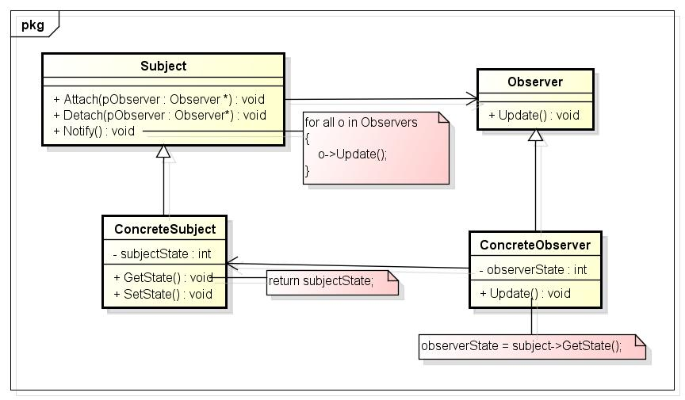
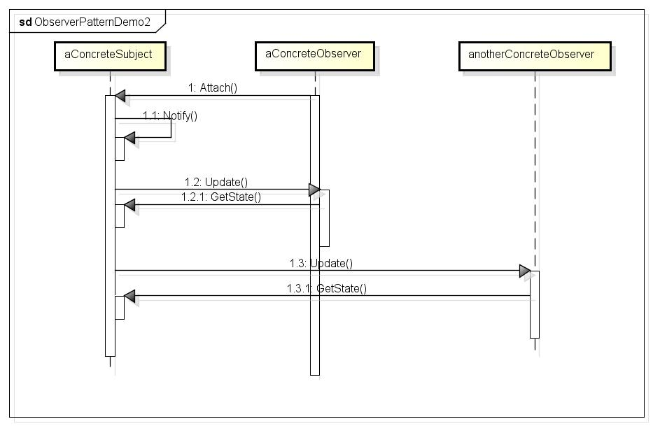
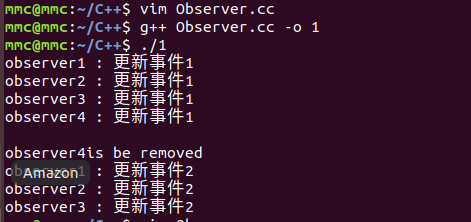

#### Observer 模式：
这个模式可以说是应用最多，影响最广的模式之一，它用于**建立一种对象于对象之间的依赖关系，一个对象发生改变时将自动通知其他对象，其他对象将相应作出反应。**

#### 模式的定义

观察者模式（Observer Pattern）定义如下：
> 定义对象间的==一种一对多的依赖关系 #9C27B0==，==当一个对象的状态发生改变时，所有依赖于它的对象都得到通知并被自动更新 #673AB7==。当一个对象发生了变化，关注它的对象就会得到通知；这种交互也称为发布-订阅(publish-subscribe)。**目标是通知的发布者，它发出通知时并不需要知道谁是它的观察者**。观察者模式的别名还包括 《模型-视图（Model/View）模式、源-监听器（Source/Listener）模式或从属者（Dependents）模式。观察者模式是一种对象行为型模式。》

#### 模式的优点
1、观察者模式（Observer）完美的将观察者和被观察的对象分离开。举个例子，用户界面可以作为一个观察者，业务数据是被观察者，用户界面观察业务数据的变化，发现数据变化后，就显示在界面上。

2、面向对象设计的一个原则是：==系统中的每个类将重点放在某一个功能上，而不是其他方面 #9C27B0==。一个对象只做一件事情，并且将他做好。观察者模式在模块之间划定了清晰的界限，提高了应用2程序的可维护性和重用性。

3、观察者设计模式定义了对象间的一种一对多的组合关系，以便一个对象的状态发生变化时，所有依赖于它的对象都得到通知并自动刷新。

4、观察者模式包含观察目标和观察者两类对象，一个目标可以有任意数目的与之相依赖的观察者，一旦观察目标的状态发生改变，所有的观察者都将得到通知。作为对这个通知的响应，每个观察者都将监视观察目标的状态以使其状态与目标状态同步，这种交互也称为发布-订阅(Publish-Subscribe)。观察目标是通知的发布者，它发出通知时并不需要知道谁是它的观察者，可以有任意数目的观察者订阅它并接收通知。

#### 模式的应用场景
在以下任意情况下都可以使用观察者模式：

 - 当一个抽象模型有两个方面，其中一个方面依赖于另一方面。**将这二者封装在独立的对象中以使它们可以各自独立的改变和复用**；
 - 当对一个对象的改变需要同时改变其它对象，**而不知道具体有多少对象有待改变**；
 - 当一个对象必须通知其它对象，而它又不能假定其它对象是谁；也就是说，**你不希望这些对象是紧密耦合的**；

#### 模式UML类图分析



Subject（目标）

 - 目标知道它的观察者。可以有任意多个观察者观察同一个目标；
 - 提供注册和删除观察者对象的接口。

Observer（观察者）

 - 为那些在目标发生改变时需获得通知的对象定义一个更新接口。

ConcreteSubject（具体目标）

 - 将有关状态存入各ConcreteObserver对象；
 - 当它的状态发生改变时，向它的各个观察者发出通知。

ConcreteObserver（具体观察者）

 - 维护一个指向ConcreteSubject对象的引用；
 - 存储有关状态，这些状态应与目标的状态保持一致；
 - 实现Observer的更新接口以使自身状态与目标的状态保持一致。

观察者模式按照以下方式进行协作：
 1. 当ConcreteSubject发生任可能导致其观察者与其本身状态不一致的改变时，它将通知它的各个观察者；
 2. 在得到一个具体目标的改变通知后，ConcreteObserver对象可向目标对象查询信息。ConcreteObserver使用这些信息以使它的状态与目标对象的状态一致。

调用时序图：


#### 代码程序示例

``` c++
#include <iostream>
#include <string>
#include <list>
using namespace std;

class Subject;
//抽象观察者
class Observer {
public:
    virtual void updata() = 0;
    virtual string getName() = 0;
    virtual ~Observer(){}
};

//具体观察者，实现updata方法
class StockObserver : public Observer {
public:
    StockObserver(string str, Subject* _obj) : 
        name(str),
        obj(_obj)
    {}

    void updata();

    string getName()
    {
        return name;
    }

private:
    string name;
    Subject* obj;
};

//抽象目标，提供目标接口
class Subject {
public:
    /* 添加观察者 */
    virtual void Add(Observer* ob) = 0;

    /* 删除观察者 */
    virtual void Remove(Observer* ob) = 0;

    /* 通知所有观察者 */
    virtual void Notify() = 0;

    virtual void print_action() = 0;
    
    virtual void change_action(string) = 0;

    virtual ~Subject(){}
};

// 具体目标，实现抽象目标所提供的接口
class ConcreteSubject : public Subject {
public:
    void Add (Observer* ob)
    {
        ObserverList.push_back(ob);
    }

    void Remove (Observer* ob)
    {
        ObserverList.remove(ob);
        cout << endl << ob->getName()
            << " : is be removed" << endl;
    }

    void Notify()
    {
        auto it = ObserverList.begin();
        while (it != ObserverList.end())
        {
            (*it)->updata();
            it++;
        }
    }

    void print_action()
    {
        cout << action;
    }

    void change_action(string ss)
    {
        action = ss;
    }
    
private:
    string action;
    list<Observer*> ObserverList;
};

void StockObserver::updata()
{
    cout << name << " : "; 
    obj->print_action();
    cout << endl;
}

int main()
{
    Subject * sptr = new ConcreteSubject();
    Observer* Optr1 = new StockObserver("observer1", sptr);
    Observer* Optr2 = new StockObserver("observer2", sptr);
    Observer* Optr3 = new StockObserver("observer3", sptr);
    Observer* Optr4 = new StockObserver("observer4", sptr);

    sptr->Add(Optr1);
    sptr->Add(Optr2);
    sptr->Add(Optr3);
    sptr->Add(Optr4);

    sptr->change_action("更新事件1");

    sptr->Notify();

    sptr->Remove(Optr4);
    
    sptr->change_action("更新事件2");

    sptr->Notify();
    return 0;
}
```


#### 实现方式

==观察者模式有很多实现方式，从根本上说，该模式必须包含两个角色：观察者和被观察对象 #9C27B0==。在上面的例子中，业务数据是被观察对象，用户界面是观察者。

**观察者和被观察者之间存在“观察”的逻辑关联，当被观察者发生改变的时候，观察者就会观察到这样的变化，并且做出相应的响应**。如果在用户界面、业务数据之间使用这样的观察过程，可以确保界面和数据之间划清界限，假定应用程序的需求发生变化，需要修改界面的表现，只需要重新构建一个用户界面，业务数据不需要发生变化。

**注意：**
==实现观察者模式的时候要注意，观察者和被观察对象之间的互动关系不能体现成类之间的直接调用，否则就将使观察者和被观察对象之间紧密的耦合起来，从根本上违反面向对象的设计的原则。无论是观察者“观察”观察对象，还是被观察者将自己的改变“通知”观察者，都不应该直接调用。 #E91E63==