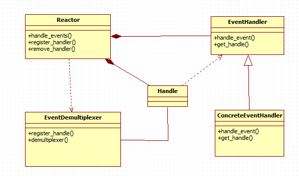
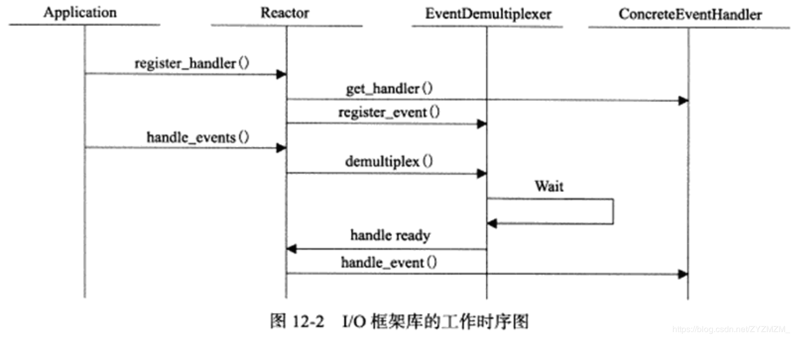
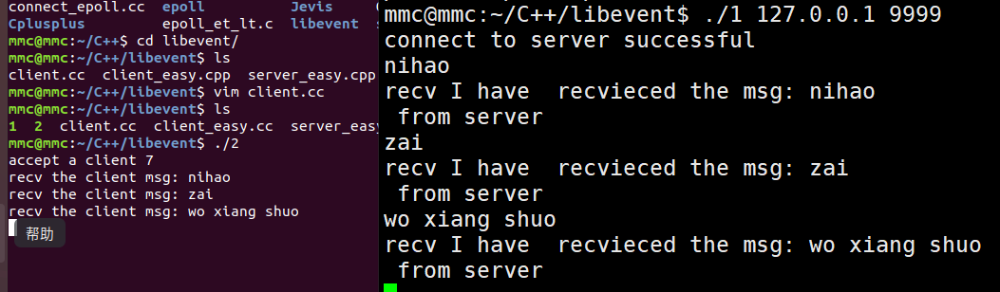

#### <i class="far fa-hand-point-right">概述</i>

**Linux服务器程序必须处理的三类事件：**

 - I/O事件
 - 信号
 - 定时事件

**处理这三类事件主要考虑以下问题：**

 - 统一事件源（统一处理这三类问题可以使代码简单易懂，又能避免潜在的逻辑问题）
 - 可移植性（不同的操作系统有不同的I/O复用方式）
 - 对并发编程的支持（在多进程和多线程情况下，需要考虑各执行实体如何协同处理了客户连接，信号和定时器，以避免竞态条件）

#### <i class="far fa-hand-point-right">I/O框架库</i>

I/O框架库是以库函数的形式，封装了较为底层的系统调用，给应用程序提供的一组更便于使用的接口。

**I/O框架库的实现原理：**

 - 以Reactor模式实现
 - 以Proactor模式实现
 - 同时用Reactor和Proactor两种模式实现


Reactor模式：

> Reactor模式，即反应器模式，是一种高效的异步IO模式，特征是 回调，当IO完成时，回调对应的函数进行处理。这种模式并非是真正的异步，而是运用了异步的思想，当IO事件触发时，通知应用程序作出IO处理。模式本身并不调用系统的异步IO函数。

Proactor模式：

> Proactor模式，即前摄器模式，也是一种高效的异步IO模式，特征也是回调，当IO事件完成时，回调对应的函数对完成事件作出处理。这种模式是真正意义上的异步，属于系统级的异步，通常要调用系统提供的异步IO函数进行IO处理。

**Reactor模式和Proactor模式之间的区别：**

 - Reacor模式不调用系统异步IO函数，是一种仿异步
 - Proactor是系统层面上的真正的异步，调用系统提供的异步IO函数


#### <i class="far fa-hand-point-right">Reactor模式</i>

**Reactor 模式它具有如下的优点：**
 - 响应快，不必为单个同步时间所阻塞，虽然Reactor 本身依然是同步的；
 - 编程相对简单， 可以最大程度的避免复杂的多线程及同步问题，并且避免了多线程/进程的切换开销；
 - 可扩展性，可以方便的通过增加Reactor 实例个数来充分利用CPU资源；
 - 可复用性，reactor框架本身与具体事件处理逻辑无关，具有很高的复用性；

 **Reactor模式框架**
 

**libevent是一个基于Reactor模式的I/O框架库包括以下几个组件：**

> **1、句柄（Handle）**
> I/O框架库要处理的对象，即I/O事件、信号和定时事件，统一称为事件源。
> 一个事件源通常和一个句柄绑定在一起。 句柄的作用是，当内核检测到就绪事件时，它将通过句柄来通知应用程序这一事件。在Linux环境下，I/O事件对应的句柄为文件描述符，信号事件对应的句柄为信号值。
> **2、事件多路分发器（EventDemultiplexer）**
> 事件的到来是随机的、异步的。我们无法预知程序何时收到一个客户连接请求，又亦或收到一个暂停信号。所以程序需要循环地等待并处理事件，这就是事件循环。在事件循环中，等待事件一般使用I/O复用技术来实现。
> I/O 框架库一般将系统支持的各种I/O复用系统调用封装成统一的接口，称为事件多路分发器。 事件多路分发器的demultiplex方法是等待事件的核心函数，其内部调用的是select、 poll、 epoll_wait 等函数。
> 此外，事件多路分发器还需要实现 register_event 和 remove_event 方法，以供调用者向事件多路分发器中添加事件和从事件多路分发器中删除事件。
> **3、事件处理器和具体事件处理器(EventHandle and ConcreteEventHandle)**
> 事件处理器执行事件对应的业务逻辑。它通常包含一个或多个 handle_event 回调函数，这些回调函数在事件循环中被执行。
> I/O 框架库提供的事件处理器通常是一个接口， 用户需要继承它来实现自己的事件处理器，即具体事件处理器。因此，事件处理器中的回调函数一般被声明为虚函数，以支持用户的扩展。 此外，事件处理器一般还提供一个 get_handle 方法，它返回与该事件处理器关联的句柄。
> ==那么事件处理器和句柄有什么关系？ #9C27B0==
> ==当事件多路分发器检测到有事件发生时，它是通过句柄来通知应用程序的。因此，我们必须将事件处理器和句柄绑定，才能在事件发生时获取到正确的事件处理器。 #F44336==
> **4、Reactor**
> Reactor是I/O框架库的核心。它提供的几个主要方法是：
> 1.handle_events 该方法执行事件循环。它重复如下过程：等待事件，然后依次处理所有就绪事件对应的事件处理器。
> 2.register_handler 该方法调用事件多路分发器的 register_event 方法来往事件多路分发器中注册一个事件。
> 3.remove_handler 该方法调用事件多路分发器的 remove_ event 方法来删除事件多路分发器中的一个事件。




客户端：

``` c++
#include <stdio.h>
#include <string.h>
#include <assert.h>
#include <stdlib.h>
#include <unistd.h>
#include <sys/socket.h>
#include <netinet/in.h>
#include <arpa/inet.h>
#include <sys/epoll.h>
#include <event.h>
#include <sys/time.h>

#define MAXFD 1024

struct event *arr[MAXFD] = { 0 };

// 添加事件处理器到arr数组中，将事件处理器和句柄绑定
void arr_add( int fd, struct event *ev )
{
    if ( fd < 0 || fd >= MAXFD )
    {
        return;
    }
    arr[fd] = ev;
}

/*
 * 从arr数组中删除句柄所指定的事件处理器，
 * 并返回该事件处理器上处理函数
 *
 */
struct event *arr_find_ev( int fd )
{
    if ( fd < 0 || fd >= MAXFD )
    {
        return NULL;
    }
    struct event *ptr = arr[fd];
    arr[fd] = 0;
    return ptr;
}

void recv_cb( int fd, short ev, void *arg )
{
    //处理读事件
    if ( ev & EV_READ )
    {
        char buff[128] = { 0 };
        int n = recv( fd, buff, 127, 0 );
        if ( n <= 0 )
        {
            // 若没有从libevent中删除，则会反复循环，
            // 因此，我们必须处理当客户端关闭时，从
            // libevent中将事件删除
            event_free(arr_find_ev(fd));
            printf("one client over\n");
            return;
        }
        printf("buff(%d) = %s\n", fd, buff);
        send( fd, "OK", 2, 0 );
    }
}

void accept_cb( int fd, short ev, void *arg )
{
    //处理新连接，每次有新连接到来时，就会调用accept_cb
    if ( ev & EV_READ )
    {
        struct event_base *base = (struct event_base*) arg;
        struct sockaddr_in caddr;
        unsigned int len = sizeof(caddr);

        //获得连接套接字
        
        int connfd = ::accept( fd, (struct sockaddr *) &caddr, &len );
        if ( connfd < 0 )
        {
            return;
        }

        printf("accept connfd = %d\n", connfd);

        struct event *c_ev = event_new( base, connfd, EV_READ | EV_PERSIST, recv_cb, NULL );
        if (c_ev == NULL)
        {
            close(connfd);
            return;
        }
       event_add(c_ev, NULL);
       arr_add( connfd, c_ev );
    }
}


int create_sockfd()
{
    int sockfd = socket( AF_INET, SOCK_STREAM, 0 );
    if ( sockfd == -1 )
    {
        return -1;
    }

    struct sockaddr_in saddr;
    bzero(&saddr, sizeof(saddr));
    saddr.sin_family = AF_INET;
    saddr.sin_port = htons(6000);
    saddr.sin_addr.s_addr = inet_addr("127.0.0.1");

    int res = bind( sockfd, (struct sockaddr*)&saddr, sizeof(saddr) );
    if (res == -1)
    {
        return -1;
    }
    listen( sockfd, 5 );
    return sockfd;
}

int main()
{
    int sockfd = create_sockfd();
    assert( sockfd != -1 );

    struct event_base * base = event_init();
    assert( base != NULL );

    struct event * sock_ev = event_new( base, sockfd, EV_READ | EV_PERSIST, accept_cb, base );
    assert( sock_ev != NULL );
    event_add( sock_ev, NULL );
    event_base_free(base);
    close(sockfd);
    exit(0);
}

```

服务器：
``` c++
#include<stdio.h>
#include<string.h>
#include<errno.h>
#include<unistd.h>
#include<event.h>

void accept_cb( int fd, short events, void* arg );

void socket_read_cb( int fd, short events, void* arg );

int tcp_server_init( int port, int listen_num );

int main( int argc, char** argv )
{
    int listener = tcp_server_init(9999, 10);
    if ( listener == -1 )
    {
        perror( "tcp_server_init error" );
        return -1;
    }

    struct event_base* base = event_base_new();

    struct event* ev_listen = event_new( base, listener, EV_READ | EV_PERSIST,
                                         accept_cb, base);
    event_add( ev_listen, NULL );

    event_base_dispatch( base );
    return 0;
}

void accept_cb( int fd, short events, void* arg )
{
    evutil_socket_t sockfd;
    struct sockaddr_in client;
    socklen_t len = sizeof(client);
    
    sockfd = ::accept(fd, ( struct sockaddr* )&client, &len);
    evutil_make_socket_nonblocking(sockfd);

    printf( "accept a client %d\n", sockfd );
    struct event_base* base = (event_base*)arg;

    struct event* ev = event_new( NULL, -1, 0, NULL, NULL );

    event_assign(ev, base, sockfd, EV_READ | EV_PERSIST, 
                 socket_read_cb, (void*)ev);
    event_add(ev, NULL);
}

void socket_read_cb( int fd, short events, void *arg )
{
    char msg[4096];
    struct event *ev = (struct event*)arg;
    int len = read(fd, msg, sizeof(msg) - 1);

    if (len <= 0)
    {
        printf( "some error happen when read\n" );
        event_free(ev);
        close(fd);
        return;
    }

    msg[len] = '\0';
    printf( "recv the client msg: %s", msg );

    char reply_msg[4096] = "I have  recvieced the msg: ";
    strcat(reply_msg + strlen(reply_msg), msg);
    write( fd, reply_msg, strlen(reply_msg) );
}

typedef struct sockaddr SA;
int tcp_server_init( int port, int listen_num )
{
    int errno_save;
    evutil_socket_t listener;

    listener = ::socket( AF_INET, SOCK_STREAM, 0 );
    if ( listener == -1 )
        return -1;

    evutil_make_listen_socket_reuseable( listener );

    struct sockaddr_in sin;
    sin.sin_family = AF_INET;
    sin.sin_port = htons(port);
    sin.sin_addr.s_addr = 0;

    if ( ::bind(listener, (SA*)&sin, sizeof(sin)) < 0 )
    {
        goto error;
    }

    if ( ::listen( listener, listen_num ) < 0 )
    {
        goto error;
    }
    evutil_make_socket_nonblocking(listener);
    return listener;
error:
    errno_save = errno;
    evutil_closesocket(listener);
    errno = errno_save;
    return -1;
}

```

 
 