c++中引入了右值引用和移动语义，可以避免无谓的复制，提高程序性能。

#### 左值、右值
c++中所有的值都必然属于左值、右值二者之一。左值是指表达式结束后依然存在的持久化对象，右值是指表达式结束时就不再存在的临时对象。所有的具名变量或者对象都是左值，而右值不具名。很难得到左值和右值的真正定义，但是有一个可以区分左值和右值的便捷方法：看能不能对表达式取地址，如果能，则为左值，否则为右值。

看见书上又将右值分为将亡值和纯右值。纯右值就是c++98标准中右值的概念，如非引用返回的函数返回的临时变量值；一些运算表达式，如1+2产生的临时变量；不跟对象关联的字面量值，如2，'c'，true，"hello"；这些值都不能够被取地址。

而将亡值则是c++11新增的和右值引用相关的表达式，这样的表达式通常时将要移动的对象、T&&函数返回值、std::move()函数的返回值等，

不懂将亡值和纯右值的区别其实没关系，统一看作右值即可，不影响使用。

示例：
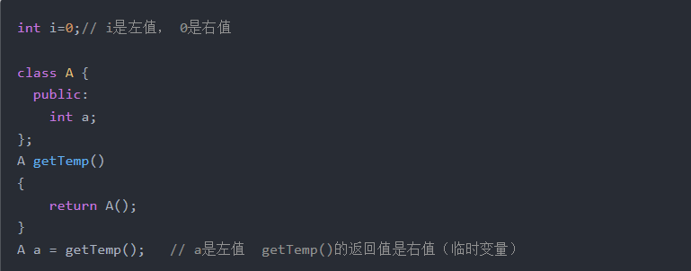

#### 左值引用、右值引用

c++98中的引用很常见了，就是给变量取了个别名，在c++11中，因为增加了右值引用(rvalue reference)的概念，所以c++98中的引用都称为了左值引用(lvalue reference)。

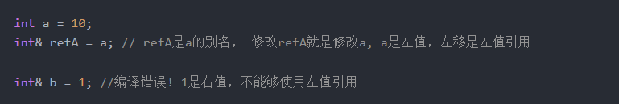

c++11中的右值引用使用的符号是&&，如

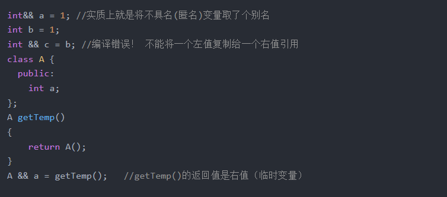

getTemp()返回的右值本来在表达式语句结束后，其生命也就该终结了（因为是临时变量），而通过右值引用，该右值又重获新生，其生命期将与右值引用类型变量a的生命期一样，只要a还活着，该右值临时变量将会一直存活下去。实际上就是给那个临时变量取了个名字。

注意：这里a的类型是右值引用类型(int &&)，但是如果从左值和右值的角度区分它，它实际上是个左值。因为可以对它取地址，而且它还有名字，是一个已经命名的右值。

所以，左值引用只能绑定左值，右值引用只能绑定右值，如果绑定的不对，编译就会失败。但是，常量左值引用却是个奇葩，它可以算是一个“万能”的引用类型，它可以绑定非常量左值、常量左值、右值，而且在绑定右值的时候，常量左值引用还可以像右值引用一样将右值的生命期延长，缺点是，只能读不能改。

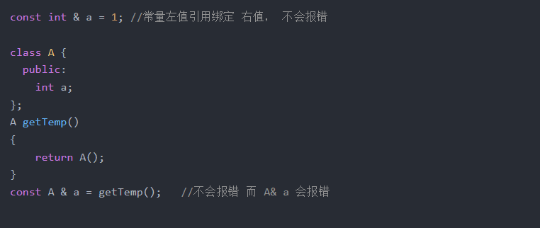

事实上，很多情况下我们用来常量左值引用的这个功能却没有意识到，如下面的例子：

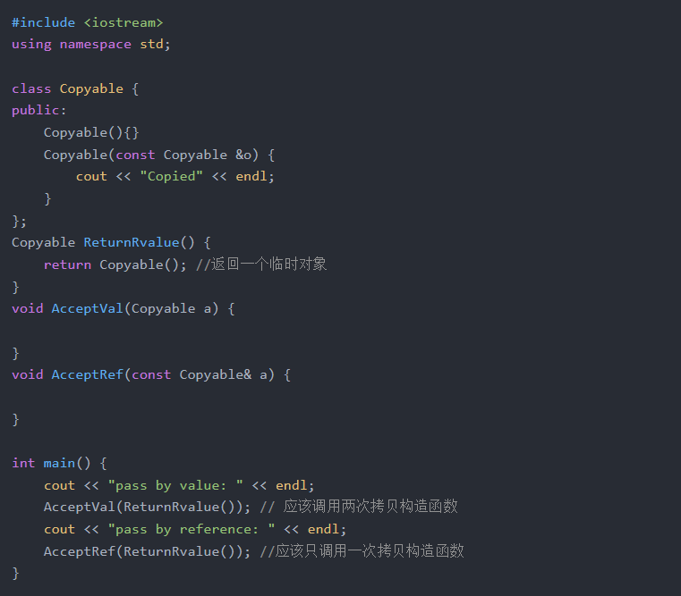

当我敲完上面的例子并运行后，发现结果和我想象的完全不一样！期望中AcceptVal(ReturnRvalue())需要调用两次拷贝构造函数，一次在ReturnRvalue()函数中，构造好了Copyable对象，返回的时候会调用拷贝构造函数生成一个临时对象，在调用AcceptVal()时，又会将这个对象拷贝给函数的局部变量a，一共调用了两次拷贝构造函数。而AcceptRef()的不同在于形参是常量左值引用，它能够接收一个右值，而且不需要拷贝。
而实际的结果是，不管哪种方式，一次拷贝构造函数都没有调用！
这是由于编译器默认开启了返回值优化(RVO/NRVO, RVO, Return Value Optimization 返回值优化，或者NRVO， Named Return Value Optimization)。编译器很聪明，发现在ReturnRvalue内部生成了一个对象，返回之后还需要生成一个临时对象调用拷贝构造函数，很麻烦，所以直接优化成了1个对象对象，避免拷贝，而这个临时变量又被赋值给了函数的形参，还是没必要，所以最后这三个变量都用一个变量替代了，不需要调用拷贝构造函数。
虽然各大厂家的编译器都已经都有了这个优化，但是这并不是c++标准规定的，而且不是所有的返回值都能够被优化，而这篇文章的主要讲的右值引用，移动语义可以解决编译器无法解决的问题。
为了更好的观察结果，可以在编译的时候加上-fno-elide-constructors选项(关闭返回值优化)。

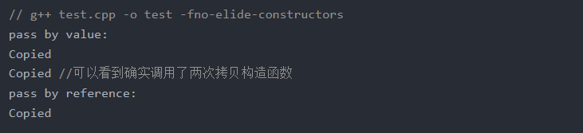

上面这个例子本意是想说明常量左值引用能够绑定一个右值，可以减少一次拷贝（使用非常量的左值引用会编译失败），但是顺便讲到了编译器的返回值优化。。编译器还是干了很多事情的，很有用，但不能过于依赖，因为你也不确定它什么时候优化了什么时候没优化。

总结：
1.左值引用， 使用 T&, 只能绑定左值 
2.右值引用， 使用 T&&， 只能绑定右值 
3.常量左值， 使用 const T&, 既可以绑定左值又可以绑定右值 
4.已命名的右值引用，编译器会认为是个左值 
5.编译器有返回值优化，但不要过于依赖

#### 移动构造和移动赋值

回顾一下如何用c++实现一个字符串类MyString，MyString内部管理一个C语言的char * 数组，这个时候一般都需要实现拷贝构造函数和拷贝赋值函数，因为默认的拷贝是浅拷贝，而指针这种资源不能共享，不然一个析构了，另一个也就完蛋了。

具体代码如下：
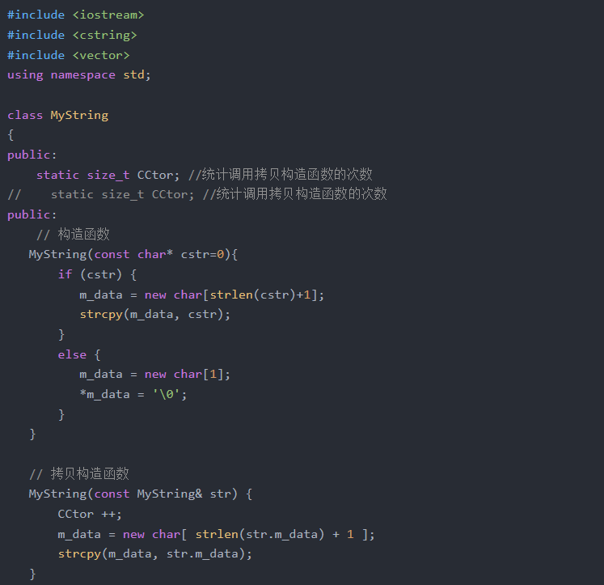
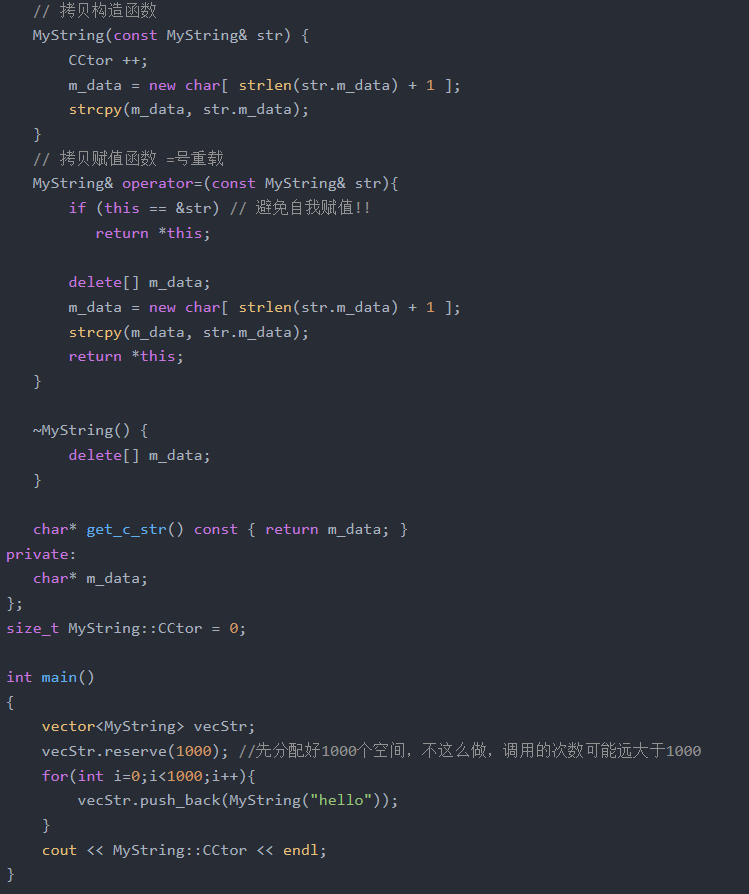

代码看起来挺不错，却发现执行了1000次拷贝构造函数，如果MyString("hello")构造出来的字符串本来就很长，构造一遍就很耗时了，最后却还要拷贝一遍，而MyString("hello")只是临时对象，拷贝完就没什么用了，这就造成了没有意义的资源申请和释放操作，如果能够直接使用临时对象已经申请的资源，既能节省资源，又能节省资源申请和释放的时间。而C++11新增加的移动语义就能够做到这一点。

要实现移动语义就必须增加两个函数：移动构造函数和移动赋值构造函数。

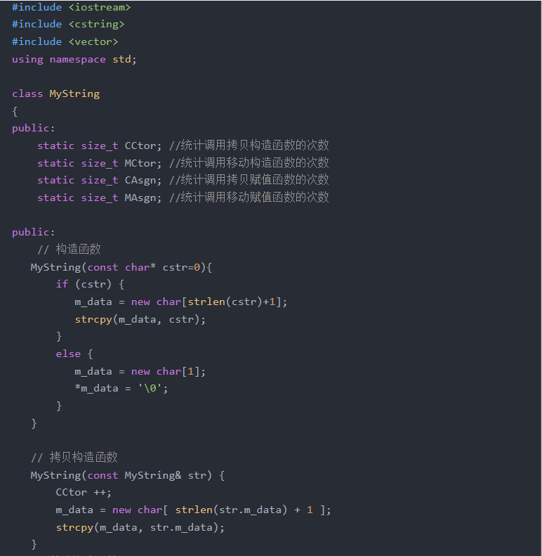
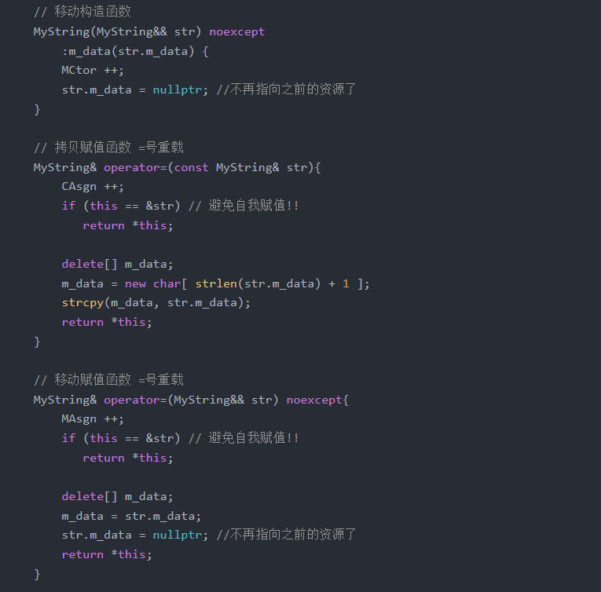
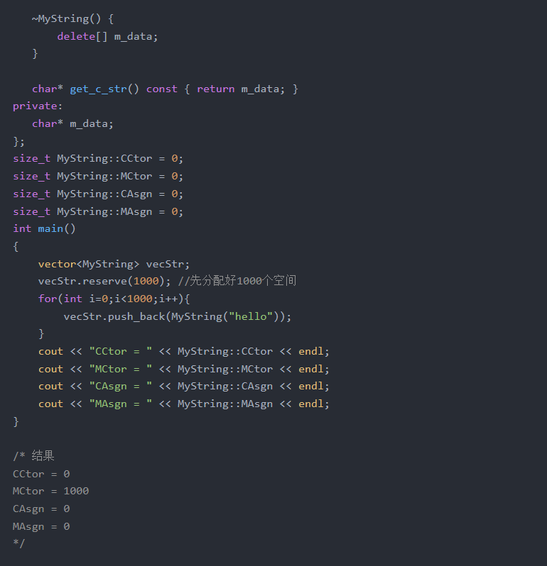

可以看到，移动构造函数与拷贝构造函数的区别是，拷贝构造的参数是const MyString& str，是常量左值引用，而移动构造的参数是MyString&& str，是右值引用，而MyString("hello")是个临时对象，是个右值，优先进入移动构造函数而不是拷贝构造函数。而移动构造函数与拷贝构造不同，它并不是重新分配一块新的空间，将要拷贝的对象复制过来，而是"偷"了过来，将自己的指针指向别人的资源，然后将别人的指针修改为nullptr，这一步很重要，如果不将别人的指针修改为空，那么临时对象析构的时候就会释放掉这个资源，"偷"也白偷了。下面这张图可以解释copy和move的区别。

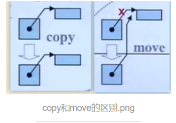

不用奇怪为什么可以抢别人的资源，临时对象的资源不好好利用也是浪费，因为生命周期本来就是很短，在你执行完这个表达式之后，它就毁灭了，充分利用资源，才能很高效。

对于一个左值，肯定是调用拷贝构造函数了，但是有些左值是局部变量，生命周期也很短，能不能也移动而不是拷贝呢？C++11为了解决这个问题，提供了std::move()方法来将左值转换为右值，从而方便应用移动语义。我觉得它其实就是告诉编译器，虽然我是一个左值，但是不要对我用拷贝构造函数，而是用移动构造函数吧。。。

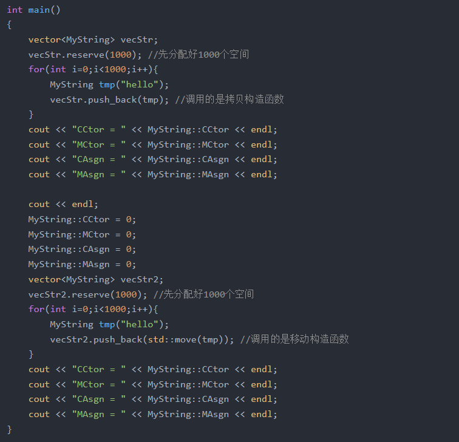
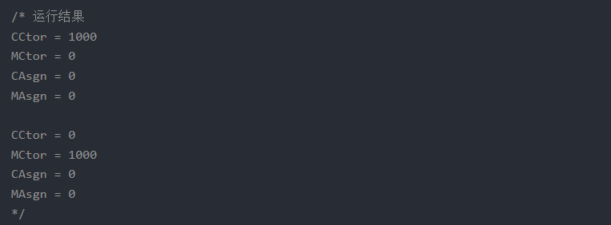

举几个例子：

```c++
MyString str1("hello"); //调用构造函数
MyString str2("world"); //调用构造函数
MyString str3(str1); //调用拷贝构造函数
MyString str4(std::move(str1)); // 调用移动构造函数、
//    cout << str1.get_c_str() << endl; // 此时str1的内部指针已经失效了！不要使用
//注意：虽然str1中的m_dat已经称为了空，但是str1这个对象还活着，知道出了它的作用域才会析构！而不是move完了立刻析构
MyString str5;
str5 = str2; //调用拷贝赋值函数
MyString str6;
str6 = std::move(str2); // str2的内容也失效了，不要再使用
```

需要注意一下几点：

1.str6 = std::move(str2)，虽然将str2的资源给了str6，但是str2并没有立刻析构，只有在str2离开了自己的作用域的时候才会析构，所以，如果继续使用str2的m_data变量，可能会发生意想不到的错误。
2.如果我们没有提供移动构造函数，只提供了拷贝构造函数，std::move()会失效但是不会发生错误，因为编译器找不到移动构造函数就去寻找拷贝构造函数，也这是拷贝构造函数的参数是const T&常量左值引用的原因！
3.c++11中的所有容器都实现了move语义，move只是转移了资源的控制权，本质上是将左值强制转化为右值使用，以用于移动拷贝或赋值，避免对含有资源的对象发生无谓的拷贝。move对于拥有如内存、文件句柄等资源的成员的对象有效，如果是一些基本类型，如int和char[10]数组等，如果使用move，仍会发生拷贝（因为没有对应的移动构造函数），所以说move对含有资源的对象说更有意义。

#### universal references(通用引用)

当右值引用和模板结合的时候，就复杂了。T&&并不一定表示右值引用，它可能是个左值引用又可能是个右值引用。例如：

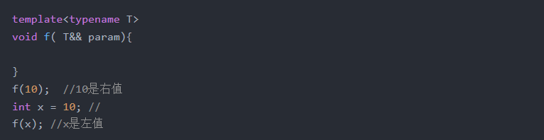

如果上面的函数模板表示的是右值引用的话，肯定是不能传递左值的，但是事实却是可以。这里的&&是一个未定义的引用类型，称为universal references，它必须被初始化，它是左值引用还是右值引用却决于它的初始化，如果它被一个左值初始化，它就是一个左值引用；如果被一个右值初始化，它就是一个右值引用。

注意：只有当发生自动类型推断时（如函数模板的类型自动推导，或auto关键字），&&才是一个universal references。

例如：

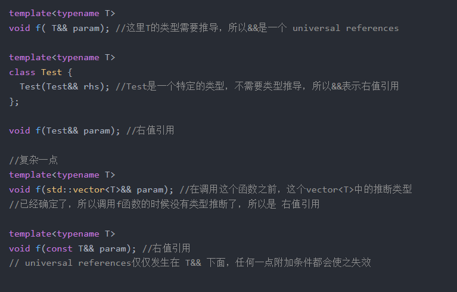

所以最终还是要看T被推导成什么类型，如果T被推导成了string，那么T&&就是string&&，是个右值引用，如果T被推导为string&，就会发生类似string& &&的情况，对于这种情况，c++11增加了引用折叠的规则，总结如下：

1.所有的右值引用叠加到右值引用上仍然使一个右值引用。
2.所有的其他引用类型之间的叠加都将变成左值引用。

如上面的T& &&其实就被折叠成了个string &，是一个左值引用。

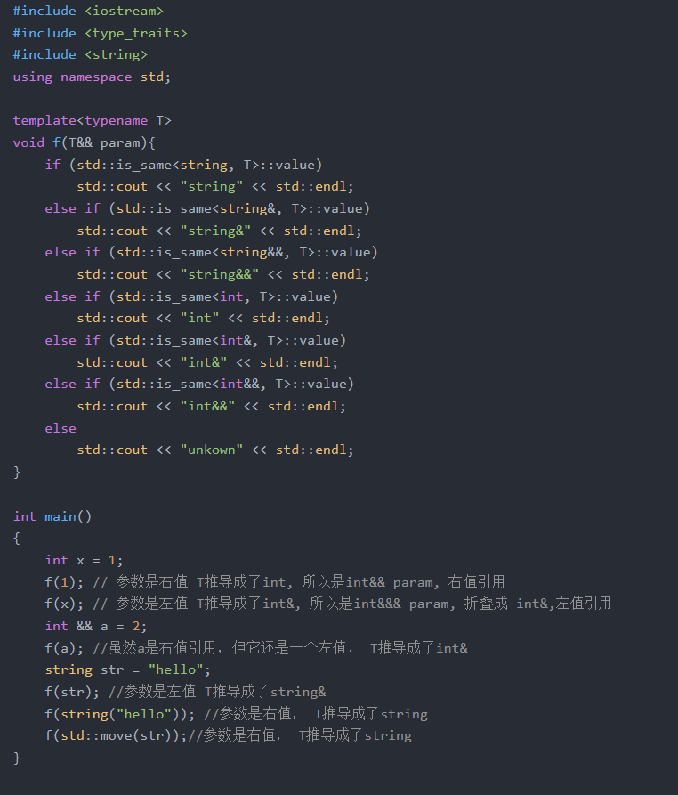

所以，归纳一下， 传递左值进去，就是左值引用，传递右值进去，就是右值引用。如它的名字，这种类型确实很"通用"，下面要讲的完美转发，就利用了这个特性。

#### 完美转发

所谓转发，就是通过一个函数将参数继续转交给另一个函数进行处理，原参数可能是右值，可能是左值，如果还能继续保持参数的原有特征，那么它就是完美的。

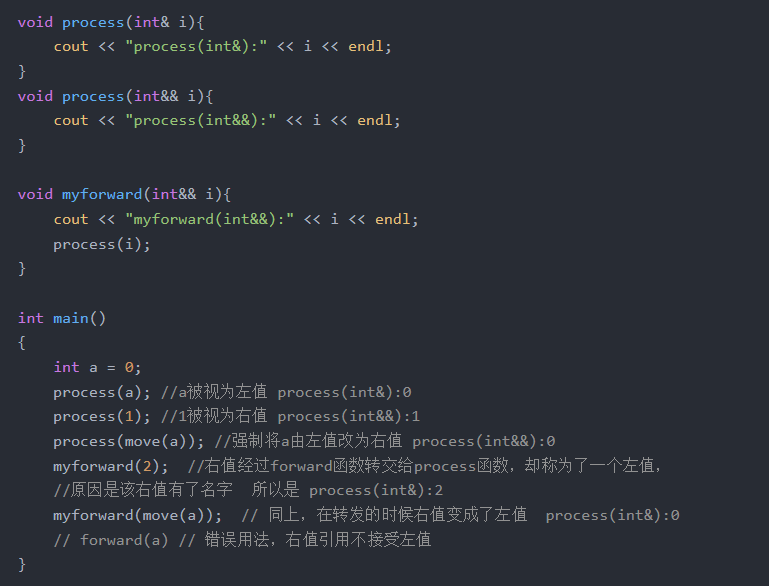

上面的例子就是不完美转发，而c++中提供了一个std::forward()模板函数解决这个问题。将上面的myforward()函数简单改写一下：

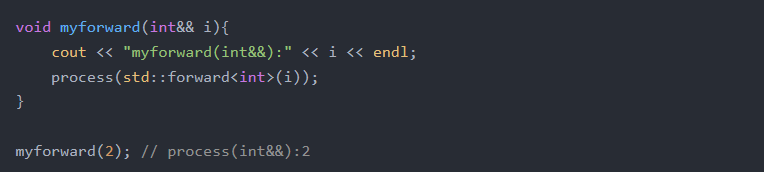

上面修改过后还是不完美转发，myforward()函数能够将右值转发过去，但是并不能够转发左值，解决办法就是借助universal references通用引用类型和std::forward()模板函数共同实现完美转发。例子如下：

```c++
#include <iostream>
#include <cstring>
#include <vector>
using namespace std;

void RunCode(int &&m) {
    cout << "rvalue ref" << endl;
}
void RunCode(int &m) {
    cout << "lvalue ref" << endl;
}
void RunCode(const int &&m) {
    cout << "const rvalue ref" << endl;
}
void RunCode(const int &m) {
    cout << "const lvalue ref" << endl;
}

// 这里利用了universal references，如果写T&,就不支持传入右值，而写T&&，既能支持左值，又能支持右值
template<typename T>
void perfectForward(T && t) {
    RunCode(forward<T> (t));
}

template<typename T>
void notPerfectForward(T && t) {
    RunCode(t);
}

int main()
{
    int a = 0;
    int b = 0;
    const int c = 0;
    const int d = 0;

    notPerfectForward(a); // lvalue ref
    notPerfectForward(move(b)); // lvalue ref
    notPerfectForward(c); // const lvalue ref
    notPerfectForward(move(d)); // const lvalue ref

    cout << endl;
    perfectForward(a); // lvalue ref
    perfectForward(move(b)); // rvalue ref
    perfectForward(c); // const lvalue ref
    perfectForward(move(d)); // const rvalue ref
}
```

上面的代码测试结果表明，在universal references和std::forward的合作下，能够完美的转发这4种类型。

#### emplace_back减少内存拷贝和移动

我们之前使用vector一般都喜欢用push_back()，由上文可知容易发生无谓的拷贝，解决办法是为自己的类增加移动拷贝和赋值函数，但其实还有更简单的办法！就是使用emplace_back()替换push_back()，如下面的例子：

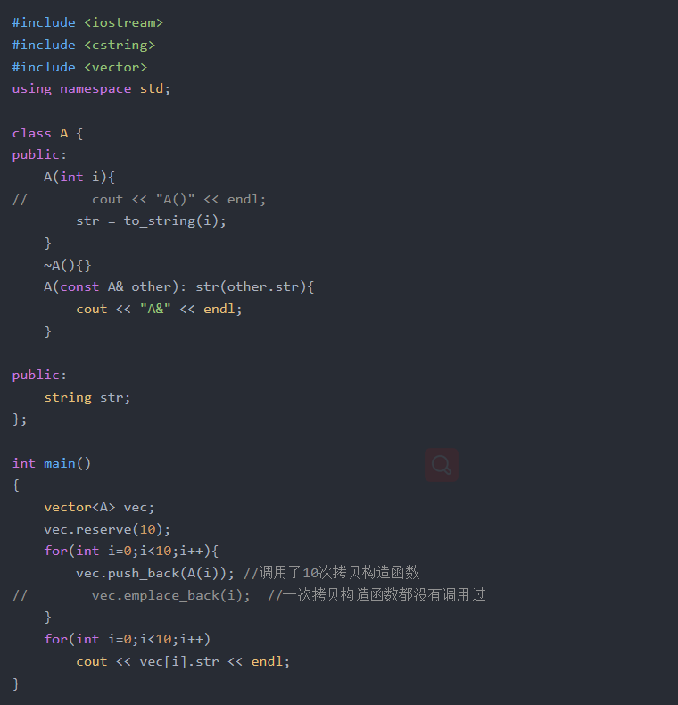

可以看到效果是明显的，虽然没有测试时间，但是确实可以减少拷贝。emplace_back()可以直接通过构造函数的参数构造对象，但前提是要有对应的构造函数。

对于map和set，可以使用emplace()。基本上emplace_back()对应push_bakc(), emplce()对应insert()。

对于map和set，可以使用emplace()。基本上emplace_back()对应push_bakc(), emplce()对应insert()。

移动语义对swap()函数的影响也很大，之前实现swap可能需要三次内存拷贝，而有了移动语义后，就可以实现高性能的交换函数了。

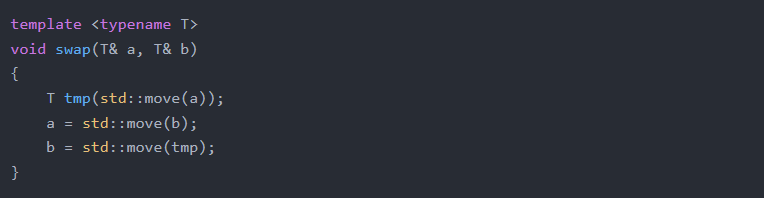

如果T是可移动的，那么整个操作会很高效，如果不可移动，那么就和普通的交换函数是一样的，不会发生什么错误，很安全。

#### 总结

 - 由两种值类型，左值和右值。
 - 有三种引用类型，左值引用、右值引用和通用引用。左值引用只能绑定左值，右值引用只能绑定右值，通用引用由初始化时绑定的值的类型确定。
 - 左值和右值是独立于他们的类型的，右值引用可能是左值可能是右值，如果这个右值引用已经被命名了，他就是左值。
 - 引用折叠规则：所有的右值引用叠加到右值引用上仍然是一个右值引用，其他引用折叠都为左值引用。当T&&为模板参数时，输入左值，它将变成左值引用，输入右值则变成具名的右值应用。
 - 移动语义可以减少无谓的内存拷贝，要想实现移动语义，需要实现移动构造函数和移动赋值函数。
 - std::move()将一个左值转换成一个右值，强制使用移动拷贝和赋值函数，这个函数本身并没有对这个左值什么特殊操作。
 - std::forward()和universal references通用引用共同实现完美转发。
 - 用empalce_back()替换push_back()增加性能。

